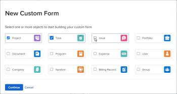
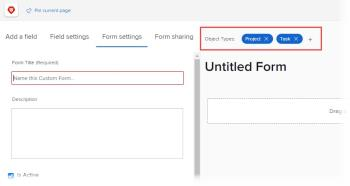

# Create or edit a custom form

You can create a new custom form or copy a custom form to create a new one that is based on the original. You can also edit an existing custom form. Both tasks are explained in this article.

For information about creating a new custom form from an existing one, see [Copy a custom form to create a new one](../../../administration-and-setup/customize-workfront/create-manage-custom-forms/copy-custom-form-to-create-a-new-one.md).

## Access requirements

You must have the following to perform the steps in this article:

<table cellspacing="0"> 
 <col> 
 <col> 
 <tbody> 
  <tr data-mc-conditions=""> 
   <td role="rowheader"> 
Adobe Workfront plan*
 </td> 
   <td>Any</td> 
  </tr> 
  <tr> 
   <td role="rowheader">Adobe Workfront license*</td> 
   <td> 
Plan 
 </td> 
  </tr> 
  <tr data-mc-conditions=""> 
   <td role="rowheader">Access level configurations*</td> 
   <td> 
Administrative access to custom forms
 
For information about how Workfront administrators grants this access, see <a href="../../../administration-and-setup/add-users/configure-and-grant-access/grant-users-admin-access-certain-areas.md" class="MCXref xref">Grant users administrative access to certain areas</a>.
 </td> 
  </tr>  
 </tbody> 
</table>

&#42;To find out what plan, license type, or access level configurations you have, contact your Workfront administrator.

## Start creating a custom form

1. Click the **Main Menu** icon  in the upper-right corner of Adobe Workfront, then click **Setup** .

1. Click **Custom Forms** in the left panel.

   In the view that appears, you can review all custom forms and custom fields that have been created for your organization. You can also see who created each form and the fields that are associated with it.

1. Click **New Custom Form**, then click the object type in the drop-down list that you want to associate with the custom form.

   The object type that you select is the only type that you can associate with the form.

   <!--
   <li value="4" data-mc-conditions="QuicksilverOrClassic.Draft mode,QuicksilverOrClassic.Quicksilver"> 
Click <b>New Custom Form</b>, then do one of the following:<!--
    [MAKE&nbsp;PREVIOUS STEP CLASSIC ONLY AND UNDRAFT THIS ONE AS NWE-ONLY WHEN THE STORY GOES TO PREVIEW. Later, on Prod release day, delete the first bullet.]
   -->

   <ul>
   <li> 
If you are using the Production environment, click the object type in the drop-down list that you want to associate with the custom form.
 
The object type that you select is the only type that you can associate with the form.
 </li>
   <li class="preview"> 
If you are using the Preview environment, select at least one object type that you want to associate with the custom form, then click <b>Continue</b>.
 
  
 </li>
   </ul> </li>
   -->

1. On the **Form Settings** tab that opens, type a **Form Title** and (optional) a **Description** for the custom form.

   <!--
   <li class="preview" value="6" data-mc-conditions="QuicksilverOrClassic.Draft mode,QuicksilverOrClassic.Quicksilver"> 
(Optional) If you want to associate more object types with the form, click the plus sign after <b>Object Types</b>, then select the object type you want in the menu that displays.
 
You can also click the X on an object type to delete it from the form.
 
  
 
For information about deleting object types from an existing (already saved) custom form, see <a href="../../../administration-and-setup/customize-workfront/create-manage-custom-forms/delete-object-type-on-a-custom-form.md" class="MCXref xref">Delete object types on a custom form</a>. 
 </li>
   -->

1. Click **Done**.

   >[!TIP]
   >
   >You can click **Apply** at any point while you are creating a custom form to save your changes and keep the form open.

1. If you want to add a new custom field to the form, continue on to [Add a custom field to a custom form](../../../administration-and-setup/customize-workfront/create-manage-custom-forms/add-a-custom-field-to-a-custom-form.md) or [Reuse an existing custom field](../../../administration-and-setup/customize-workfront/create-manage-custom-forms/reuse-an-existing-field.md).

   Or

   If you want to continue building your custom form in other ways, continue on to one of the following articles:

     <!--   
     <li data-mc-conditions="QuicksilverOrClassic.Draft mode,QuicksilverOrClassic.Quicksilver"><a href="../../../administration-and-setup/customize-workfront/create-manage-custom-forms/add-image-or-edit-its-properties-in-a-custom-form.md" class="MCXref xref">Add or edit an image widget in a custom form</a> </li>   
     -->   
   
   * [Position fields and widgets in a custom form](../../../administration-and-setup/customize-workfront/create-manage-custom-forms/position-fields-in-a-custom-form.md) 
   * [Add a section break to a custom form](../../../administration-and-setup/customize-workfront/create-manage-custom-forms/add-a-section-break-to-a-custom-form.md) 
   * [Add calculated data to a custom form](../../../administration-and-setup/customize-workfront/create-manage-custom-forms/add-calculated-data-to-custom-form.md) 
   * [Using an existing calculated custom field on a new custom form](../../../administration-and-setup/customize-workfront/create-manage-custom-forms/use-existing-calc-field-new-custom-form.md) 
   * [Display logic and skip logic on a custom form](../../../administration-and-setup/customize-workfront/create-manage-custom-forms/display-or-skip-logic-custom-form.md)

## Start editing a custom form

You can edit a custom form any time after it has been created.

>[!CAUTION]
>
>For information about removing fields from a custom form without losing data that users have entered in those fields, see the section [Remove fields without losing data](../../../administration-and-setup/customize-workfront/create-manage-custom-forms/delete-a-custom-field.md#remove) in the article [Delete a custom field](../../../administration-and-setup/customize-workfront/create-manage-custom-forms/delete-a-custom-field.md).
>
>In general, we recommend minimizing the number of times you edit a custom form that is already in use. There is no notification system to alert people who use the custom form about your changes.

1. Click the **Main Menu** icon  in the upper-right corner of Adobe Workfront, then click **Setup** .

1. Click **Custom Forms** in the left panel.

   In the view that appears, you can review all custom forms that have been created for your organization. You can also see who created each form, which object type it works with, and whether it is active.

1. Select the custom form you want to edit, then click **Edit**.
1. (Optional) To change the title and description of the custom form, click the **Form Settings** tab, then type a **Form Title** and **Description**.  

1. Click **Done**.

   >[!TIP]
   >
   >You can click **Apply** at any point while you are creating a custom form to save your changes and keep the form open.

1. If you want to add a new custom field to the form, continue on to [Add a custom field to a custom form](../../../administration-and-setup/customize-workfront/create-manage-custom-forms/add-a-custom-field-to-a-custom-form.md) or [Reuse an existing custom field](../../../administration-and-setup/customize-workfront/create-manage-custom-forms/reuse-an-existing-field.md).

   Or

   If you want to continue building your custom form in other ways, continue on to one of the following articles:

     <!--   
     <li data-mc-conditions="QuicksilverOrClassic.Draft mode,QuicksilverOrClassic.Quicksilver"><a href="../../../administration-and-setup/customize-workfront/create-manage-custom-forms/add-image-or-edit-its-properties-in-a-custom-form.md" class="MCXref xref">Add or edit an image widget in a custom form</a> </li>   
     -->   
   
   * [Position fields and widgets in a custom form](../../../administration-and-setup/customize-workfront/create-manage-custom-forms/position-fields-in-a-custom-form.md) 
   * [Add a section break to a custom form](../../../administration-and-setup/customize-workfront/create-manage-custom-forms/add-a-section-break-to-a-custom-form.md) 
   * [Add calculated data to a custom form](../../../administration-and-setup/customize-workfront/create-manage-custom-forms/add-calculated-data-to-custom-form.md) 
   * [Using an existing calculated custom field on a new custom form](../../../administration-and-setup/customize-workfront/create-manage-custom-forms/use-existing-calc-field-new-custom-form.md) 
   * [Display logic and skip logic on a custom form](../../../administration-and-setup/customize-workfront/create-manage-custom-forms/display-or-skip-logic-custom-form.md)

##  

