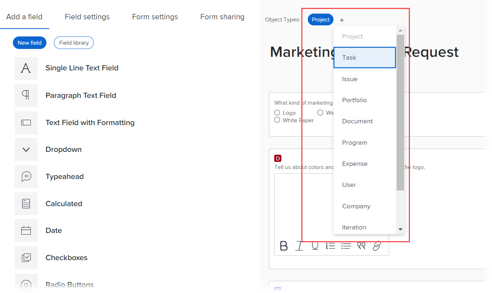

# Create or edit a custom form with the legacy form builder

<!--Audited: 01/2024-->

You can create a new custom form or edit an existing form. Both tasks are explained in this article.

For information about creating a new custom form from an existing one, see [Copy a custom form to create a new one with the legacy form builder](../../../administration-and-setup/customize-workfront/create-manage-custom-forms/copy-custom-form-to-create-a-new-one.md).

This article describes how you can create a custom form using the legacy form builder. For information about creating a custom form using the form designer, see [Design a form with the form designer](/help/quicksilver/administration-and-setup/customize-workfront/create-manage-custom-forms/form-designer/design-a-form/design-a-form.md).

## Access requirements

+++ Expand to view access requirements for the functionality in this article.

You must have the following to perform the steps in this article:

<table style="table-layout:auto"> 
 <col> 
 <col> 
 <tbody> 
  <tr data-mc-conditions=""> 
   <td role="rowheader"> 
Adobe Workfront plan
 </td> 
   <td>Any</td> 
  </tr> 
  <tr> 
   <td role="rowheader">Adobe Workfront license</td> 
   <td>
New: Standard

   
or

   
Current: Plan
</td> 
  </tr> 
  <tr data-mc-conditions=""> 
   <td role="rowheader">Access level configurations</td> 
   <td> 
Administrative access to custom forms
 </td> 
  </tr>  
 </tbody> 
</table>

For more detail about the information in this table, see [Access requirements in Workfront documentation](/help/quicksilver/administration-and-setup/add-users/access-levels-and-object-permissions/access-level-requirements-in-documentation.md).

+++

## Start creating a custom form

{{step-1-to-setup}}

1. Click **Custom Forms** in the left panel.

   Custom forms display in a list. You can review all custom forms and custom fields that have been created for your organization. You can also see who created each form, the objects associated with it, and whether it is active.

1. Click **New Custom Form.**
1. Select at least one object type that you want to associate with the custom form, then click **Continue**.

   

1. On the **Form settings** tab that opens, type a **Form Title** and an optional **Description** for the custom form.

1. (Optional) If you want to add more object types to the form so that it can be attached to more objects, click the **plus** sign after **Object Types**, then select the object type you want in the menu that displays.

   You can repeat this to add as many object types as you want.

1. (Optional) Click the **X** on an object type to delete it from the form.

   For information about deleting object types from a custom form you have already saved, see [Delete object types on a custom form](../../../administration-and-setup/customize-workfront/create-manage-custom-forms/delete-object-type-on-a-custom-form.md).

1. Click **Done** in the lower-left corner of the screen.

   >[!TIP]
   >
   >You can click **Apply** at any point while you are creating a custom form to save your changes and keep the form open.

1. If you want to add a new custom field to the form, continue on to [Add a custom field to a custom form](../../../administration-and-setup/customize-workfront/create-manage-custom-forms/add-a-custom-field-to-a-custom-form.md) or [Reuse a custom field or widget in a custom form](../../../administration-and-setup/customize-workfront/create-manage-custom-forms/reuse-an-existing-field.md).

   Or

   If you want to continue building your custom form in other ways, continue on to one of the following articles:

   * [Add or edit an asset widget in a custom form](../../../administration-and-setup/customize-workfront/create-manage-custom-forms/add-widget-or-edit-its-properties-in-a-custom-form.md) 
   * [Position custom fields and widgets in a custom form](../../../administration-and-setup/customize-workfront/create-manage-custom-forms/position-fields-in-a-custom-form.md) 
   * [Add a section break to a custom form](../../../administration-and-setup/customize-workfront/create-manage-custom-forms/add-a-section-break-to-a-custom-form.md) 
   * [Add calculated data to a custom form](../../../administration-and-setup/customize-workfront/create-manage-custom-forms/add-calculated-data-to-custom-form.md) 
   * [Reuse an existing calculated custom field in a custom form](../../../administration-and-setup/customize-workfront/create-manage-custom-forms/use-existing-calc-field-new-custom-form.md) 
   * [Add display logic and skip logic to a custom form](../../../administration-and-setup/customize-workfront/create-manage-custom-forms/display-or-skip-logic-custom-form.md)

## Start editing a custom form

You can edit a custom form any time after it has been created.

>[!CAUTION]
>
>For information about removing fields from a custom form without losing data that users have entered in those fields, see the section [Remove a custom field without losing data that users have entered](../../../administration-and-setup/customize-workfront/create-manage-custom-forms/delete-a-custom-field.md#remove) in the article [Delete a custom field or widget from the system](../../../administration-and-setup/customize-workfront/create-manage-custom-forms/delete-a-custom-field.md).
>
>In general, we recommend minimizing the number of times you edit a custom form that is already in use. There is no notification system to alert people who use the custom form about your changes.

{{step-1-to-setup}}

1. Click **Custom Forms** in the left panel.

   Custom forms display in a list. You can review all custom forms and custom fields that have been created for your organization. You can also see who created each form, the objects associated with it, and whether it is active.

1. Select the custom form you want to edit, then click .
1. (Optional) To change the title and description of the custom form, click the **Form Settings** tab, then type a **Form Title** and **Description**.

1. (Optional) If you want to add more object types to the form so that it can be attached to more objects, click the plus sign + after **Object Types**, then select the type you want in the menu that displays.

   

   You can repeat this to add as many object types as you want. 
   
   You can also click the X on an object type to delete it from the form. This should be done with caution when you want to delete an object type from a custom form you have already saved. For more information, see [Delete object types on a custom form](../../../administration-and-setup/customize-workfront/create-manage-custom-forms/delete-object-type-on-a-custom-form.md).

1. Click **Done**.

   >[!TIP]
   >
   >You can click **Apply** at any point while you are creating a custom form to save your changes and keep the form open.

1. If you want to add a new custom field to the form, continue on to [Add a custom field to a custom form](../../../administration-and-setup/customize-workfront/create-manage-custom-forms/add-a-custom-field-to-a-custom-form.md) or [Reuse a custom field or widget in a custom form](../../../administration-and-setup/customize-workfront/create-manage-custom-forms/reuse-an-existing-field.md).

   Or

   If you want to continue building your custom form in other ways, continue on to one of the following articles:

   * [Add or edit an asset widget in a custom form](../../../administration-and-setup/customize-workfront/create-manage-custom-forms/add-widget-or-edit-its-properties-in-a-custom-form.md) 
   * [Position custom fields and widgets in a custom form](../../../administration-and-setup/customize-workfront/create-manage-custom-forms/position-fields-in-a-custom-form.md) 
   * [Add a section break to a custom form](../../../administration-and-setup/customize-workfront/create-manage-custom-forms/add-a-section-break-to-a-custom-form.md) 
   * [Add calculated data to a custom form](../../../administration-and-setup/customize-workfront/create-manage-custom-forms/add-calculated-data-to-custom-form.md) 
   * [Reuse an existing calculated custom field in a custom form](../../../administration-and-setup/customize-workfront/create-manage-custom-forms/use-existing-calc-field-new-custom-form.md) 
   * [Add display logic and skip logic to a custom form](../../../administration-and-setup/customize-workfront/create-manage-custom-forms/display-or-skip-logic-custom-form.md)
