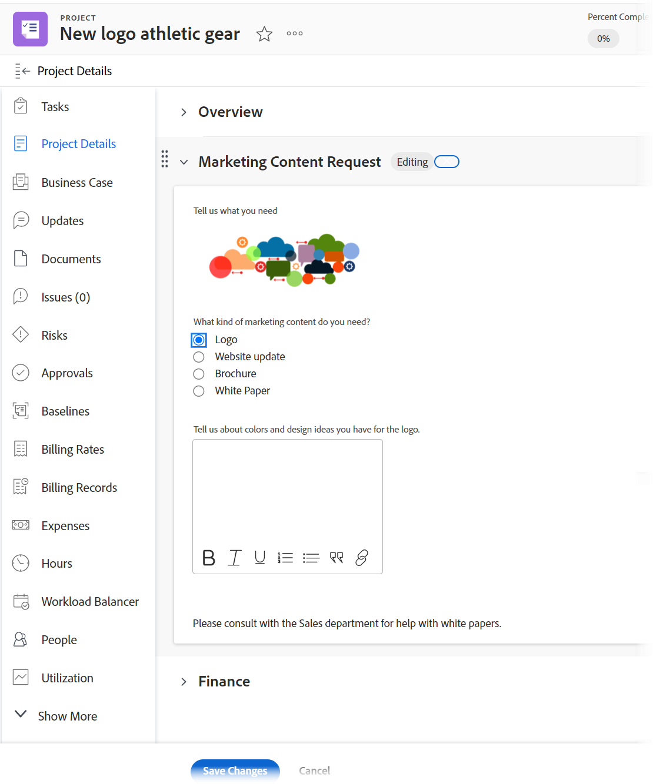
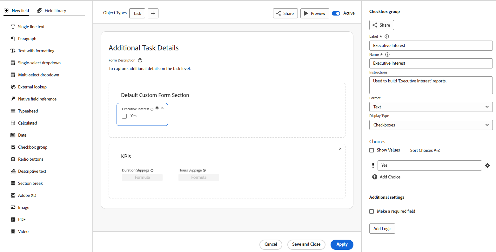

# Custom forms overview

<!--Audited: 12/2023-->

{{form-designer-default}}

You can build a custom form that users can attach to an Adobe Workfront object. Users who work on the object can fill out the custom form to supply information about the object.

For example, you can attach a custom form called "Marketing Content Research" to attach to a project so that users on the project can request marketing content for the project:

## How to create a custom form

The form designer has a canvas-style workspace that allows you to view the fields, canvas, and field settings all at the same time. It also allows you to drag and drop fields within the sections while designing your form.

For more information, see [Design a form with the form designer](/help/quicksilver/administration-and-setup/customize-workfront/create-manage-custom-forms/form-designer/design-a-form/design-a-form.md).

## Custom fields and widgets

Workfront provides many built-in fields for each object type.

In a custom form, you can create additional fields that prompt users for information that is unique to their workflows. These custom fields are the building blocks of a custom form.

You can add the following types of custom fields to a custom form in Workfront:

* Single line text
* Paragraph text
* Text with formatting
* Dropdown
* Multi-Select Dropdown
* External Lookup
* Native Field
* Typeahead
* Calculated
* Date Field
* Checkbox Group
* Radio Buttons
* Descriptive Text
* Section Break
* Adobe XD
* Image
* PDF
* Video

>[!NOTE]
>
>To track field changes in update feeds, go to Setup > Interface > Update Feeds. For more information, see [Configure system updates](/help/quicksilver/administration-and-setup/set-up-workfront/system-tracked-update-feeds/configure-system-updates.md).

## Objects where users can attach a custom form

As you are building a custom form, you can configure it to work with more than one object type.

Users can attach custom forms to the following object types:

* Project (including Business Cases)
* Task
* Issue (including Request Queue)
* Company
* Document
* User
* Program
* Portfolio
* Expense
* Group
* Iteration
* Billing Record

For more information about attaching custom forms to objects, see [Add a custom form to an object](../../../workfront-basics/work-with-custom-forms/add-a-custom-form-to-an-object.md).

For information about what happens to custom forms when converting an object, see [Transfer custom form data when converting an object](/help/quicksilver/administration-and-setup/customize-workfront/create-manage-custom-forms/transfer-custom-form-data-larger-item.md).

