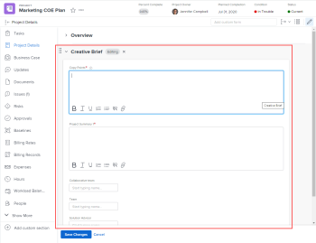

# Custom forms overview

The highlighted information on this page refers to functionality available only in the new Workfront experience beta.

**Video**:

See this video overview of custom forms.

 [Custom Forms in the new Workfront experience](https://one.workfront.com/s/learningpath2/custom-forms-in-the-new-workfront-experience-final-MCC2AF4MH6NRHKHJJBXO6T65DHUU)

You can build custom forms that users can attach to a Workfront objects and fill out to supply information about those objects.

For example, users can attach a custom form like the one pictured below to projects where they need to supply creative brief information:



## Custom fields and widgets

Workfront provides many built-in fields for each object type. In a custom form, you can create additional fields that prompt users for information that is unique to their workflows. These custom fields are the building blocks of a custom form.

You can add the following types of custom fields to a custom form in Workfront:

* Single line text field
* Paragraph text field
* Text field with formatting 
* Dropdown
* Calculated
* Date
* Checkboxes
* Radio buttons
* Descriptive text

For more information, see [Add a custom field to a custom form](../../../administration-and-setup/customize-workfront/create-manage-custom-forms/add-a-custom-field-to-a-custom-form.md).

You can also add image and ```video``` widgets to a custom form. This is useful when you need to include content such as branding images or visual instructions. For more information, see [Add or edit an asset widget in a custom form](../../../administration-and-setup/customize-workfront/create-manage-custom-forms/add-widget-or-edit-its-properties-in-a-custom-form.md).

For instructions on creating a custom form, see [Create or edit a custom form](../../../administration-and-setup/customize-workfront/create-manage-custom-forms/create-or-edit-a-custom-form.md).

## Objects where users can attach a custom form

Users can attach custom forms to the following object types:

* Project (including Business Cases)
* Task
* Issue
* Company
* Document
* User
* Program
* Portfolio
* Expense
* Group

For instructions, see [Add a custom form to an object](../../../workfront-basics/work-with-custom-forms/add-a-custom-form-to-an-object.md).

Users who create a custom form can configure it to work with more than one object type. For more information, see [Create or edit a custom form](../../../administration-and-setup/customize-workfront/create-manage-custom-forms/create-or-edit-a-custom-form.md).
