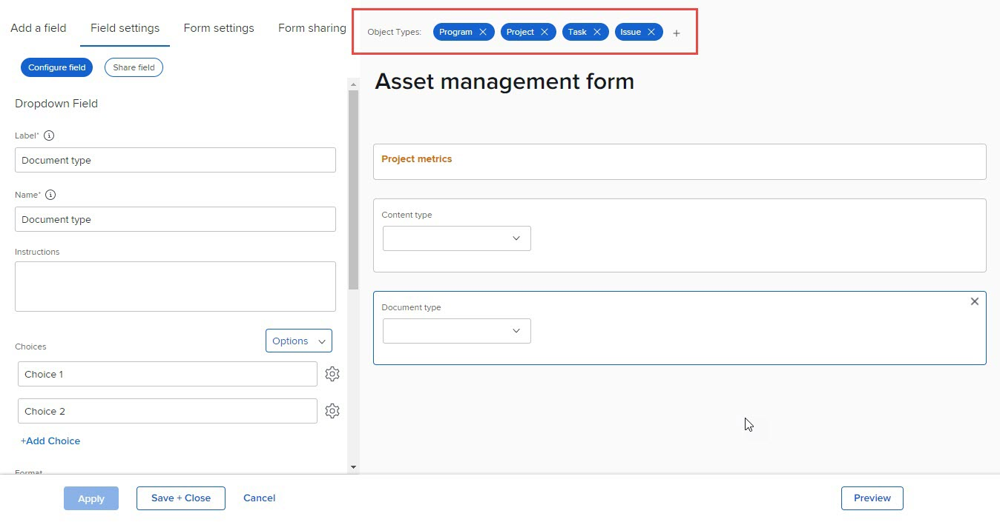

# Delete object types on a custom form

On an existing custom form, you can delete object types that are associated with the form. After you do this, users can no longer attach the form to objects of that type.

## Access requirements

You must have the following to perform the steps in this article:

<table style="table-layout:auto"> 
 <col> 
 <col> 
 <tbody> 
  <tr data-mc-conditions=""> 
   <td role="rowheader"> 
Adobe Workfront plan*
 </td> 
   <td>Any</td> 
  </tr> 
  <tr> 
   <td role="rowheader">Adobe Workfront license*</td> 
   <td>Plan</td> 
  </tr> 
  <tr data-mc-conditions=""> 
   <td role="rowheader">Access level configurations*</td> 
   <td> 
Administrative access to custom forms
 
For information about how Workfront administrators grants this access, see <a href="../../../administration-and-setup/add-users/configure-and-grant-access/grant-users-admin-access-certain-areas.md" class="MCXref xref">Grant users administrative access to certain areas</a>.
 </td> 
  </tr>  
 </tbody> 
</table>

&#42;To find out what plan, license type, or access level configurations you have, contact your Workfront administrator.

## Delete object types on a custom form

You can delete object types from an existing custom form.

A custom form must have at least one object type.

>[!CAUTION]
>
>If people have already attached the custom form to objects of the type you want to delete and added data to it, that data is permanently deleted when you delete that object type on the form. It might include historical information that users will need later.
>
>In general, we recommend minimizing the number of times you edit a custom form that is already in use. There is no notification system to alert people who use the custom form about your changes.

1. Click the **Main Menu** icon  in the upper-right corner of Adobe Workfront, then click **Setup** .

1. Click **Custom Forms** in the left panel.
1. Select the custom form you want to edit, then click **Edit**.
1. Click the X on any of the **Object Types** that you want to delete from the form, then click **Delete** on the warning message that displays.

   

1. (Optional) Repeat the previous step for any other object type you want to remove from the form.
1. Click **Done**, then click **Close and Save**.
