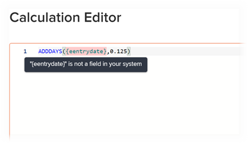

# Add calculated fields to a form

You can add a calculated custom field that uses existing data to generate new data when the custom form is attached to an object. 

A calculated custom field can contain:

* A simple reference to a single built-in field.

  >[!INFO]
  >
  > **Example:** To calculate the revenue generated by projects and tasks, you could create a calculated custom field  that contains the built-in  field Actual Revenue. When someone attaches the custom form to a project or task, the revenue for the project or task displays in the field.

* An expression that references one or more fields. These can be custom fields, other calculated custom fields, and built-in  fields.

  >[!INFO]
  >
  >**Example:** To calculate the profit generated by projects and tasks, you could create a calculated custom field called Profit containing a mathematical expression that subtracts cost from revenue.
  >
  >To do this, you could use the mathematical expression SUB (subtract) with the built-in Workfront fields Actual Cost and Actual Revenue.
  >
  >In the steps below, you can see how this example can be carried out.

## Access requirements

+++ Expand to view access requirements for the functionality in this article.

You must have the following to perform the steps in this article:

<table style="table-layout:auto"> 
 <col> 
 <col> 
 <tbody> 
  <tr data-mc-conditions=""> 
   <td role="rowheader"> 
Adobe Workfront plan*
 </td> 
   <td>Any</td> 
  </tr> 
  <tr> 
   <td role="rowheader">Adobe Workfront license*</td> 
   <td>Plan</td> 
  </tr> 
  <tr data-mc-conditions=""> 
   <td role="rowheader">Access level configurations*</td> 
   <td> 
Administrative access to custom forms
 
For information about how Workfront administrators grants this access, see <a href="/help/quicksilver/administration-and-setup/add-users/configure-and-grant-access/grant-users-admin-access-certain-areas.md" class="MCXref xref">Grant users administrative access to certain areas</a>.
 </td> 
  </tr>  
 </tbody> 
</table>

&#42;To find out what plan, license type, or access level configurations you have, contact your Workfront administrator.

+++

## Reuse an existing calculated custom field in a custom form

You can use the same calculated custom field on custom forms that belong to different objects. For example, you can use the Profit calculated field that you created for the project custom form on a task custom form.

When using an existing calculated custom field, the calculation does not transfer to the new form. You must add the calculation again, on the same field, on the new custom form.

You can also have a different calculation for the same field, on the new form. Keeping the same name for the calculated custom field ensures cohesiveness and consistency in your naming convention.

>[!IMPORTANT]
>
>Changes in calculated expressions can cause the field value on objects to become outdated. To ensure that you always view the up-to-date calculation in these fields, do one of the following:
>
>* After saving an object where you have edited data in an attached custom form, click the More icon  on the object's main page, then Recalculate Custom Expressions.
>* Select the Recalculate Custom Expressions option when editing objects in bulk.
>* Select the Update previous calculations option when editing a Calculated Custom Field on a custom form.

To reuse an existing calculated custom field:

{{step-1-to-setup}}

1. Click **Custom Forms** in the left panel.

   <!-- >[!TIP]
    >
    >In the view that appears, you can review all custom forms and custom fields that have been created for your organization. You can also see who created each form and the fields that are associated with it. -->

1. Click **New Custom Form.**
1. Select which object types you'd like to attach the custom form to, then click **Continue**.

1. On the top-left side of the screen, click **Field library**.

   

1. Use the search box or expand the **Calculated** section to locate the calculated field you need, then drag the field where you want it to appear in the custom form.

1. (Optional) Repeat the previous step to add any other fields.

   >[!NOTE]
   >
   >You can add up to 500 fields and widgets on a single custom form. However, performance degradation can occur when more than 100 exist on a form, depending on its complexity. 
   >
   >
   >Examples of complex forms include forms with cascading parameters, calculated custom data fields, and multiple value options in a single field.

1. To save your changes, click **Apply** and move on to another section to continue building your form.

    or

    Click **Save and Close**. 

## Add a new calculated field

>[!IMPORTANT]
>
>Before you create a new calculated custom field, identify the existing fields that you want to include so that you are sure that the data necessary for the calculation is present in Workfront.

{{step-1-to-setup}}

1. Click **Custom Forms** in the left panel.

   <!-- >[!TIP]
    >
    >In the view that appears, you can review all custom forms and custom fields that have been created for your organization. You can also see who created each form and the fields that are associated with it. -->

1. Click **New Custom Form.**
1. Select which object types you'd like to attach the custom form to, then click **Continue**.

1. On the left side of the screen, find **Calculated** and drag it to a section on the canvas.

    

1. On the right side of the screen, configure the options that are available for the type of custom field you are adding:

   <table style="table-layout:auto"> 
    <col> 
    </col> 
    <col> 
    </col> 
    <tbody> 
     <tr> 
      <td role="rowheader">Label</td> 
      <td>Type a label for the field. This is what users will see when they use the custom form. The field <b>Name</b>, which fills in automatically, is referenced by Workfront in reports.</td> 
     </tr> 
     <tr> 
      <td role="rowheader" id="instructions">Instructions</td> 
      <td> By default, the formula you create for the field is stored here. You can add text to provide additional information about the field and the formula in it. This can be useful in two ways: 
       <ul> 
      <li>
As a reminder of what the formula is and how it works. This is especially helpful if you plan to use this calculated custom field on multiple forms.
 </li> 
      <li> 
As a tooltip users can see when they hover over the field. You add any text here that you want them to see in the tooltip.
 
If you don't want them to see the formula in the tooltip, which might be confusing for them, you can hide it.</li> 
       </ul> </td> 
     </tr> 
     <tr> 
      <td role="rowheader">Format</td> 
      <td> 
The format in which you want the results of the field to be stored and displayed.
 
If the field will be used in mathematical calculations, always use a <strong>Number</strong> or a <strong>Currency</strong> format. When you select Number or Currency, the system automatically truncates numbers that start with 0.
 
      
<b>IMPORTANT</b>: Before you choose a format, consider the correct format for the new field. The format field cannot be edited after the custom form is saved. And selecting the wrong format could impact future calculations and aggregate values in report and list groupings.

      
<strong>NOTE:</strong> Calculated fields with a Currency format should not include quotation marks. (For example, use 800.00 and not "800.00.") Using quotation marks can cause unexpected consequences due to nuances with language formatting for currency types.
</td>
     </tr> 
    </tbody> 
   </table>

1. In the **Calculation** box, begin building your calculation: 
   1. Click **Maximize** to open the Calculation Editor and build your calculation.
 
    A calculation usually starts with an expression, followed by parentheses containing the fields you want to reference when the custom form is attached to an object. 

      Each field must be surrounded with curly brackets. When you start typing the name of a field, the system makes suggestions and you can select one to insert it into your calculation.

      +++ **Expand to see syntax required in calculated custom fields**

      Each field must use the syntax explained below, with curly brackets around each field name. When you start typing the name of a field, the system makes suggestions and you can select one  to insert it into your calculation. If you enter data in a calculation incorrectly, a warning message alerts you. You cannot save the form unless you edit your calculation to contain valid fields and a valid calculated expression.

      >[!NOTE]
      >
      >Currently, the system makes suggestions only when you start typing the name of a field you want to reference on an object that the custom form will be attached to. Fields from the parent object are not suggested. 

      **Surround field names with curly brackets**

      * If you want the calculation to reference a built-in field, the name of the field must be surrounded by curly brackets.

         For example: `{actualRevenue}`

         Field names are case-sensitive and must appear in the calculation exactly how they appear in the Workfront system.

         Navigate to the [Workfront API explorer](https://developer.adobe.com/workfront/api-explorer/) to identify the field names that can be used in calculations.

      * If you want the calculation to reference a custom field, the name of the field must be surrounded by curly brackets, and preceded by `DE:` within the brackets.

         For example: `{DE:Profit}`

         The system lists all of the custom fields you can choose from when you type `DE:`.  

         * If you want the calculation to reference a field that will pull data from  the *parent* object when the custom form is attached to an object, you must precede the field name with the object type of the parent object, also in curly brackets.

         For example, if the custom form is configured to work with tasks, and you want the field to calculate the actual revenue of the parent object when the form is attached to a task, you need to indicate `Project` as the object type of the field: 
         
         `{project}.{actualRevenue}`
         
         Or, if it's a custom field: 
         
         `{project}.{DE:profit}`

         **Separate items with periods**

         When you reference a related object in a calculated custom field, you must separate object names and attributes with periods.

         For example, in a task-type custom form, to display the name of the Portfolio Owner in a calculated custom field, you would type the following: 

         `{project}.{porfolio}.{owner}`

         This would determine the following: From the object of the custom form (a task), you can access the next object related to the task (a project). From there, you can access the next related object to the project (a portfolio), then reference the fields defined for portfolio object (the owner)

         **Name syntax for referencing a custom field**

         When you reference another custom field in a calculated custom field, you need to enter the name of the field as it displays in the Workfront user interface.

         For example, to reference the selected option in a custom field labeled Executive sponsor, you would type the following:

         `{DE:Executive sponsor}`

         >[!NOTE]
         >
         >The syntax for a typeahead field is a bit different than it is for other types of fields because you need to add `:name` at the end.
         >
         >For example, to reference the selected option in a custom typeahead field named "Executive sponsor," you would type:
         >
         >`{DE:Executive sponsor:name}`

         **Calculated custom fields in multi-object custom forms**

         In a multi-object custom form, the selected object types must be compatible with at lesat one field referenced in the form's calculated custom fields. Fields not compatable with the object will display N/A on the form. 

         To ensure the calculated field is showing a correct result for all object types, you must use `$$OBJCODE` to define a calculation for each object type.

         >[!INFO]
         >
         >**Example:**
         >
         >In a custom form configured to work with projects, tasks, and issues, you can use the following formula to display the object type:
         >
         >`IF($$OBJCODE="PROJ","This is a project",IF($$OBJCODE="TASK","This is a task","This is an issue"))`
         >
         >On a project the field will show "This is a project", on a task it will show "This is a task", and on an issue it will say "This is an issue".
         

         >[!INFO]
         >
         >**Example:** Though there is no Assigned To: Name field in projects, there is a built-in Owner field (which fills in automatically with the name of the person who created the project, unless someone manually changes this).
         >
         >So, in your custom In Charge field, you could use `$$OBJCODE` as shown below to reference the Owner field when the custom form is attached to a project, and the Assigned To: Name field when the form is attached to a task:
         >
         >`IF($$OBJCODE="PROJ",{owner}.{name},{assignedTo}.{name})`

         For more information about variables like `$$OBJCODE,` see [Wildcard filter variables overview](/help/quicksilver/reports-and-dashboards/reports/reporting-elements/understand-wildcard-filter-variables.md).

         **Automatic updates of calculated custom fields**

         Calculated custom fields on an object recalculate automatically when the following things happen:

         * Something on the object changes, such as a daily timeline calculation.
         * Someone edits another field that is referenced by a calculated custom field on the object.
         * The calculated expression is empty and the field contains a value—this sets the value to null.

            >[!NOTE]
            >
            >
In a custom form attached to an object, date and time statements in calculated custom fields are calculated and saved by Coordinated Universal Time (UTC), not by the time zone configurations set for your organization's instance and your user profile. Calculations in a custom form generate based on each users' individual time zones.

         +++

   1. Click in the large text box, then click **Expressions** and **Fields** that are available to add them to your calculation.

      You can also start typing an expression or field in the large text box, then select it when it displays. Each item displays with an "F" for field or an "E" for expression.

      If you type an opening parenthesis, the closing parenthesis is added automatically.

      +++ **Expand to see helpful tips**
      
      >[!TIP]
      >
      >You can do any of the following to get help with your calculation:
      > 
      >* Hover over an expression in your calculation to see a description, an example showing how it can be used, and a "Learn More" link to more information in the article [Overview of calculated data expressions](/help/quicksilver/reports-and-dashboards/reports/calc-cstm-data-reports/calculated-data-expressions.md).
      >  
      >* Use the color coding to identify the components you have added. Expressions display in blue and fields display in green.
      >  
      >* Find calculation errors, highlighted in pink, as you go. You can hover over a highlighted error to display a brief description of its cause.
      >   
      >* In the area below your calculation, preview the results on an existing Workfront object.
      ><!--or by providing test values (NOT READY YET; CHANGE THIS SCREENSHOT WHEN IT IS)-->
      >  
      >* Reference expressions in a long calculation using the line numbers that display on the left.

      +++
   1. Click **Minimize** when you are finished creating the calculation for the calculated custom field.

   1. (Optional) Use any of the following options to further configure your calculated custom field:

      <table style="table-layout:auto"> 
    <col> 
    <col> 
    <tbody> 
     <tr> 
      <td role="rowheader">Add Logic</td> 
      <td>You can add Display Logic to determine whether the calculated field displays, based on at least one choice that a user makes in a preceding multiple choice field (Dropdown, Checkboxes, or Radio Buttons) when filling out the form. <!-- For more information, see <a href="Need to add link for new article when it's written" class="MCXref xref">Add display logic and skip logic to a custom form</a>.--> 
This is available only when at least one checkbox, radio button, or a dropdown field precedes the calculated custom field on the form. 
 
Skip Logic is unavailable for calculated custom fields.
 </td> 
     </tr> 
     <tr> 
      <td role="rowheader">Update previous calculations</td> 
      <td>When you are editing an existing calculated custom field, you can select this option to trigger an update in the calculation when you save the custom form. This happens only once when you save the custom form. The option returns to its disabled state after you do so.</td> 
     </tr> 
     <tr> 
      <td role="rowheader">Display formula in instructions</td> 
      <td>Leave this option enabled if you want the users who fill out the custom form to see the field's formula when they hover over the field. For more information, see the information about <a href="#instructions" class="MCXref xref">Instructions</a> earlier in this table.</td> 
     </tr> 
    </tbody> 
   </table>

1. To save your changes, click **Apply** and move on to another section to continue building your form.

    or

    Click **Save and Close**.
