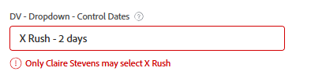
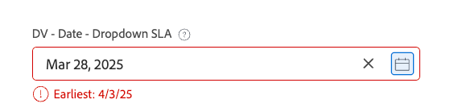
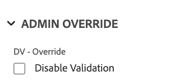
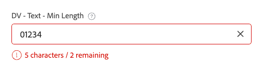
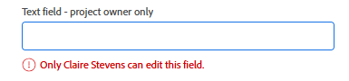
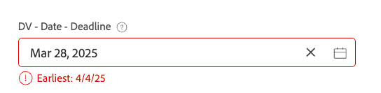
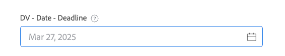

# Examples of advanced logic in custom forms

Logic rules allow you to further customize the fields on a custom form.

This article provides examples of expressions used to build advanced logic on custom fields.

For more information about adding logic to a custom form, see [Add logic rules to custom forms and fields](/help/quicksilver/administration-and-setup/customize-workfront/create-manage-custom-forms/form-designer/design-a-form/display-skip-logic-form-designer.md).

## Access requirements

+++ Expand to view access requirements for the functionality in this article.

You must have the following access to perform the steps in this article:

<table style="table-layout:auto"> 
 <col> 
 <col> 
 <tbody> 
  <tr data-mc-conditions=""> 
   <td role="rowheader">Adobe Workfront plan </td> 
   <td>Any</td> 
  </tr> 
  <tr> 
   <td role="rowheader">Adobe Workfront license</td> 
   <td>
   <p>New: Standard</p>
   <p>or</p>
   <p>Current: Plan</p></td> 
  </tr> 
  <tr data-mc-conditions=""> 
   <td role="rowheader">Access level configurations</td> 
   <td>Administrative access to custom forms </td> 
  </tr>  
 </tbody> 
</table>

For more detail about the information in this table, see [Access requirements in Workfront documentation](/help/quicksilver/administration-and-setup/add-users/access-levels-and-object-permissions/access-level-requirements-in-documentation.md).

+++

## Validation logic examples

Validation logic is built using formulas, and you can make the logic as simple or as complex as you need. The validation can be based on the values of other fields or the status of objects, and you can provide an error message for when the validation fails.

If the field with the logic applied meets the defined validation conditions when a user fills out the custom form, the field is highlighted and the error message is displayed.

You can apply validation logic to the following field types: single line text, paragraph, single-select dropdown, multi-select dropdown, external lookup, typeahead, date, checkbox group, and radio buttons.

### Only allow project owner to select "Rush" SLA

In this example, a single-select dropdown field has choices for the SLA of Standard – 14 days, Priority – 7 days, and Rush – 2 days.

Validation expression:

```
IF({ownerID}!=$$USER&&{DE:DV - Dropdown - Control Dates}="2",CONCAT("Only ",{owner}.{name}," may select X Rush"))
```

When anyone who is not the project owner (including the system administrator) attempts to select **X Rush**, an error is displayed:



### Date validation based on choice in previous field

Continuing with the SLA example, you can add a date field that is validated based on the settings from the previous dropdown field.

Validation expression:

```
IF({DE:DV - Date - Dropdown SLA}<ADDDAYS($$TODAY,{DE:DV - Dropdown - Control Dates}),CONCAT("Earliest: ",ADDDAYS($$TODAY,{DE:DV - Dropdown - Control Dates})))
```

If the user selects a date prior to the allowed date, the message displays the earliest date they can select:



### Minimum character count with the option to override

In this example, a minimum character count is enforced on a text field, with the character count displayed. Also, a separate check box is set up to disable the validation for the character count.

Validation expression:

```
IF({DE:DV - Override}!="Disable Validation"&&LEN({DE:DV - Text - Min Length})<"7",CONCAT(LEN({DE:DV - Text - Min Length})," characters / ",("7"-LEN({DE:DV - Text - Min Length}))," remaining"))
```

Enforcement of the validation can be overridden by selecting the check box:



A running character count is included on the text field:



### Lock a field so that only the owner can edit it

In this example, a field can only be edited by the project owner. Even the system administrator cannot edit the field.

Validation expression:

```
IF({ownerID}!=$$USER,IF(ISBLANK({ownerID}),"Project Owner will provide this.",CONCAT("Only ",{owner}.{name}," can edit this.")))
```

If a user who is not the project owner tries to type in the field, they see a message stating that only the project owner can edit the field.



### Typeahead allows or rejects values based on other field values

In this example, a typeahead field dynamically allows or rejects values based on the value entered in another field on the form. The option to override the validation is also included in the formula.

Validation expression:

```
IF({DE:DV - Override}!="Disable Validation"&&{DE:DV - Text - Budget}>"10000"&&{DE:DV - TA User - by Budget}.{role}!="Director","Requires Director Approver")
```

If the value in the budget field is more than $10,000, then only users with a Director role can be selected from the typeahead, even if there is no role filter enabled on the typeahead configuration.


### Disallow values that are less than 10 days from the entry date

In this example, the validation only allows values that are 10 days in the future from the entry date. The option to override the validation (in a separate check box field) is also included in the formula, along with allowing the date field to be blank.

Validation expression:

```
IF({DE:DV - Override}!="Disable Validation"&&ISBLANK({DE:DV - Date - Deadline})!="true"&&{DE:DV - Date - Deadline}<ADDDAYS({entryDate},"10"),CONCAT("Earliest: ",ADDDAYS({entryDate},"10")))
```

Any value less than 10 days from the entry date triggers validation:



A blank value does not trigger the validation message:



### Enforce exact/minimum/maximum selections in a multi-select field

In this example, a multi-select field such as a check box group requires the user to choose a certain number of options.

Validation expression (pick exactly two):

```
IF({DE:DV - Override}!="Disable Validation"&&ARRAYLENGTH(ARRAY({DE:DV - Checkbox - Pick exactly 2},","))!="2","Pick Exactly 2 Options")
```

Validation expression (pick at least two):

```
IF({DE:DV - Override}!="Disable Validation"&&ARRAYLENGTH(ARRAY({DE:DV - Checkbox - Pick at least 2},","))<"2","Pick at least 2 choices")
```

Validation expression (pick no more than two):

```
IF({DE:DV - Override}!="Disable Validation"&&ARRAYLENGTH(ARRAY({DE:DV - Checkbox - Pick no more than 2},","))>"2","Pick no more than 2 choices")
```

The user sees validation errors if they don't select the correct number of options.


