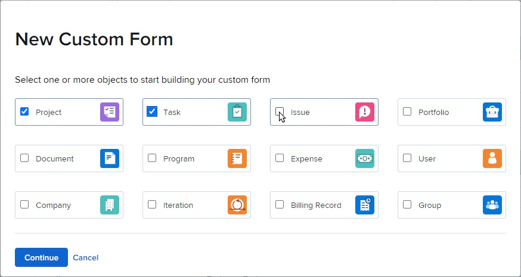
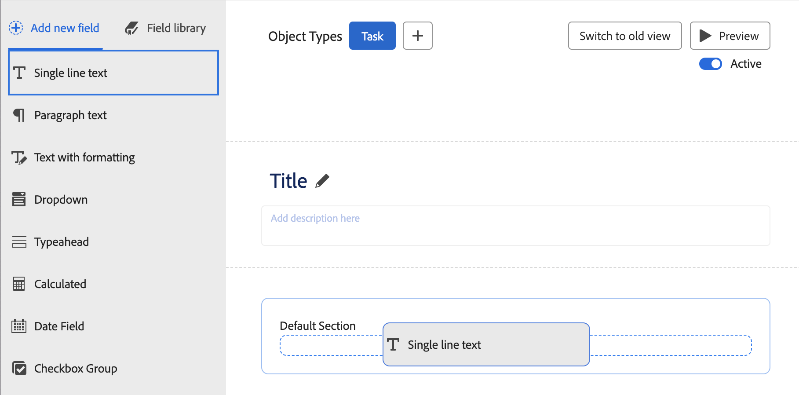
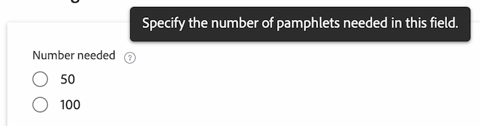
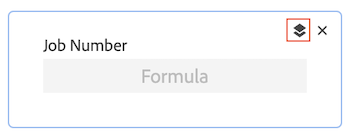

# Design a form with the form designer

The highlighted information on this page refers to functionality not yet generally available. It is available only in the Preview environment for all customers, or in the Production environment for customers who enabled fast releases.

For information about fast releases, see [Enable or disable fast releases for your organization](/help/quicksilver/administration-and-setup/set-up-workfront/configure-system-defaults/enable-fast-release-process.md).

For information about the current release, see [Second Quarter 2024 release overview](/help/quicksilver/product-announcements/product-releases/24-q2-release-activity/24-q2-release-overview.md).

You can design a custom form with the form designer. You can attach custom forms to different Workfront objects to capture data about those objects.

## Access requirements

You must have the following to perform the steps in this article:

<table style="table-layout:auto"> 
 <col> 
 <col> 
 <tbody> 
  <tr data-mc-conditions=""> 
   <td role="rowheader"> 
Adobe Workfront plan
 </td> 
   <td>Any</td> 
  </tr> 
  <tr> 
   <td role="rowheader">Adobe Workfront license</td> 
   <td>
   
New: Standard

   
or

   
Current: Plan
</td> 
  </tr> 
  <tr data-mc-conditions=""> 
   <td role="rowheader">Access level configurations</td> 
   <td> 
Administrative access to custom forms
 </td> 
  </tr>  
 </tbody> 
</table>

For more detail about the information in this table, see [Access requirements in Workfront documentation](/help/quicksilver/administration-and-setup/add-users/access-levels-and-object-permissions/access-level-requirements-in-documentation.md).

## Start designing a custom form

{{step-1-to-setup}}

1. Click **Custom Forms** in the left panel.

   <!-- >[!TIP]
    >
    >In the view that appears, you can review all custom forms and custom fields that have been created for your organization. You can also see who created each form and the fields that are associated with it. -->

1. Click **New Custom Form.**
1. Select which object types you'd like to attach the custom form to, then click **Continue**.

   

1. In the **Title is required** area, type the custom form title.
1. (Optional) If you want to add more object types to the form so that it can be attached to more objects, click the **Add** icon  after **Object Types**, then select the type you want in the menu that displays. You can repeat this to add as many object types as you want. 
   
   You can also click the X on an object type to delete it from the form. 

   >[!CAUTION]
   >
   >Deleting a custom form also deletes all custom data on the objects associated with the form. The deleted data cannot be recovered. Consider deactivating a custom form instead—when deactivate a custom form you no longer use, you retain all of the associated historical data.
   >
   >For more information, see [Delete object types on a custom form](/help/quicksilver/administration-and-setup/customize-workfront/create-manage-custom-forms/delete-object-type-on-a-custom-form.md).

1. Next, you can start adding fields to your custom form. See the following sections:
    * [Reuse an existing field or widget already used in another custom form](#reuse-an-existing-field-or-widget-already-used-in-another-custom-form)
    * [Add text fields](#add-text-fields)
    * [Add calculated fields](#add-calculated-fields)
    * [Add radio buttons, checkbox group, and dropdowns](#add-radio-buttons-checkboxes-and-dropdowns)
    * [Add typeahead and date fields](#add-typeahead-and-date-fields)
    * [Add external lookup fields](#add-external-lookup-fields)
    * [Add images, PDFs, and Videos](#add-images-pdfs-and-videos)
    * [Add Workfront native fields](#add-workfront-native-fields)
    * [Add Adobe XD files](#add-adobe-xd-files)

## Add new or existing fields to your custom form

You can use new or existing fields when designing your custom form. 

## Reuse an existing field or widget already used in another custom form

1. On the top-left side of the screen, click **Field library**.

1. Drag the field or widget here you want it in the custom form.
1. (Optional) Repeat the previous step to add any other fields or widgets.

   >[!NOTE]
   >
   >You can add up to 500 fields and widgets on a single custom form. However, performance degradation can occur when more than 100 exist on a form, depending on its complexity. 
   >
   >
   >Examples of complex forms include forms with cascading parameters, calculated custom data fields, and multiple value options in a single field.

1. To save your changes, click **Apply** and move on to another section to continue building your form.

    or

    Click **Save and Close**. 

### Add text fields

 You can add several different text fields to a custom form. 

+++ **Expand to see descriptions of available text fields**

* **Single Line Text Field**: Allows users to type a single line of text in the field.
* **Paragraph Text Field**: Allows users to type multiple lines of text in the field.
* **Text Field with Formatting**: Allows users to type multiple lines of text in the field and format the text with bold, italics, underline, bullets, numbering, hyperlinks, and block quotes. A character limit of 15,000 allows for plenty of text and formatting.

    This custom field type is not supported in filters on lists and reports.

    For information about accessing this field through the API, see [Rich text field storage in the API](/help/quicksilver/administration-and-setup/customize-workfront/create-manage-custom-forms/rich-text-field-storage-in-the-api.md).

    >[!NOTE]
    >
    >Text fields with formatting are not available for Workfront mobile apps (available in coming releases).

* **Descriptive text**: Allows you to include instructions and link to pages outside Workfront.

+++

To add a text field: 

1. On the left side of the screen, find one of the following text fields and drag it to a section on the canvas:

    * Single Line Text
    * Paragraph Text
    * Text field with formatting
    * Descriptive text

    

1. On the right side of the screen, configure the options that are available for the type of custom field you are adding:

   <table>
    <tr>
    <td>Input into</td>
    <td>Description</td>
    <td>Available for </td>
    </tr>
    <tr>
    <td>Size</td>
    <td>
Change the size of the text fields on the form.

   </td>
    <td><ul>
    <li>Single line text</li>
    <li>Paragraph text</li>
    <li>Text with formatting</li>
    <li>Descriptive text - Coming soon</li>
    </ul></td>
    </tr>
    <tr>
    <td>Label</td>
    <td>
Type a descriptive label to display above the widget. You can change the label at any time.

    
IMPORTANT: Avoid using special characters in this label. They don't display correctly in reports.
</td>
    <td><ul>
    <li>Single line text</li>
    <li>Paragraph text</li>
    <li>Text with formatting</li>
    </ul></td>
    </tr>
    <tr>
     <td>Name</td>
    <td>
(Required) This name is how the system identifies the field. When you are configuring the widget for the first time and you type the label, the Name field populates automatically to match it. But the Label and Name fields are not synchronized—this gives you the freedom to change the label that your users see without having to change the name that the system sees.

    
<b>IMPORTANT</b>:   
      <ul> 
      <li>Though it's possible to do so, we recommend that you do not change this name after you or other users start using the custom form in Workfront. If you do, the system will no longer recognize the custom field where it might now be referenced in other areas of Workfront. 
For example, if you add the custom field to a report and later change its name, Workfront doesn't recognize it in the report and it will stop functioning correctly there unless you re-add it to the report using the new name.
 </li>
      <li> 
We recommend that you do not type a name that is already used for built-in Workfront fields.
 </li>
      <li>
We recommend that you do not use the period/dot character in the custom field name, to prevent errors when using the field in different areas of Workfront.
</li>
    </td>
    <td><ul>
    <li>Single line text</li>
    <li>Paragraph text</li>
    <li>Text with formatting</li>
    <li>Descriptive text</li>
    </ul></td>
    </tr>
    <tr>
    <td>Instructions</td>
    <td>Type any additional information about the widget. When users fill out the custom form, they can hover over the question mark icon to view a tool tip containing the information you type here.
    
    </td>
    <td><ul>
    <li>Single line text</li>
    <li>Paragraph text</li>
    <li>Text with formatting</li>
    </ul></td>
    </tr>
    <tr>
    <td>Format</td>
    <td>
Select the type of data that will be captured in the custom field.
 
<b>NOTE</b>:   
    <ul> 
    <li>This field cannot be edited after the form is saved. If you intend to use your field in mathematical calculations, ensure that you select a Number or Currency format.</li> 
    <li>When you select Number or Currency, the system automatically truncates numbers that start with 0.</li>
    <li>The character limit for Number fields is 16. You can also use a Text field to enter numbers and avoid the limit.</li>
     </ul>
</td> </td>
    <td><ul>
    <li>Single line text</li>
    <li>Paragraph text</li>
    </ul></td>
    </tr>
    <tr>
    <td>Display Type</td>
    <td>Switch between single line and paragraph text fields.</td>
    <td><ul>
    <li>Single line text</li>
    <li>Paragraph text</li>
    </ul></td>
    </tr>
    <tr>
    <td>Hyperlink</td>
    <td> If you want to apply a hyperlink to the Descriptive Text you have typed, add it here. The Descriptive text displays as a link on objects where the form is attached.</td>
    <td><ul><li>Descriptive text</li></ul></td>
    </tr>
   </table>

1. (Optional) Repeat the previous step to add any other fields or widgets. 

    or

    To copy a field, hover over a field, and click the copy icon.

    

1. To save your changes, click **Apply** and move on to another section to continue building your form.

    or

    Click **Save and Close**. 

### Add calculated fields

 In a custom form, you can add a calculated custom field that uses existing data to generate new data when the custom form is attached to an object. 

To add a calculated field, see [Add calculated fields with the form designer](/help/quicksilver/administration-and-setup/customize-workfront/create-manage-custom-forms/form-designer/design-a-form/add-a-calculated-field.md).

### Add radio buttons, checkboxes, and dropdowns

 You can add radio buttons, checkboxes, and dropdowns to a custom form.

+++ **Expand to see descriptions of available fields**

* **Radio buttons**: Requires users to select only one choice.
* **Checkbox Group**: Allows users to select multiple choices.
* **Dropdown**: Provides a list of dropdown choices.

+++

>[!NOTE]
>
>Fields that allow multiple selections, such as the Checkbox Group and Dropdown, are difficult to chart and group in reports. To allow easier charting and grouping in reports, you can create separate fields for each choice (for example, a single-line text field).

To add radio buttons and checkboxes:

1. On the left side of the screen, find one of the following fields and drag it to a section on the canvas.

    * Radio buttons
    * Checkbox Group
    * Dropdown

    

1. On the right side of the screen, configure the options that are available for the type of custom field you are adding:

    <table style="table-layout:auto"> 
    <tbody> 
    <tr>
    <td>Input into</td>
    <td>Description</td>
    <td>Available for </td>
    </tr>
    <tr> 
     <td role="rowheader">Label</td> 
     <td> 
(Required) Type a descriptive label to display above the custom field. You can change the label at any time.
 
<b>IMPORTANT</b>: Avoid using special characters in this label. They don't display correctly in reports.
 </td> 
     <td><ul>
    <li>Radio buttons</li>
    <li>Checkbox Group</li>
    <li>Dropdown</li>
    </ul></td>
     </tr> 
     <tr> 
    <td role="rowheader">Name</td> 
     <td> 
(Required) This name is how the system identifies the custom field when you add it to various areas throughout Workfront, such as reports, Home, and API interactions.
 
When you are configuring the custom field for the first time and you type the label, the Name field populates automatically to match it. But the Label and Name fields are not synchronized—this gives you the freedom to change the label that your users see without having to change the name that the system sees.
 
    
<b>IMPORTANT</b>:   
     <ul> 
    <li>Though it's possible to do so, we recommend that you do not change this name after you or other users start using the custom form in Workfront. If you do, the system will no longer recognize the custom field where it might now be referenced in other areas of Workfront. 
For example, if you add the custom field to a report and later change its name, Workfront doesn't recognize it in the report and it will stop functioning correctly there unless you re-add it to the report using the new name.
 </li>
    <li> 
We recommend that you do not type a name that is already used for built-in Workfront fields.
 </li>
     <li>
We recommend that you do not use the period/dot character in the custom field name, to prevent errors when using the field in different areas of Workfront.
</li>
     </ul> 
Each custom field name must be unique in your organization's Workfront instance. This way, you can reuse one that was already created for another custom form. For more information, see <a href="#Add" class="MCXref xref">Add a custom field to a custom form</a> in this article.
 </td>
     <td><ul>
    <li>Radio buttons</li>
    <li>Checkbox Group</li>
    <li>Dropdown</li>
    </ul></td>
    </tr> 
    <tr> 
    <td role="rowheader">Instructions</td> 
    <td> 
Type any additional information about the custom field. When users fill out the custom form, they can hover over the question mark icon to view a tool tip containing the information you type here.
 
    
   

    </td> 
    <td><ul>
    <li>Radio buttons</li>
    <li>Checkbox Group</li>
    <li>Dropdown</li>
    </ul></td>
    </tr> 
    <tr> 
    <td role="rowheader">Format</td> 
    <td> 
Select the type of data that will be captured in the custom field.
 
<b>NOTE</b>:   
     <ul> 
    <li>This field cannot be edited after the form is saved. If you intend to use your field in mathematical calculations, ensure that you select a Number or Currency format. </li> 
    <li>When you select Number or Currency, the system automatically truncates numbers that start with 0.</li>
    <li>The character limit for Number fields is 16. You can also use a Text field to enter numbers and avoid the limit.</li>
     </ul>
</td> 
     <td><ul>
    <li>Radio buttons</li>
    <li>Checkbox Group</li>
    <li>Dropdown</li>
    </ul></td>
    </tr> 
    <tr> 
     <td role="rowheader">Display Type</td> 
    <td>Switch between radio buttons, checkbox groups, dropdowns, or multi-select dropdowns for the field.</td> 
    <td><ul>
    <li>Radio buttons</li>
    <li>Checkbox Group</li>
    <li>Dropdown</li>
    </ul></td>
    </tr> 
     <tr> 
    <td role="rowheader">Make a required field</td> 
    <td>Select this option if you want the field to be required in order for the user to complete the custom form. </td> 
    <td><ul>
    <li>Radio buttons</li>
    <li>Checkbox Group</li>
    <li>Dropdown</li>
    </ul></td>
     </tr> 
    <tr> 
    <td role="rowheader">Choices </td> 
    <td> 
    <ol> 
    <li> 
Click <b>Options</b>, then enable any of the following:
 
    <ul> 
    <li><strong>Show Values</strong>: Shows the values of each choice in the field. The label of each choice shows by default.</li> 
     <li><strong>Sort Choices A-Z</strong>: Sorts the choices you add alphabetically in the field.</li> 
    </ul> 
    </li> 
    <li> 
For each choice you add for the user, click the gear icon , then select one of the following options:
 
    <ul> 
    <li><strong>Select by Default</strong>: Select the choice by default in the field.</li> 
    <li> 
<strong>Hide Choice</strong>: Hide the choice in the field. Hidden choices remain accessible in reports.
 </li> 
    <li> 
<strong>Remove Choice</strong>: Remove the choice from the field.
 
<b>WARNING</b>:  If you have current objects using this choice, do not remove it from the field. Removing it will cause historic data to be lost. Instead, select the option to hide it, which prevents users from selecting it in the future.
 </li> 
    </ul> 
     </li> 
    </ol> </td> 
    <td><ul>
    <li>Radio buttons</li>
    <li>Checkbox Group</li>
    <li>Dropdown</li>
    </ul></td>
     </tr> 
    </tbody> 
    </table>

1. (Optional) Repeat the previous step to add any other fields or widgets. 

    or

    To copy a field, hover over a field, and click the copy icon.
    
    

1. To save your changes, click **Apply** and move on to another section to continue building your form.

    or

    Click **Save and Close**. 

### Add typeahead and date fields

 You can add typeahead and date fields to a custom form. 

+++ **Expand to see descriptions of available fields**

* **Typeahead**: Allows users to type the name of an object that exists in Workfront. A list of suggestions appears when the user starts typing. This field type supports the following objects:
    * User
    * Group
    * Job Role
    * Portfolio
    * Program
    * Project
    * Team
    * Template
    * Company
* **Date Field**: Displays a calendar where users can select a date and time.

+++

To add typeahead date fields:

1. On the left side of the screen, find one of the following fields and drag it to a section on the canvas.

    * Typeahead
    * Date Field

    

1. On the right side of the screen, configure the options that are available for the type of custom field you are adding:

    <table style="table-layout:auto"> 
    <tbody> 
     <tr>
    <td>Field setting</td>
    <td>Description</td>
    <td>Available for </td>
    </tr>
     <tr> 
      <td role="rowheader">Label</td> 
      <td> 
(Required) Type a descriptive label to display above the custom field. You can change the label at any time.
 
<b>IMPORTANT</b>: Avoid using special characters in this label. They don't display correctly in reports.
 </td> 
       <td><ul>
    <li>Typeahead</li>
    <li>Date Field</li>
    </ul></td>
     </tr> 
     <tr> 
      <td role="rowheader">Name</td> 
      <td> 
(Required) This name is how the system identifies the custom field when you add it to various areas throughout Workfront, such as reports, Home, and API interactions.
 
When you are configuring the custom field for the first time and you type the label, the Name field populates automatically to match it. But the Label and Name fields are not synchronized—this gives you the freedom to change the label that your users see without having to change the name that the system sees.
 
      
<b>IMPORTANT</b>:   
      <ul> 
      <li>Though it's possible to do so, we recommend that you do not change this name after you or other users start using the custom form in Workfront. If you do, the system will no longer recognize the custom field where it might now be referenced in other areas of Workfront. 
For example, if you add the custom field to a report and later change its name, Workfront doesn't recognize it in the report and it will stop functioning correctly there unless you re-add it to the report using the new name.
 </li>
      <li> 
We recommend that you do not type a name that is already used for built-in Workfront fields.
 </li>
      <li>
We recommend that you do not use the period/dot character in the custom field name, to prevent errors when using the field in different areas of Workfront.
</li>
      </ul> 
Each custom field name must be unique in your organization's Workfront instance. This way, you can reuse one that was already created for another custom form. For more information, see <a href="#Add" class="MCXref xref">Add a custom field to a custom form</a> in this article.
 </td>
         <td><ul>
    <li>Typeahead</li>
    <li>Date Field</li>
    </ul></td>
     </tr> 
     <tr> 
      <td role="rowheader">Instructions</td> 
      <td> 
Type any additional information about the custom field. When users fill out the custom form, they can hover over the question mark icon to view a tool tip containing the information you type here.
 
      
  

      </td> 
         <td><ul>
    <li>Typeahead</li>
    <li>Date Field</li>
    </ul></td>
     </tr> 
     <tr> 
      <td role="rowheader">Display Time of Day</td> 
      <td>Select this option if you want to show the time of day along with the date in the field.</td> 
         <td><ul>
    <li>Date Field</li>
    </ul></td>
     </tr> 
     <tr> 
      <td role="rowheader">Referenced Object Type</td> 
      <td> 
Select the object type that you want to associate with the field.
 
Once you have clicked Apply or Save+Close, you cannot change the object type for the field.
 
<b>NOTE</b>:   
        <ul> 
         <li>If your Workfront administrator customized the name for Portfolios, Programs, or Projects in the Workfront user interface, the default Workfront name for the object appears in this dropdown list, not the customized name. See your Workfront administrator if you need help with this. </li> 
         <li>The following object types are supported in the iOS and Android Workfront Mobile Apps: User, Company, Group, Job Role, Portfolio, Program, Project, and Template.</li> 
        </ul> 
 </td> 
         <td><ul>
    <li>Typeahead</li>
    </ul></td>
     </tr>
     <tr> 
      <td role="rowheader">Make a required field</td> 
      <td>Select this option if you want the field to be required in order for the user to complete the custom form. </td> 
       <td><ul>
    <li>Typeahead</li>
    <li>Date Field</li>
    </ul></td>
     </tr> 
    </tbody> 
   </table>

1. (Optional) Repeat the previous step to add any other fields or widgets. 

    or

    To copy a field, hover over a field, and click the copy icon.

    

1. To save your changes, click **Apply** and move on to another section to continue building your form.

    or

    Click **Save and Close**.

### Add external lookup fields

An external lookup field calls an external API and returns values as options in a dropdown field. Users who work with the object the custom form is attached to can select one or more of these options from the dropdown. The external lookup field is also available in lists and reports.

For examples of using the External Lookup field to call the same instance of Workfront or a public API, see [Examples of the External Lookup field in a custom form](/help/quicksilver/administration-and-setup/customize-workfront/create-manage-custom-forms/form-designer/design-a-form/external-lookup-examples.md).

>[!NOTE]
>
>External lookup functionality is not available on Document or User objects.
>
>External lookup fields from custom forms are currently not supported in dashboards. You cannot edit the field value inline, and it may not display properly in a dashboard.

To add an external lookup:

1. On the left side of the screen, find **External lookup** and drag it to a section on the canvas.
1. On the right side of the screen, configure the options for the custom field:

   <table style="table-layout:auto"> 
    <col> 
    <col> 
    <tbody> 
     <tr> 
      <td role="rowheader">Label</td> 
      <td> 
(Required) Type a descriptive label to display above the custom field. You can change the label at any time.
 
<b>IMPORTANT</b>: Avoid using special characters in this label. They don't display correctly in reports.
 </td> 
     </tr> 
     <tr> 
      <td role="rowheader">Name</td> 
      <td> 
(Required) This name is how the system identifies the custom field.
 
When you are configuring the custom field for the first time and you type the label, the Name field populates automatically to match it. But the Label and Name fields are not synchronized—this gives you the freedom to change the label that your users see without having to change the name that the system sees.
 
      
<b>IMPORTANT</b>:   
      <ul> 
      <li>Though it's possible to do so, we recommend that you do not change this name after you or other users start using the custom form in Workfront. If you do, the system will no longer recognize the custom field where it might now be referenced in other areas of Workfront. 
For example, if you add the custom field to a report and later change its name, Workfront doesn't recognize it in the report and it will stop functioning correctly there unless you re-add it to the report using the new name.
 </li>
      <li> 
We recommend that you do not type a name that is already used for built-in Workfront fields.
 </li>
      <li>
We recommend that you do not use the period/dot character in the custom field name, to prevent errors when using the field in different areas of Workfront.
</li>
      </ul> 
Each custom field name must be unique in your organization's Workfront instance. This way, you can reuse one that was already created for another custom form. For more information, see <a href="#Add" class="MCXref xref">Add a custom field to a custom form</a> in this article.
 </td>
     </tr> 
      <td role="rowheader">Instructions</td> 
      <td> 
Type any additional information about the custom field. When users fill out the custom form, they can hover over the question mark icon to view a tool tip containing the information you type here.
 </td> 
     </tr> 
     <tr> 
      <td role="rowheader">Format</td>
      <td>
Select the type of data that will be captured in the custom field.

      
<strong>NOTE:</strong>

      <ul><li>You can change the format type after the form is saved, with one limitation: All existing values on objects must be able to be converted to the new type. (For example, if the format type is Text, and an object is storing the value "abc," you cannot convert the field and will get an error that the system cannot convert "abc" to number/currency.) If you intend to use your field in mathematical calculations, ensure that you select a Number or Currency format.</li>
      <li>When you select Number or Currency, the system automatically truncates numbers that start with 0.</li>
      <li>The character limit for Number fields is 16. You can also use a Text field to enter numbers and avoid the limit.</li>
      </ul></td>
     </tr> 
     <tr> 
      <td role="rowheader">Base API URL</td> 
      <td>
Type or paste the URL for the API.

The API URL must return a JSON content of the options that you would like to show in the dropdown. You can use the JSON Path field to select the specific values from the returned JSON to be dropdown options.

When entering the API URL, you can optionally pass the following values in the URL:

      <ul>
      <li>$$HOST - This represents the current Workfront host and can be used to make /search API calls to the Workfront API. When this wildcard is used, the authentication is handled and users don't need to send authentication headers. (For example, users can search tasks using the base URL <code>$$HOST/attask/api/task/search</code> and it will allow searching tasks and selecting values from a returned list of tasks.)</li>
      <li>
$$QUERY - This represents the search text that the end user types in the field and allows you to implement query filtering for your end users. (The user will search for the value in the dropdown.)

      
If the API you are referencing allows it, you can also include modifiers in your search query to identify how the search should work. For example, you can use the following as the Base API URL to allow people to search for any Workfront projects that contain specific text: <code>$$HOST/attask/api/v15.0/proj/search?name=$$QUERY&name_Mod=contains</code>.

Learn more about the Workfront search modifiers in <a href="/help/quicksilver/wf-api/general/api-basics.md">API Basics</a>.

      
<strong>NOTE:</strong> If you are not using $$QUERY and the user types text in the search box, it will narrow down the choices you already have. However, if you use $$QUERY and the user types anything, a new network call to your API is performed. Therefore, if you have more than 2000 values in your API, and the API supports querying, you can utilize $$QUERY to not only search from the existing 2000 values, but from the original API with the narrowed down options.
</li>
      <li>
{fieldName} - Where fieldName is any custom or native field in Workfront. This way you can implement cascading dropdown option filters, when you pass the value of an already selected field to the External Lookup field to filter down options. (For example, the Region field already exists on the form and you are narrowing a list of countries from the API to those that are in a specific region.)

      
For an external lookup field that has a dependency on other fields (using the {fieldName} syntax), the options returned from the API are limited to those that match any strings or values entered in the other fields. (This functionality is not supported in lists and reports.)
</li>
      <li>{referenceObject}.{fieldName} – Where the field is part of an object. This syntax is similar to custom expressions. (For example, portfolioID={project}.{portfolioID})</li></ul>
      
<strong>NOTE:</strong> Review the documentation for the API you are working with for the specific queries you can define.
</td>
     </tr>
     <tr> 
      <td role="rowheader">HTTP Method</td> 
      <td>Select <strong>Get</strong>, <strong>Post</strong>, or <strong>Put</strong> for the method.</td> 
     </tr>
     <tr> 
      <td role="rowheader">JSON Path</td>
      <td>
Type or paste the JSON path for the API.
 
This option allows extracting data from the JSON returned by the API URL. It serves as a way to select which values from inside the JSON will appear in the dropdown options.

For example, if your API URL returns JSON in this format: 
      <pre>
      {
       data: {
         { name: "USA"},
         { name: "Canada"}
       }
      }
      </pre>
      

      
then you can use "$.data[*].name" to select USA and Canada as dropdown options.
 
For more information about the JSON Path and ensuring you write the correct JSON Path, refer to <a href="https://jsonpath.com/">https://jsonpath.com/</a>.
</td>
     </tr>
     <tr> 
      <td role="rowheader">Headers</td>
      <td>
Click <strong>Add Header</strong>, and type or paste the key-value pair required for authentication with the API.

<strong>NOTE:</strong> The Header fields are not a secure place to store credentials, and you should be careful of what you enter and save.
</td>
     </tr>
     <tr> 
      <td role="rowheader">Multi-Select Dropdown</td>
      <td>
Select this option to allow the user to select more than one value in the dropdown.
</td>
     </tr>
     </tr>
     <tr> 
      <td role="rowheader">Make a required field</td>
      <td>
Select this option if you want the field to be required in order for the user to complete the custom form.
</td>
     </tr>       
    </tbody>
   </table>

1. To save your changes, click **Apply** and move on to another section to continue building your form.

    or

    Click **Save and Close**.

>[!NOTE]
>
>The following items are technical limitations of the call to the external API:
>
>* Maximum number of options: 2000 (only the first 2000 unique options from the returned JSON are displayed)
>* Timeout: 3 seconds
>* Number of retries: 3
>* Wait duration between retries: 500ms
>* Expected response statuses: 2xx

### Add images, PDFs, and videos

 You can add an images, PDFs, and videos to a custom form. Users who work with the object the custom form is attached to can see the image, PDF, or video only in the following areas:

* The object's Details area (for example, for a project, the Project Details area)
* The Edit box for the object, if it has the new Adobe Workfront experience look and feel (for example, the Edit Project and Edit Task boxes)

<!-- Do we need to tell them where they can't see it if we tell them where they can see it?
Currently, users cannot see the widget in the following areas:​
Lists and reports
Home and Summary
The Edit box for the object, if it doesn't have the new Adobe Workfront experience look and feel (for example, the Edit Expense box)
The Workfront Mobile app -->

 +++ **Expand to see descriptions of available fields**

* **Image**: Allows users to add _____ image files.
* **PDF**: Allows users to add PDFs
* **Videos**: Allows users to add ____ video files.

+++

 To add images, PDFs, or videos:

1. On the left side of the screen, find one of the following fields and drag it to a section on the canvas.

   * Image
   * PDF
   * Video

   

1. Type or edit any of the following properties for the widget:

   <table style="table-layout:auto"> 
    <col> 
    <col> 
    <tbody> 
     <tr> 
      <td role="rowheader">Label</td> 
      <td> 
(Required) Type a descriptive label to display above the widget. You can change the label at any time.
 
<b>IMPORTANT</b>: Avoid using special characters in this label. They don't display correctly in reports.
 </td> 
     </tr> 
     <tr> 
      <td role="rowheader">Name</td> 
      <td> 
(Required) This name is how the system identifies the widget.
 
When you are configuring the widget for the first time and you type the label, the Name field populates automatically to match it. But the Label and Name fields are not synchronized—this gives you the freedom to change the label that your users see without having to change the name that the system sees.
 
<b>IMPORTANT</b>: Though it's possible to do so, we recommend that you do not change this name after you or other users start using the custom form in Workfront. If you do, the system will no longer recognize the widget where it might now be referenced in other areas of Workfront. 
 
Each widget name must be unique in your organization's Workfront instance. This way, you can reuse one that was already created for another custom form. 
 </td> 
     </tr> 
     <tr> 
      <td role="rowheader">URL</td> 
      <td> 
(Required) Type or paste the URL of the widget where it is stored on the internet.
 
      
If you are adding a video widget, currently you can do so by adding the following in the URL box:
 
      <ul> 
      <li> 
YouTube or Vimeo link
 </li> 
      <li> 
Google Drive video link
 </li> 
      <li> 
Link to video with MP4 and MOV extension
 </li> 
      <li> 
Link to video already uploaded to the Documents area in your Workfront instance. For instructions, see <a href="#add-a-video-widget-to-a-custom-form-from-the-documents-area" class="MCXref xref">Add a video widget to a custom form from the Documents area</a> in this article.
 </li> 
      </ul> 
       </td> 
     </tr> 
     <tr> 
      <td role="rowheader">Instructions</td> 
      <td> 
Type any additional information about the widget. When users fill out the custom form, they can hover over the question mark icon to view a tool tip containing the information you type here.
 </td> 
     </tr> 
     <tr> 
      <td role="rowheader">Size</td> 
      <td>Change the display size of the widget as needed.</td> 
     </tr> 
    </tbody> 
   </table>

1. (Optional) Repeat the previous step to add any other fields or widgets. 

    or

    To copy a field, hover over a field, and click the copy icon.

    

1. To save your changes, click **Apply** and move on to another section to continue building your form.

    or

    Click **Save and Close**. 

#### Add a video widget to a custom form from the Documents area{#add-a-video-widget-to-a-custom-form-from-the-documents-area}

>[!IMPORTANT]
>
>When you add a video to a custom form this way, only the permissions set for the custom form apply to the video when users access the form on an object, not the permissions that were set for the video in the Documents area.

1. Go to the video in the Documents area and generate a proof for it, as described in [Create an interactive proof for a website or other web content](/help/quicksilver/review-and-approve-work/proofing/creating-proofs-within-workfront/generate-interactive-proof-for-website-or-other-web-content.md).
1. Open the proof.
1. Right-click anywhere on the video, then select **Copy Video Address**.
1. In the custom form where you are adding the video widget, paste the copied address in the **URL** box.
1. To save your changes, click **Apply** and move on to another section to continue building your form.

    or

    Click **Save and Close**.

### Add Workfront native fields

You can add Workfront native fields to your custom forms. When the custom form is attached to an object, the field is populated from the object data. For example, the Description field on a custom form attached to a project will pull in the project description. (The field may show "N/A" if no data is available.)

1. On the left side of the screen, find **Native field** and drag it to a section on the canvas.
1. On the right side of the screen, configure the options for the custom field:

   <table style="table-layout:auto"> 
    <col> 
    <col> 
    <tbody> 
     <tr> 
      <td role="rowheader">Label</td> 
      <td> 
(Required) Type a descriptive label to display above the field. You can change the label at any time.
 
<b>IMPORTANT</b>: Avoid using special characters in this label. They don't display correctly in reports.
 </td> 
     </tr> 
     <tr> 
      <td role="rowheader">Name</td> 
      <td> 
(Required) This name is how the system identifies the field.

 When you are configuring the field for the first time and you type the label, the Name field populates automatically to match it. But the Label and Name fields are not synchronized—this gives you the freedom to change the label that your users see without having to change the name that the system sees.

      
<b>IMPORTANT</b>:
      <ul> 
      <li>Though it's possible to do so, we recommend that you do not change this name after you or other users start using the custom form in Workfront. If you do, the system will no longer recognize the field where it might now be referenced in other areas of Workfront.
 </li>
      <li> 
Each field name must be unique in your organization's Workfront instance. This way, you can reuse one that was already created for another custom form.
 </li>
      <li>
We recommend that you do not use the period/dot character in the custom field name, to prevent errors when using the field in different areas of Workfront.
</td> 
     </tr> 
     <tr> 
      <td role="rowheader">Instructions</td> 
      <td> 
Type any additional information about the field. When users fill out the custom form, they can hover over the question mark icon to view a tool tip containing the information you type here.</td> 
     </tr> 
     <tr> 
      <td role="rowheader">Reference Field</td> 
      <td>
(Required) Select a Workfront native field.

Only native fields for the form's objects are available. For example, if the Object Types list at the top of the form designer shows Project, you will be able to select native fields for projects but not fields that are specific to tasks.
</td>
     </tr>
     <tr> 
      <td role="rowheader">Size</td> 
      <td>(Optional) Change the display size of the field as needed.</td> 
     </tr> 
    </tbody> 
   </table>

1. To save your changes, click **Apply** and move on to another section to continue building your form.

    or

    Click **Save and Close**.

### Add Adobe XD files

 You can add an Adobe XD prototype directly to a custom form. Users who work with the object the custom form is attached to can see the Adobe XD file only in the following areas:

* The object's Details area (for example, for a project, the Project Details area)
* The Edit box for the object, if it has the new Adobe Workfront experience look and feel (for example, the Edit Project and Edit Task boxes)

 To add an Adobe XD file:

1. On the left side of the screen, find **Adobe XD** and drag it to a section on the canvas. 
1. Type or edit any of the following properties for the widget:

   <table style="table-layout:auto"> 
    <col> 
    <col> 
    <tbody> 
     <tr> 
      <td role="rowheader">Label</td> 
      <td> 
(Required) Type a descriptive label to display above the widget. You can change the label at any time.
 
<b>IMPORTANT</b>: Avoid using special characters in this label. They don't display correctly in reports.
 </td> 
     </tr> 
     <tr> 
      <td role="rowheader">Name</td> 
      <td> 
(Required) This name is how the system identifies the widget. When you are configuring the widget for the first time and you type the label, the Name field populates automatically to match it. But the Label and Name fields are not synchronized—this gives you the freedom to change the label that your users see without having to change the name that the system sees.

    
<b>IMPORTANT</b>:   
      <ul> 
      <li>Though it's possible to do so, we recommend that you do not change this name after you or other users start using the custom form in Workfront. If you do, the system will no longer recognize the custom field where it might now be referenced in other areas of Workfront. 
For example, if you add the custom field to a report and later change its name, Workfront doesn't recognize it in the report and it will stop functioning correctly there unless you re-add it to the report using the new name.
 </li>
      <li> 
We recommend that you do not type a name that is already used for built-in Workfront fields.
 </li>
      <li>
We recommend that you do not use the period/dot character in the custom field name, to prevent errors when using the field in different areas of Workfront.
</td> 
     </tr> 
     <tr> 
      <td role="rowheader">URL</td> 
      <td> 
(Required) Type or paste a valid XD prototype link.
 
      
Note: The Link Access setting on the Share tab in Adobe XD must be set to Anyone with the link. Otherwise, users will not be able to view the prototype. 
   </td> 
     </tr> 
     <tr> 
      <td role="rowheader">Instructions</td> 
      <td> 
Type any additional information about the widget. When users fill out the custom form, they can hover over the question mark icon to view a tool tip containing the information you type here.
    
 </td> 
     </tr> 
     <tr> 
      <td role="rowheader">Size</td> 
      <td>(Optional) Change the display size of the widget as needed.</td> 
     </tr> 
    </tbody> 
   </table>

1. (Optional) Repeat the previous step to add any other fields or widgets. 

    or

    To copy a field, hover over a field, and click the copy icon.

    

1. To save your changes, click **Apply** and move on to another section to continue building your form.

    or

    Click **Save and Close**. 

## Organize and preview a form with the form designer

 For information on how to organize and see a preview of your form, see [Organize and preview a form with the form designer](/help/quicksilver/administration-and-setup/customize-workfront/create-manage-custom-forms/form-designer/design-a-form/organize-a-form.md).
