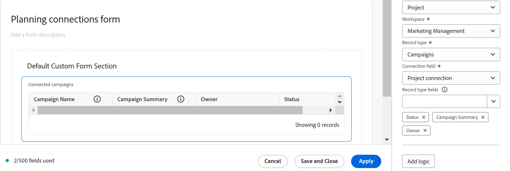

# Create a custom form

<!-- Audited: 6/2025 -->

<!--The highlighted information on this page refers to functionality not yet generally available. It is available only in the Preview environment for all customers. After the monthly releases to Production, the same features are also available in the Production environment for customers who enabled fast releases.    

For information about fast releases, see [Enable or disable fast releases for your organization](/help/quicksilver/administration-and-setup/set-up-workfront/configure-system-defaults/enable-fast-release-process.md).    -->

You can design a custom form with the form designer in Adobe Workfront. You can attach custom forms to different Workfront objects to capture data about those objects.

## Access requirements

+++ Expand to view access requirements for the functionality in this article.

<table style="table-layout:auto"> 
 <col> 
 <col> 
 <tbody> 
  <tr> 
   <td>Adobe Workfront package</td> 
   <td>
Any
</td> 
  </tr> 
  <tr> 
   <td>Adobe Workfront license</td> 
   <td>
Standard

       
Plan
</td>
  </tr> 
  <tr> 
   <td>Access level configurations</td> 
   <td> 
Administrative access to custom forms
 </td> 
  </tr>  
 </tbody> 
</table>

For information, see [Access requirements in Workfront documentation](/help/quicksilver/administration-and-setup/add-users/access-levels-and-object-permissions/access-level-requirements-in-documentation.md).

+++

## Start designing a custom form

{{step-1-to-setup}}

1. In the left panel, click **Custom Forms**, then select **Forms**.

1. Click **New Custom Form.**
1. Select which object types you'd like to attach the custom form to, then click **Continue**.

   

1. In the **Add a form name** area, type the custom form title.
1. (Optional) If you want to add more object types to the form so that it can be attached to more objects, click the **Add** icon  next to **Object Types**, then select the type you want in the menu that displays. You can repeat this to add as many object types as you want. 
   
    Once you have more than one object added to the form, you can click the X on an object type to delete it from the form. 

   >[!CAUTION]
   >
   >Deleting a custom form also deletes all custom data on the objects associated with the form. The deleted data can't be recovered. Alternatively, you can deactivate a custom form you no longer use, which will retain all of the associated historical data.
   >
   >For more information, see [Add or delete object types from an existing custom form](/help/quicksilver/administration-and-setup/customize-workfront/create-manage-custom-forms/form-designer/manage-a-form/add-or-remove-objects-from-a-form.md) and [Deactivate or reactivate a custom form](/help/quicksilver/administration-and-setup/customize-workfront/create-manage-custom-forms/form-designer/manage-a-form/activate-deactivate-form.md).

1. Next, you can start adding fields to your custom form. For more information, see the following sections:
    * [Reuse an existing field or widget already used in another custom form](#reuse-an-existing-field-or-widget-already-used-in-another-custom-form)
    * [Notes on field names and labels](#notes-on-field-names-and-labels)
    * [Add text fields](#add-text-fields)
    * [Add calculated fields](#add-calculated-fields)
    * [Add radio buttons, checkbox groups, and drop-downs](#add-radio-buttons-checkbox-groups-and-drop-downs)
    * [Add typeahead and date fields](#add-typeahead-and-date-fields)
    * [Add external lookup fields](#add-external-lookup-fields)
    * [Add images, PDFs, and videos](#add-images-pdfs-and-videos)
    * [Add Workfront native fields](#add-workfront-native-fields)
    * [Add Adobe XD files](#add-adobe-xd-files)
    * [Add Planning connection fields](#add-planning-connection-fields)

## Add new or existing fields to your custom form

You can use new or existing fields when designing your custom form.

Custom forms are limited to 500 fields. A counter on the bottom left displays how many fields are used on the form, and it's always visible as you scroll within the form designer.

### Reuse an existing field or widget already used in another custom form

1. In the upper-left side of the screen, click **Field library**.

1. Drag and drop the desired field or widget onto the canvas. Repeat this step to add any other fields or widgets.

   >[!NOTE]
   >
   >You can add up to 500 fields and widgets on a single custom form. However, performance degradation can occur when more than 100 exist on a form, depending on its complexity. 
   >
   >
   >Examples of complex forms include forms with cascading parameters, calculated custom data fields, and multiple value options in a single field.

1. To save your changes, click **Apply** and move on to another section to continue building your form.

    Or

    Click **Save and Close**. 

### Notes on field names and labels {#notes-on-field-names-and-labels}

The label is available for most fields. It's a descriptive label that appears above the field or widget on the custom form. You can change the label at any time.

>[!NOTE]
>
>Avoid using special characters in this label as they don't display correctly in reports.

A name is required for every field. This name is how the system identifies the custom field when you add it to various areas throughout Workfront, such as reports, Home, and API interactions. When you are configuring the field or widget for the first time and you type the label, the Name field populates automatically to match it. The Label and Name fields are not synchronized. This gives you the option to change the label that your users see without having to change the name that the system sees.

Each custom field name must be unique in your organization's Workfront instance. This way, you can reuse one that was already created for another custom form.

>[!NOTE]
>
>Though it's possible to do so, we recommend that you don't change this name after you or other users start using the custom form in Workfront. If you do, the system will no longer recognize the custom field where it might now be referenced in other areas of Workfront.
>For example, if you add the custom field to a report and later change its name, Workfront doesn't recognize it in the report and it will stop functioning correctly there unless you re-add it to the report using the new name.
>
>We recommend that you don't type a name that is already used for built-in Workfront fields.
>
>We recommend that you don't use the period/dot character in the custom field name to prevent errors when using the field in different areas of Workfront.

The following special characters are not supported in custom field labels and names.

* \t
* \n
* \r
* \f
* `[`
* `]`
* (
* )
* :
* `{`
* `}`

### Add text fields

 You can add several different text fields to a custom form. 

+++ Expand to see descriptions of available text fields.

* **Single line text field**: Allows users to type a single line of text in the field.
* **Paragraph field**: Allows users to type multiple lines of text in the field.
* **Text field with formatting**: Allows users to type multiple lines of text in the field and format the text with bold, italics, underline, bullets, numbering, hyperlinks, and block quotes. A character limit of 15,000 allows for plenty of text and formatting.

    This custom field type is not supported in filters on lists and reports.

    For information about accessing this field through the API, see [Rich text field storage in the API](/help/quicksilver/administration-and-setup/customize-workfront/create-manage-custom-forms/rich-text-field-storage-in-the-api.md).

    >[!NOTE]
    >
    >Text fields with formatting are not available for Workfront mobile apps (available in coming releases).

* **Descriptive text**: Allows you to include instructions and link to pages outside Workfront.

+++

To add a text field: 

1. In the **New field** tab on the left side of the screen, find one of the following text fields and drag it to a section on the canvas:

    * Single line text
    * Paragraph
    * Text with formatting
    * Descriptive text

    

1. On the right side of the screen, configure the options that are available for the type of custom field you are adding:

   <table>
    <tr>
    <td>Input into</td>
    <td>Description</td>
    <td>Available for </td>
    </tr>
    <tr>
    <td>Size</td>
    <td>
(Optional) Change the size of the text fields on the form.

   </td>
    <td><ul>
    <li>Single line text</li>
    <li>Paragraph</li>
    <li>Text with formatting</li>
    <li>Descriptive text</li>
    </ul></td>
    </tr>
    <tr>
    <td>Label</td>
    <td>
(Required) Type a descriptive label to display above the field. You can change the label at any time.

    
<b>Important</b>: Avoid using special characters in this label as they don't display correctly in reports. For more information, see <a href="design-a-form.md#notes-on-field-names-and-labels">Notes on field names and labels</a>.
</td>
    <td><ul>
    <li>Single line text</li>
    <li>Paragraph</li>
    <li>Text with formatting</li>
    </ul></td>
    </tr>
    <tr>
     <td>Name</td>
    <td>
(Required) This name is how the system identifies the field. When you are configuring the widget for the first time and you type the label, the Name field populates automatically to match it. The Label and Name fields are not synchronized. This gives you the option to change the label that your users see without having to change the name that the system sees.

    
For more information, see <a href="design-a-form.md#notes-on-field-names-and-labels">Notes on field names and labels</a>.

    </td>
    <td><ul>
    <li>Single line text</li>
    <li>Paragraph</li>
    <li>Text with formatting</li>
    <li>Descriptive text</li>
    </ul></td>
    </tr>
    <tr>
    <td>Instructions</td>
    <td>Type any additional information about the field. When users fill out the custom form, they can hover over the question mark icon to view a tooltip containing the information you type here.
    
    </td>
    <td><ul>
    <li>Single line text</li>
    <li>Paragraph</li>
    <li>Text with formatting</li>
    </ul></td>
    </tr>
    <tr>
    <td>Format</td>
    <td>
Select the type of data that will be captured in the custom field.
 
<b>Note</b>:   
    <ul> 
    <li>This field can't be edited after the form is saved. If you intend to use your field in mathematical calculations, ensure that you select a Number or Currency format.</li> 
    <li>When you select Number or Currency, the system automatically truncates numbers that start with 0.</li>
    <li>The character limit for Number fields is 16. You can also use a Text field to enter numbers and avoid the limit.</li>
     </ul>
</td> </td>
    <td><ul>
    <li>Single line text</li>
    <li>Paragraph</li>
    </ul></td>
    </tr>
    <tr>
    <td>Display Type</td>
    <td>Switch between single line and paragraph text fields.</td>
    <td><ul>
    <li>Single line text</li>
    <li>Paragraph</li>
    </ul></td>
    </tr>
    <tr>
    <td>Hyperlink</td>
    <td> If you want to apply a hyperlink to the Descriptive Text you have typed, add it here. The Descriptive text displays as a link on objects where the form is attached.</td>
    <td><ul><li>Descriptive text</li></ul></td>
    </tr>
    <tr> 
      <td role="rowheader">Make a required field</td>
      <td>
Select this option if you want the field to be required in order for the user to complete the custom form.
</td>
    <td><ul>
    <li>Single line text</li>
    <li>Paragraph</li>
    <li>Text with formatting</li>
    </ul></td> 
    </tr> 
   </table>

1. (Optional) Repeat the previous step to add any other fields or widgets. 

    Or

    To copy a field, hover over a field, and click the copy icon.

    

1. To save your changes, click **Apply** and move on to another section to continue building your form.

    Or

    Click **Save and Close**. 

### Add calculated fields

 In a custom form, you can add a calculated custom field that uses existing data to generate new data when the custom form is attached to an object. 

To add a calculated field, see [Add calculated fields with the form designer](/help/quicksilver/administration-and-setup/customize-workfront/create-manage-custom-forms/form-designer/design-a-form/add-a-calculated-field.md).

### Add radio buttons, checkbox groups, and drop-downs

 You can add radio buttons, checkbox groups, drop-downs, and multi-select drop-downs to a custom form.

+++ Expand to see descriptions of available fields.

* **Radio buttons**: Requires users to select only one choice.
* **Checkbox group**: Allows users to select multiple choices.
* **Single-select dropdown**: Provides a list of drop-down choices.
* **Multi-select dropdown**: Allows users to select multiple choices from a drop-down list.

+++

>[!NOTE]
>
>Fields that allow multiple selections, such as the Checkbox Group and Multi-Select Dropdown, are difficult to chart and group in reports. To allow easier charting and grouping in reports, you can create separate fields for each choice (e.g. a single-line text field).

To add radio buttons, checkbox groups, and drop-downs:

1. In the **New field** tab on the left side of the screen, find one of the following fields and drag it to a section on the canvas:

    * Radio buttons
    * Checkbox group
    * Single-select dropdown
    * Multi-select dropdown

    

1. On the right side of the screen, configure the options that are available for the type of custom field you are adding:

    <table style="table-layout:auto"> 
    <tbody> 
    <tr>
    <td>Input into</td>
    <td>Description</td>
    <td>Available for </td>
    </tr>
    <tr> 
     <td role="rowheader">Label</td> 
     <td> 
(Required) Type a descriptive label to display above the custom field. You can change the label at any time.
 
<b>Important</b>: Avoid using special characters in this label as they don't display correctly in reports. For more information, see <a href="design-a-form.md#notes-on-field-names-and-labels">Notes on field names and labels</a>.
 </td> 
     <td><ul>
    <li>Radio buttons</li>
    <li>Checkbox group</li>
    <li>Single-select dropdown</li>
    <li>Multi-select dropdown</li>
    </ul></td>
     </tr> 
     <tr> 
    <td role="rowheader">Name</td> 
     <td> 
(Required) This name is how the system identifies the field. When you are configuring the widget for the first time and you type the label, the Name field populates automatically to match it. The Label and Name fields are not synchronized. This gives you the option to change the label that your users see without having to change the name that the system sees.
 
    
For more information, see <a href="design-a-form.md#notes-on-field-names-and-labels">Notes on field names and labels</a>.
 </td>
     <td><ul>
    <li>Radio buttons</li>
    <li>Checkbox group</li>
    <li>Single-select dropdown</li>
    <li>Multi-select dropdown</li>
    </ul></td>
    </tr> 
    <tr> 
    <td role="rowheader">Instructions</td> 
    <td> 
Type any additional information about the custom field. When users fill out the custom form, they can hover over the question mark icon to view a tooltip containing the information you type here.
 
    
   

    </td> 
    <td><ul>
    <li>Radio buttons</li>
    <li>Checkbox group</li>
    <li>Single-select dropdown</li>
    <li>Multi-select dropdown</li>
    </ul></td>
    </tr> 
    <tr> 
    <td role="rowheader">Format</td> 
    <td> 
Select the type of data that will be captured in the custom field.
 
<b>Note</b>:   
     <ul> 
    <li>This field can't be edited after the form is saved. If you intend to use your field in mathematical calculations, ensure that you select a Number or Currency format. </li> 
    <li>When you select Number or Currency, the system automatically truncates numbers that start with 0.</li>
    <li>The character limit for Number fields is 16. You can also use a Text field to enter numbers and avoid the limit.</li>
     </ul>
</td> 
     <td><ul>
    <li>Radio buttons</li>
    <li>Checkbox group</li>
    <li>Single-select dropdown</li>
    <li>Multi-select dropdown</li>
    </ul></td>
    </tr> 
    <tr> 
     <td role="rowheader">Display Type</td> 
    <td>Switch between radio buttons, checkbox group, single-select drop-down, or multi-select drop-down for the field.</td> 
    <td><ul>
    <li>Radio buttons</li>
    <li>Checkbox group</li>
    <li>Single-select dropdown</li>
    <li>Multi-select dropdown</li>
    </ul></td>
    </tr> 
    <td role="rowheader">Choices </td> 
    <td> 
    
Select any of the following options:
 
    <ul> 
    <li><strong>Show Values</strong>: Shows the values of each choice in the field. The label of each choice shows by default.</li>
   <li><strong>Sort Choices A-Z</strong>: Sorts the choices you add alphabetically in the field.</li>
    </ul>
     
For each choice you add for the user, click the gear icon , then select one of the following options:
 
    <ul> 
    <li><strong>Select by Default</strong>: Select the choice by default in the field.</li> 
    <li> 
<strong>Hide Choice</strong>: Hide the choice in the field. Hidden choices remain accessible in reports.
 </li> 
    <li> 
<strong>Remove Choice</strong>: Remove the choice from the field.
 
<b>Warning</b>:  If you have current objects using this choice, do not remove it from the field. Removing it will cause historic data to be lost. Instead, select the option to hide it, which prevents users from selecting it in the future.
 </li> 
    </ul>   
    
<b>Note:</b> There is no limit for how many choices you can select. 
    
    </td> 
    <td><ul>
    <li>Radio buttons</li>
    <li>Checkbox group</li>
    <li>Single-select dropdown</li>
    <li>Multi-select dropdown</li>
    </ul>
    </td>
     </tr> 
          <tr> 
    <td role="rowheader">Make a required field</td> 
    <td>Select this option if you want the field to be required in order for the user to complete the custom form. </td> 
    <td><ul>
    <li>Radio buttons</li>
    <li>Checkbox group</li>
    <li>Single-select dropdown</li>
    <li>Multi-select dropdown</li>
    </ul></td>
     </tr> 
    <tr> 
    </tbody> 
    </table>

1. (Optional) Repeat the previous step to add any other fields or widgets. 

    Or

    To copy a field, hover over a field, and click the copy icon.
    
    

1. To save your changes, click **Apply** and move on to another section to continue building your form.

    Or

    Click **Save and Close**.

### Add typeahead and date fields

 You can add typeahead and date fields to a custom form.

+++ Expand to see descriptions of available fields.

* **Typeahead**: Allows users to type the name of an object that exists in Workfront. A list of suggestions appears when the user starts typing. This field type supports the following objects:
    * User
    * Group
    * Job Role
    * Portfolio
    * Program
    * Project
    * Team
    * Template
    * Company
* **Date**: Displays a calendar where users can select a date and time.

+++

To add typeahead and date fields:

1. In the **New field** tab on the left side of the screen, find one of the following fields and drag it to a section on the canvas.

    * Typeahead
    * Date

    

1. On the right side of the screen, configure the options that are available for the type of custom field you are adding:

    <table style="table-layout:auto"> 
    <tbody> 
     <tr>
    <td>Field setting</td>
    <td>Description</td>
    <td>Available for </td>
    </tr>
     <tr> 
      <td role="rowheader">Label</td> 
      <td> 
(Required) Type a descriptive label to display above the custom field. You can change the label at any time.
 
<b>Important</b>: Avoid using special characters in this label as they don't display correctly in reports. For more information, see <a href="design-a-form.md#notes-on-field-names-and-labels">Notes on field names and labels</a>.
 </td> 
       <td><ul>
    <li>Typeahead</li>
    <li>Date</li>
    </ul></td>
     </tr> 
     <tr> 
      <td role="rowheader">Name</td> 
      <td> 
(Required) This name is how the system identifies the field. When you are configuring the widget for the first time and you type the label, the Name field populates automatically to match it. The Label and Name fields are not synchronized. This gives you the option to change the label that your users see without having to change the name that the system sees.
 
      
For more information, see <a href="design-a-form.md#notes-on-field-names-and-labels">Notes on field names and labels</a>.
 </td>
    <td><ul>
    <li>Typeahead</li>
    <li>Date</li>
    </ul></td>
     </tr> 
     <tr> 
      <td role="rowheader">Instructions</td> 
      <td> 
Type any additional information about the custom field. When users fill out the custom form, they can hover over the question mark icon to view a tooltip containing the information you type here.
 
      
  

      </td> 
         <td><ul>
    <li>Typeahead</li>
    <li>Date</li>
    </ul></td>
     </tr> 
     <tr> 
      <td role="rowheader">Display Time of Day</td> 
      <td>Select this option if you want to show the time of day along with the date in the field.</td> 
         <td><ul>
    <li>Date</li>
    </ul></td>
     </tr> 
     <tr> 
      <td role="rowheader">Referenced Object Type</td> 
      <td> 
Select the object type that you want to associate with the field.
 
Once you have clicked <b>Apply</b> or <b>Save and Close</b>, you can't change the object type for the field.
 
<b>Note</b>:   
        <ul> 
         <li>If your Workfront administrator customized the name for Portfolios, Programs, or Projects in the Workfront user interface, the default Workfront name for the object appears in this drop-down list, not the customized name. See your Workfront administrator if you need help with this. </li> 
         <li>The following object types are supported in the iOS and Android Workfront Mobile Apps: User, Company, Group, Job Role, Portfolio, Program, Project, and Template.</li> 
        </ul> 
 </td> 
         <td><ul>
    <li>Typeahead</li>
    </ul></td>
     </tr>
     <tr>
      <td role="rowheader">Add Filter</td>
      <td>
Add a filter for an object type to limit the objects users can choose when they are using the field. 
 
For example, you could limit a field so that usernames can be selected only if they meet the following criteria:
 
       <ul> 
        <li>They belong to a group or groups that you specify.</li> 
        <li>They are associated with a role or job title you specify.</li> 
        <li>They belong to the same group as the person using the field.</li> 
       </ul>
       
You must define the filter for the object type you selected using Text Mode syntax. For information about creating a filter using Text Mode, see <a href="/help/quicksilver/reports-and-dashboards/reports/text-mode/edit-text-mode-in-filter.md">Edit a filter using text mode</a>.

       
<b>Tip:</b> You can create a report to test your filter before adding the filter directly to the typeahead field. This will help you verify that the filter returns the correct objects. Then you can switch to text mode in the report, copy the text mode statement, and add it to the typeahead filter.

       
<b>Note</b>:
       <ul> 
        <li>If you are editing an existing custom form, adding a filter to a typeahead field does not remove any objects (outside the scope of the filter) that users have already added using the field.</li> 
        <li>This filter is not available on mobile devices. If you use the filter for a typeahead field, the field will appear on users' mobile devices unaffected by the filter.</li> 
        </ul>
</td> 
      <td>
       <ul>
       <li>Typeahead</li>
       </ul>
      </td>
     </tr>
     <tr> 
      <td role="rowheader">Make a required field</td> 
      <td>Select this option if you want the field to be required in order for the user to complete the custom form. </td> 
       <td><ul>
    <li>Typeahead</li>
    <li>Date</li>
    </ul></td>
     </tr> 
    </tbody> 
   </table>

1. (Optional) Repeat the previous step to add any other fields or widgets. 

    Or

    To copy a field, hover over a field, and click the copy icon.

    

1. To save your changes, click **Apply** and move on to another section to continue building your form.

    Or

    Click **Save and Close**.

### Add external lookup fields

An external lookup field calls an external API and returns values as options in a drop-down field. Users who work with the object the custom form is attached to can select one or more of these options from the drop-down, depending on whether the external lookup field is a single or multi-select field. The external lookup fields are also available in lists and reports.

For examples of using the External lookup field to call the same instance of Workfront or a public API, see [Examples of the External lookup field in a custom form](/help/quicksilver/administration-and-setup/customize-workfront/create-manage-custom-forms/form-designer/design-a-form/external-lookup-examples.md).

>[!NOTE]
>
>* External lookup fields are not supported in the Outlook plug-in.
>* External lookup fields are not available in lists when the field has a dependency on another field.

To add an external lookup:

1. In the **New field** tab on the left side of the screen, find **External lookup** or **Multi-select external lookup**, and drag it to a section on the canvas.
1. On the right side of the screen, configure the options for the custom field:

   <table style="table-layout:auto"> 
    <col> 
    <col> 
    <tbody> 
     <tr> 
      <td role="rowheader">Label</td> 
      <td> 
(Required) Type a descriptive label to display above the custom field. You can change the label at any time.
 
<b>Important</b>: Avoid using special characters in this label as they don't display correctly in reports. For more information, see <a href="design-a-form.md#notes-on-field-names-and-labels">Notes on field names and labels</a>.
 </td> 
     </tr> 
     <tr> 
      <td role="rowheader">Name</td> 
      <td> 
(Required) This name is how the system identifies the field. When you are configuring the widget for the first time and you type the label, the Name field populates automatically to match it. But the Label and Name fields are not synchronized—this gives you the option to change the label that your users see without having to change the name that the system sees.

      
For more information, see <a href="design-a-form.md#notes-on-field-names-and-labels">Notes on field names and labels</a>.
 </td>
     </tr> 
      <td role="rowheader">Instructions</td> 
      <td> 
Type any additional information about the custom field. When users fill out the custom form, they can hover over the question mark icon to view a tooltip containing the information you type here.
 </td> 
     </tr> 
     <tr> 
      <td role="rowheader">Format</td>
      <td>
Select the type of data that will be captured in the custom field.

      
<strong>Note:</strong>

      <ul><li>You can change the format type after the form is saved, with one limitation: All existing values on objects must be able to be converted to the new type. (For example, if the format type is Text, and an object is storing the value "abc," you cannot convert the field and will get an error that the system cannot convert "abc" to number/currency.) If you intend to use your field in mathematical calculations, ensure that you select a Number or Currency format.</li>
      <li>When you select Number or Currency, the system automatically truncates numbers that start with 0.</li>
      <li>The character limit for Number fields is 16. You can also use a Text field to enter numbers and avoid the limit.</li>
      </ul></td>
     </tr> 
     <tr> 
      <td role="rowheader">Base API URL</td> 
      <td>
Type or paste the URL for the API.

The API URL must return a JSON content of the options that you would like to show in the drop-down. You can use the JSON Path field to select the specific values from the returned JSON to be drop-down options.

When entering the API URL, you can optionally pass the following values in the URL:

      <ul>
      <li>$$HOST - This represents the current Workfront host and can be used to make/search API calls to the Workfront API. When this wildcard is used, the authentication is handled and users don't need to send authentication headers. (For example, users can search tasks using the base URL <code>$$HOST/attask/api/task/search</code> and it will allow searching tasks and selecting values from a returned list of tasks.)</li>
      <li>
$$QUERY - This represents the search text that the end user types in the field and allows you to implement query filtering for your end users. (The user will search for the value in the drop-down.)

      
If the API you are referencing allows it, you can also include modifiers in your search query to identify how the search should work. For example, you can use the following as the Base API URL to allow people to search for any Workfront projects that contain specific text: <code>$$HOST/attask/api/v15.0/proj/search?name=$$QUERY&name_Mod=contains</code>.

Learn more about the Workfront search modifiers in <a href="/help/quicksilver/wf-api/general/api-basics.md">API Basics</a>.

      
<strong>Note:</strong> If you are not using $$QUERY and the user types text in the search box, it will narrow down the choices you already have. However, if you use $$QUERY and the user types anything, a new network call to your API is performed. Therefore, if you have more than 2000 values in your API, and the API supports querying, you can utilize $$QUERY to not only search from the existing 2000 values, but from the original API with the narrowed down options.
</li>
      <li>
{fieldName} - Where fieldName is any custom or native field in Workfront. This way you can implement cascading drop-down option filters, when you pass the value of an already selected field to the External lookup field to filter down options. (For example, the Region field already exists on the form and you are narrowing a list of countries from the API to those that are in a specific region.)

      
For an external lookup field that has a dependency on other fields (using the {fieldName} syntax), the options returned from the API are limited to those that match any strings or values entered in the other fields. (This functionality is not supported in lists and reports.)
</li>
      <li>{referenceObject}.{fieldName} – Where the field is part of an object. This syntax is similar to custom expressions. (For example, portfolioID={project}.{portfolioID})</li></ul>
      
<strong>Tip:</strong> Review the documentation for the API you are working with for the specific queries you can define.
</td>
     </tr>
     <tr> 
      <td role="rowheader">HTTP Method</td> 
      <td>Select <strong>Get</strong>, <strong>Post</strong>, or <strong>Put</strong> for the method.</td> 
     </tr>
     <tr> 
      <td role="rowheader">JSON Path</td>
      <td>
Type or paste the JSON path for the API.
 
This option allows extracting data from the JSON returned by the API URL. It serves as a way to select which values from inside the JSON will appear in the drop-down options.

For example, if your API URL returns JSON in the following format, then you can use "$.data[*].name" to select USA and Canada as drop-down options: 
      <pre>
      {
       data: {
         { name: "USA"},
         { name: "Canada"}
       }
      }
      </pre>
      

     
For more information about the JSON Path and ensuring you write the correct JSON Path, refer to <a href="https://jsonpath.com/">https://jsonpath.com/</a>.
</td>
     </tr>
     <tr> 
      <td role="rowheader">Headers</td>
      <td>
Click <strong>Add Header</strong>, then type or paste the key-value pair required for authentication with the API.

<strong>Note:</strong> The Header fields are not a secure place to store credentials, and you should be careful of what you enter and save.
</td>
     </tr>
     <tr> 
      <td role="rowheader">Multi-select dropdown</td>
      <td>
Select this option to allow the user to select more than one value in the drop-down.
</td>
     </tr>
     </tr>
     <tr> 
      <td role="rowheader">Make a required field</td>
      <td>
Select this option if you want the field to be required in order for the user to complete the custom form.
</td>
     </tr>       
    </tbody>
   </table>

1. To save your changes, click **Apply** and move on to another section to continue building your form.

    Or

    Click **Save and Close**.

>[!NOTE]
>
>The following items are technical limitations of the call to the external API:
>
>* Maximum number of options: 2000 (only the first 2000 unique options from the returned JSON are displayed)
>* Timeout: 30 seconds
>* Number of retries: 3
>* Wait duration between retries: 500ms
>* Expected response statuses: 2xx

### Add images, PDFs, and videos

 You can add images, PDFs, and videos to a custom form. Users who work with the object the custom form is attached to can see the image, PDF, or video only in the following areas:

* The object's Details area (for example, for a project, the Project Details area).
* The Edit box for the object, if it has the new Adobe Workfront experience look and feel (for example, the Edit Project and Edit Task boxes).

<!-- Do we need to tell them where they can't see it if we tell them where they can see it?
Currently, users cannot see the widget in the following areas:​
Lists and reports
Home and Summary
The Edit box for the object, if it doesn't have the new Adobe Workfront experience look and feel (for example, the Edit Expense box)
The Workfront Mobile app -->

 +++ Expand to see descriptions of available fields.

* **Image**: Allows users to add image files.
* **PDF**: Allows users to add PDFs
* **Videos**: Allows users to add video files.

+++

 To add images, PDFs, or videos:

1. In the **New field** tab on the left side of the screen, find one of the following fields and drag it to a section on the canvas.

   * Image
   * PDF
   * Video

   

1. Type or edit any of the following properties for the widget:

   <table style="table-layout:auto"> 
    <col> 
    <col> 
    <tbody> 
         <tr> 
      <td role="rowheader">Size</td> 
      <td>(Optional) Change the display size of the widget as needed.</td> 
     </tr> 
     <tr> 
      <td role="rowheader">Label</td> 
      <td> 
(Required) Type a descriptive label to display above the widget. You can change the label at any time.
 
<b>Important</b>: Avoid using special characters in this label as they don't display correctly in reports. For more information, see <a href="design-a-form.md#notes-on-field-names-and-labels">Notes on field names and labels</a>.
 </td> 
     </tr> 
     <tr> 
      <td role="rowheader">Name</td> 
      <td> 
(Required) This name is how the system identifies the widget. When you are configuring the widget for the first time and you type the label, the Name field populates automatically to match it. The Label and Name fields are not synchronized. This gives you the option to change the label that your users see without having to change the name that the system sees.
 
For more information, see <a href="design-a-form.md#notes-on-field-names-and-labels">Notes on field names and labels</a>.
 </td> 
     </tr> 
     <tr> 
      <td role="rowheader">URL</td> 
      <td> 
(Required) Type or paste the URL of the widget where it is stored on the internet.
 
      
If you are adding a video widget, currently you can do so by adding the following in the URL box:
 
      <ul> 
      <li> 
YouTube or Vimeo link
 </li> 
      <li> 
Google Drive video link
 </li> 
      <li> 
Link to video with MP4 and MOV extension
 </li> 
      <li> 
Link to video already uploaded to the Documents area in your Workfront instance. For instructions, see <a href="#add-a-video-widget-to-a-custom-form-from-the-documents-area" class="MCXref xref">Add a video widget to a custom form from the Documents area</a> in this article.
 </li> 
      </ul> 
       </td> 
     </tr> 
     <tr> 
      <td role="rowheader">Instructions</td> 
      <td> 
Type any additional information about the widget. When users fill out the custom form, they can hover over the question mark icon to view a tooltip containing the information you type here.
 </td> 
     </tr> 
    </tbody> 
   </table>

   >[!NOTE]
   >For PDFs, it is recommended to use Large for the widget display size.
   >A browser's PDF viewer affects the display for users, and they might need to adjust their window size and browser zoom percentage if the PDF display is not optimal.

1. (Optional) Repeat the previous step to add any other fields or widgets. 

    Or

    To copy a field, hover over a field, and click the copy icon.

    

1. To save your changes, click **Apply** and move on to another section to continue building your form.

    Or

    Click **Save and Close**. 

#### Add a video to a custom form from the Documents area{#add-a-video-widget-to-a-custom-form-from-the-documents-area}

>[!IMPORTANT]
>
>When you add a video to a custom form this way, the permissions set in the Documents area apply to the video when users access the form on an object.

1. Go to the video in the Documents area and generate a proof for it, as described in [Create an interactive proof for a website or other web content](/help/quicksilver/review-and-approve-work/proofing/creating-proofs-within-workfront/generate-interactive-proof-for-website-or-other-web-content.md).
1. Open the proof.
1. Right-click anywhere on the video, then select **Copy Video Address**.
1. In the custom form where you are adding the video widget, paste the copied address in the **URL** box.
1. To save your changes, click **Apply** and move on to another section to continue building your form.

    Or

    Click **Save and Close**.

### Add Workfront native fields

You can add Workfront native fields to your custom forms. When the custom form is attached to an object, the field is populated from the object data. For example, the Description field on a custom form attached to a project will pull in the project description. (The field may show "N/A" if no data is available.)

+++ Expand to see the list of supported native fields.

This table lists the available native fields for specific Workfront objects in a custom form.

| Field name                 | Project | Task   | Issue  | Template | Template Task | Portfolio | Program | Group |
|--------------------------- |-------- |------- |------- |--------- |-------------- | --------- |-------- |------ |
| Actual Completion Date     | ✓       | ✓     | ✓      | &nbsp;   | &nbsp;        | &nbsp;    | &nbsp;  | &nbsp;|
| Actual Duration            | ✓       | &nbsp; | &nbsp; | &nbsp;   | &nbsp;        | &nbsp;    | &nbsp;  | &nbsp;|
| Actual Hours               | ✓       | &nbsp; | ✓      | &nbsp;   | &nbsp;        | &nbsp;    | &nbsp;  | &nbsp;|
| Actual Start Date          | ✓       | ✓      | ✓      | &nbsp;   | &nbsp;        | &nbsp;    | &nbsp;  | &nbsp;|
| Company                    | ✓       | &nbsp; | &nbsp; | ✓        | &nbsp;        | &nbsp;    | &nbsp;  | &nbsp;|
| Condition                  | ✓       | ✓      | ✓     | &nbsp;   | &nbsp;        | &nbsp;    | &nbsp;  | &nbsp;|
| Condition Type             | ✓       | &nbsp; | &nbsp; | ✓        | &nbsp;        | &nbsp;    | &nbsp;  | &nbsp;|
| Description                | ✓       | ✓      | ✓     | ✓        | ✓             | ✓        | ✓       | ✓     |
| Duration                   | &nbsp;   | ✓     | &nbsp; | &nbsp;   | ✓             | &nbsp;    | &nbsp;  | &nbsp;|
| Duration Type              | &nbsp;   | ✓     | &nbsp; | &nbsp;   | ✓             | &nbsp;    | &nbsp;  | &nbsp;|
| Duration Unit              | &nbsp;   | ✓     | &nbsp; | &nbsp;   | ✓             | &nbsp;    | &nbsp;  | &nbsp;|
| Entered By                 | ✓       | ✓      | ✓     | ✓        | ✓             | &nbsp;    | &nbsp;  | ✓     |
| Entry Date                 | ✓       | ✓      | ✓     | ✓        | ✓             | &nbsp;    | &nbsp;  | ✓     |
| Group                      | ✓       | &nbsp; | &nbsp; | ✓        | &nbsp;        | ✓        | ✓       | &nbsp; |
| Last Updated By            | ✓       | ✓      | ✓     | ✓        | ✓             | &nbsp;    | &nbsp;  | &nbsp; |
| Last Update Date           | ✓       | ✓      | ✓     | ✓        | ✓             | &nbsp;    | &nbsp;  | &nbsp; |
| Name                       | ✓       | ✓      | ✓     | ✓        | ✓             | ✓        | ✓       | ✓     |
| Owner                      | ✓       | &nbsp; | &nbsp; | ✓        | &nbsp;        | ✓        | ✓       | &nbsp; |
| Planned Completion Date    | ✓       | ✓      | ✓      | &nbsp;   | &nbsp;        | &nbsp;    | &nbsp;  | &nbsp;|
| Planned Duration           | ✓       | &nbsp; | &nbsp; | ✓        | &nbsp;        | &nbsp;    | &nbsp;  | &nbsp;|
| Planned Hours              | ✓       | ✓      | ✓      | &nbsp;   | ✓            | &nbsp;    | &nbsp;  | &nbsp;|
| Planned Start Date         | ✓       | &nbsp; | &nbsp; | &nbsp;    | &nbsp;        | &nbsp;    | &nbsp;  | &nbsp;|
| Portfolio                  | ✓       | &nbsp; | &nbsp; | ✓        | &nbsp;        | &nbsp;    | ✓       | &nbsp; |
| Priority                   | ✓       | ✓      | ✓     | ✓        | ✓             | &nbsp;    | &nbsp;  | &nbsp; |
| Program                    | ✓       | &nbsp; | &nbsp; | ✓        | &nbsp;        | &nbsp;    | &nbsp;  | &nbsp;|
| Projected Completion Date  | ✓       | ✓     | &nbsp;  | &nbsp;   | &nbsp;        | &nbsp;    | &nbsp;  | &nbsp;|
| Projected Duration Minutes | &nbsp;   | ✓     | &nbsp; | &nbsp;   | &nbsp;        | &nbsp;    | &nbsp;  | &nbsp;|
| Projected Start Date       | ✓       | ✓     | &nbsp;  | &nbsp;   | &nbsp;        | &nbsp;    | &nbsp;  | &nbsp;|
| Reference Number           | ✓       | ✓      | ✓     | ✓        | ✓             | &nbsp;    | &nbsp;  | &nbsp; |
| Schedule Mode              | ✓       | &nbsp; | &nbsp; | ✓        | &nbsp;        | &nbsp;    | &nbsp;  | &nbsp;|
| Severity                   | &nbsp;   | &nbsp; | ✓     | &nbsp;   | &nbsp;        | &nbsp;    | &nbsp;  | &nbsp;|
| Sponsor                    | ✓       | &nbsp; | &nbsp; | ✓        | &nbsp;        | &nbsp;    | &nbsp;  | &nbsp;|
| Status                     | ✓       | ✓     | &nbsp;  | &nbsp;   | &nbsp;        | &nbsp;    | &nbsp;  | &nbsp;|
| Story Points               | &nbsp;   | ✓     | &nbsp; | &nbsp;   | &nbsp;        | &nbsp;    | &nbsp;  | &nbsp;|
| Template                   | ✓       | &nbsp; | &nbsp;  | &nbsp;   | &nbsp;        | &nbsp;    | &nbsp;  | &nbsp;|
| URL                        | ✓       | ✓     | &nbsp;  | ✓        | ✓             | &nbsp;    | &nbsp;  | &nbsp;|

{style="table-layout:auto"}

+++

1. In the **New field** tab on the left side of the screen, find **Native field reference** and drag it to a section on the canvas.
1. On the right side of the screen, configure the options for the custom field:

   <table style="table-layout:auto"> 
    <col> 
    <col> 
    <tbody> 
         <tr> 
      <td role="rowheader">Size</td> 
      <td>(Optional) Change the display size of the field as needed.</td> 
     </tr> 
     <tr> 
      <td role="rowheader">Label</td> 
      <td> 
(Required) Type a descriptive label to display above the field. You can change the label at any time.
 
<b>Important</b>: Avoid using special characters in this label as they don't display correctly in reports. For more information, see <a href="design-a-form.md#notes-on-field-names-and-labels">Notes on field names and labels</a>.
 </td> 
     </tr> 
     <tr> 
      <td role="rowheader">Name</td>
      <td> 
(Required) This name is how the system identifies the field. When you are configuring the field for the first time and you type the label, the Name field populates automatically to match it. The Label and Name fields are not synchronized. This gives you the option to change the label that your users see without having to change the name that the system sees.

      
For more information, see <a href="design-a-form.md#notes-on-field-names-and-labels">Notes on field names and labels</a>.
</td> 
     </tr> 
     <tr> 
      <td role="rowheader">Instructions</td> 
      <td> 
Type any additional information about the field. When users fill out the custom form, they can hover over the question mark icon to view a tooltip containing the information you type here.</td> 
     </tr> 
     <tr> 
      <td role="rowheader">Reference Field</td> 
      <td>
(Required) Select a Workfront native field.

Only native fields for the form's objects are available. For example, if the Object Types list at the top of the form designer shows Project, you will be able to select native fields for projects but not fields that are specific to tasks.
</td>
     </tr>
     <tr>
      <td role="rowheader">Add Filter</td>
      <td>
Add a filter for the reference field to limit the list of items users can choose from when they are using the field. 
 
For example, you could limit a field so that usernames can be selected only if they meet the following criteria:
 
       <ul>
        <li>They belong to a group or groups that you specify.</li> 
        <li>They are associated with a role or job title you specify.</li> 
        <li>They belong to the same group as the person using the field.</li> 
       </ul>
       
You must define the filter for the reference field you selected using Text Mode syntax. For information, see <a href="/help/quicksilver/reports-and-dashboards/reports/text-mode/edit-text-mode-in-filter.md">Edit a filter using text mode</a>.

       
<b>Note</b>:
       <ul> 
        <li>The filter option is only available when you reference a native typeahead field, such as Portfolio, Company, or Owner.</li>
        <li>If you are editing an existing custom form, adding a filter to a native field doesn't remove any objects (outside the scope of the filter) that users have already added using the field.</li> 
        <li>This filter isn't available on mobile devices. If you use the filter for a native field, the field will appear on users' mobile devices unaffected by the filter.</li> 
        </ul>
</td> 
      <td>
     </tr>
     <tr> 
      <td role="rowheader">Make a required field</td>
      <td>
Select this option if you want the field to be required in order for the user to complete the custom form.
</td>
     </tr> 
    </tbody> 
   </table>

1. To save your changes, click **Apply** and move on to another section to continue building your form.

    Or

    Click **Save and Close**.

### Add Adobe XD files

 You can add an Adobe XD prototype directly to a custom form. Users who work with the object the custom form is attached to can see the Adobe XD file only in the following areas:

* The object's Details area (for example, for a project, the Project Details area)
* The Edit box for the object, if it has the new Adobe Workfront experience look and feel (for example, the Edit Project and Edit Task boxes)

 To add an Adobe XD file:

1. In the **New field** tab on the left side of the screen, find **Adobe XD** and drag it to a section on the canvas. 
1. Type or edit any of the following properties for the widget:

   <table style="table-layout:auto"> 
    <col> 
    <col> 
    <tbody> 
         <tr> 
      <td role="rowheader">Size</td> 
      <td>(Optional) Change the display size of the widget as needed.</td> 
     </tr> 
     <tr> 
      <td role="rowheader">Label</td> 
      <td> 
(Required) Type a descriptive label to display above the widget. You can change the label at any time.
 
<b>Important</b>: Avoid using special characters in this label as they don't display correctly in reports. For more information, see <a href="design-a-form.md#notes-on-field-names-and-labels">Notes on field names and labels</a>.
 </td> 
     </tr> 
     <tr> 
      <td role="rowheader">Name</td> 
      <td> 
(Required) This name is how the system identifies the widget. When you are configuring the widget for the first time and you type the label, the Name field populates automatically to match it. The Label and Name fields are not synchronized. This gives you the option to change the label that your users see without having to change the name that the system sees.

    
For more information, see <a href="design-a-form.md#notes-on-field-names-and-labels">Notes on field names and labels</a>.
</td> 
     </tr> 
     <tr> 
      <td role="rowheader">URL</td> 
      <td> 
(Required) Type or paste a valid XD prototype link.
 
      
<b>Note</b>: The Link Access setting on the Share tab in Adobe XD must be set to Anyone with the link. Otherwise, users will not be able to view the prototype. 
   </td> 
     </tr> 
     <tr> 
      <td role="rowheader">Instructions</td> 
      <td> 
Type any additional information about the widget. When users fill out the custom form, they can hover over the question mark icon to view a tooltip containing the information you type here.
    
 </td> 
     </tr> 
    </tbody> 
   </table>

1. (Optional) Repeat the previous step to add any other fields or widgets. 

    Or

    To copy a field, hover over a field, and click the copy icon.

    

1. To save your changes, click **Apply** and move on to another section to continue building your form.

    Or

    Click **Save and Close**.

### Add Planning connection fields

>[!IMPORTANT]
>
>The information in this section refers to Adobe Workfront Planning, an additional capability from Adobe Workfront. 
>
>You must have the following to access Workfront Planning:
>
>* A new Workfront plan and license. Workfront Planning is not available for legacy Workfront plans or licenses. 
>* An additional package for Workfront Planning. 
>* Your organization's instance of Workfront must be onboarded to the Adobe Unified Experience.
>
> For a complete list of requirements to access Workfront Planning, see [Adobe Workfront Planning access overview](/help/quicksilver/planning/access/access-overview.md). 
> 
>For more information about Workfront Planning, see [Adobe Workfront Planning overview](/help/quicksilver/planning/general/planning-overview.md).

You can view records connected from Workfront Planning in a custom field on a Workfront object by adding a  Planning connection custom field to an object's custom form. 

You can add the Planning connection field to all objects' custom forms. However, you can display connected records only on the custom forms associated with Workfront objects that can be connected from Workfront Planning. 

>[!NOTE]
>
>Users viewing information in the custom field must have access to Workfront Planning and to the workspaces that contain the record types connected to Workfront objects.

To add a Planning connection field:

1. In the **New field** tab on the left side of the screen, find **Planning connection** and drag it to a section on the canvas. 
1. On the right side of the screen, configure the options for the custom field:

   <table style="table-layout:auto"> 
    <col> 
    <col> 
    <tbody> 
    <tr> 
      <td role="rowheader">Size</td> 
      <td>(Optional) Change the display size of the widget as needed.</td> 
     </tr> 
     <tr> 
      <td role="rowheader">Label</td> 
      <td> 
(Required) Type a descriptive label to display above the field. You can change the label at any time.
 
<b>Important</b>: Avoid using special characters in this label.
 
      
We recommend you choose a label that helps you easily identify where the Planning record is coming from. Add information like the name of the workspace or the name of the record type. 
   </td> 
     </tr> 
     <tr> 
      <td role="rowheader">Name</td>
      <td> 
(Required) The name is how the system identifies the field. When you are configuring the field for the first time and you type the label, the Name field populates automatically to match it. The Label and Name fields are not synchronized. This gives you the option to change the label that your users see without having to change the name that the system sees.
</td> 
     </tr> 
     <tr> 
      <td role="rowheader">Instructions</td> 
      <td> 
(Recommended) Type any additional information about the field. When users fill out the custom form, they can hover over the question mark icon to view a tooltip containing the information you type here.

      
Here, you can add detailed information about the record and the objects you are connecting. 

      </td> 
     </tr> 
     <tr> 
      <td role="rowheader">Object type</td> 
      <td>
(Required) Select a Workfront object type that is connected to a record type in Workfront Planning.

      You may select from the following object types:
      <ul><li> Project</li>
      <li> Portfolio</li><li> Program</li><li> Company</li><li> Group</li></ul>
       
Only Workfront object types for the form's object types are available.
 
 For example, if the Object Types list at the top of the form designer shows Project, you can only select Project in this field and not Portfolios, although portfolios can also be connected to record types.

      </td>
     </tr>
     <tr> 
      <td role="rowheader">Workspace</td> 
      <td> 
(Required) Select the Planning workspace where the records you want to display in Workfront come from.
 
 Only workspaces that are connected to the object types you selected in the Object type field display. </td> 
     </tr> 
     <tr> 
      <td role="rowheader">Record type</td> 
      <td>
(Required) Select the Workfront Planning record type that has a connection with the Workfront object type.

Only record types that have connections to the object type you selected in the Object type field display. 
</td> 
     </tr>
     <tr> 
      <td role="rowheader">Connection field</td> 
      <td>
(Required) Select the connection field between the selected Planning record type that you want to display on the Workfront objects and the Workfront object type. 
 
 <b>Note</b>: You can have multiple connection fields between the same object and record types, but you can select only one field.
  </td> 
     </tr>

<tr> 
      <td role="rowheader">Record type fields</td> 
      <td>
(Optional) Select up to 7 lookup fields from the connected record type to display in the custom form. The primary field is selected by default and cannot be edited. 
 
 The connected record's fields that you select display in a table view on the custom form. When the form is attached to a Workfront object, the table view is read-only. 
  
    </td> 
     </tr>
      </tbody> 
   </table>

1. (Optional) Repeat the previous steps to add any other fields. 

    Or

    To copy a field, hover over a field, and click the copy icon.

    

1. To save your changes, click **Apply** and move on to another section to continue building your form.

    Or

    Click **Save and Close**.

    You can now attach the form to an object connected from Workfront Planning and do one of the following:

    * View Workfront Planning record types connected to the Workfront object, if there are any. 
    * Connect or disconnect records from the Workfront object. 

    For more information, see [Manage record connections from Workfront objects](/help/quicksilver/planning/records/manage-records-in-planning-section.md)

### Add UI Extensions

An app can be embedded on a Workfront custom form using the UI Extensions field type. To create UI Extensions, you must have access to Adobe App Builder in the Adobe Developer Console. For information, see [Embed an app using a Workfront custom form](/help/quicksilver/app-builder/app-builder.md#embed-an-app-using-a-workfront-custom-form) in the article [Create custom applications for Workfront with Adobe App Builder](/help/quicksilver/app-builder/app-builder.md).

## Organize and preview a form with the form designer

For information on how to organize a custom form with section breaks and see a preview of the form, see [Organize and preview a form with the form designer](/help/quicksilver/administration-and-setup/customize-workfront/create-manage-custom-forms/form-designer/design-a-form/organize-a-form.md).

