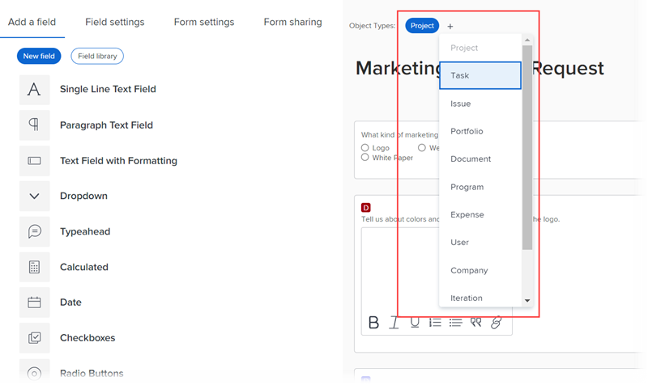

# Design a form

You can design a custom form with the Form Designer. You can attach custom forms to different Workfornt objects. 

## Access requirements

You must have the following to perform the steps in this article:

<table style="table-layout:auto"> 
 <col> 
 <col> 
 <tbody> 
  <tr data-mc-conditions=""> 
   <td role="rowheader"> 
Adobe Workfront plan*
 </td> 
   <td>Any</td> 
  </tr> 
  <tr> 
   <td role="rowheader">Adobe Workfront license*</td> 
   <td>
   
Current plan: Standard

   
or

   
Legacy plan: Plan
</td> 
  </tr> 
  <tr data-mc-conditions=""> 
   <td role="rowheader">Access level configurations*</td> 
   <td> 
Administrative access to custom forms
 
For information about how Workfront administrators grants this access, see <a href="../../../administration-and-setup/add-users/configure-and-grant-access/grant-users-admin-access-certain-areas.md" class="MCXref xref">Grant users administrative access to certain areas</a>.
 </td> 
  </tr>  
 </tbody> 
</table>

&#42;To find out what plan, license type, or access level configurations you have, contact your Workfront administrator.

## Start designing a custom form

1. Click the **Main Menu** icon  in the upper-right corner of Adobe Workfront, then click **Setup** .

1. Click **Custom Forms** in the left panel.

    >[!TIP]
    >
    >In the view that appears, you can review all custom forms and custom fields that have been created for your organization. You can also see who created each form and the fields that are associated with it.

1. Click **New Custom Form.**
1. Select which object types you'd like to attach the custom form to, then click **Continue**.

   

1. In the **Title is required** area, type the custom form title.
1. (Optional) If you want to add more object types to the form so that it can be attached to more objects, click the plus sign + after **Object Types**, then select the type you want in the menu that displays.

   

   You can repeat this to add as many object types as you want. 
   
   You can also click the X on an object type to delete it from the form. This should be done with caution when you want to delete an object type from a custom form you have already saved. For more information, see [Delete object types on a custom form](../../../administration-and-setup/customize-workfront/create-manage-custom-forms/delete-object-type-on-a-custom-form.md).

1. Next, you can start adding fields to your custom form. See the following sections: 
    * Add text fields
    * Add calculated fields
    * Add radio buttons and checkboxes
    * Add typeahead, drop-down, and date fields
    * Add images, PDFs, and Videos
    * Add Adobe XD files

## Add fields

<table>
    <tr>
        <td>Field</td>
        <td>Uses</td>
    </tr>
    <tr>
        <td>Single Line Text Field</td>
        <td>Allows users to type a single line of text in the field.</td>
    </tr>
    <tr>
        <td>Paragraph Text Field</td>
        <td>Allows users to type multiple lines of text in the field.</td>
    </tr>
    <tr>
        <td>Text Field with Formatting</td>
        <td>
Allows users to type multiple lines of text in the field and format the text with bold, italics, underline, bullets, numbering, hyperlinks, and block quotes. This is available in Home, the Updates area, lists, and the Details area for Workfront objects. A character limit of 15,000 allows for plenty of text and formatting.

        
For information about accessing this field through the API, see Rich text field storage in the API.

        
<strong>Note</strong>: Text fields with formatting are not available for Workfront mobile apps (available in coming releases).
</td>
    </tr>
    <tr>
        <td>Descriptive Text</td>
        <td>Allows you to include instructions and link to pages outside Workfront.</td>
    </tr>
</table>

 ### Add text fields

 ### Add calculated fields

 ### Add radio buttons and checkboxes

 ### Add typeahead, drop-down, and date fields

 ### Add images, PDFs, and Videos

 ### Add Adobe XD files

 ## Organize your form