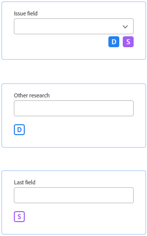
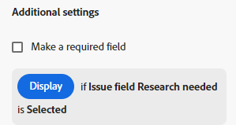
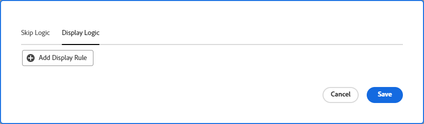
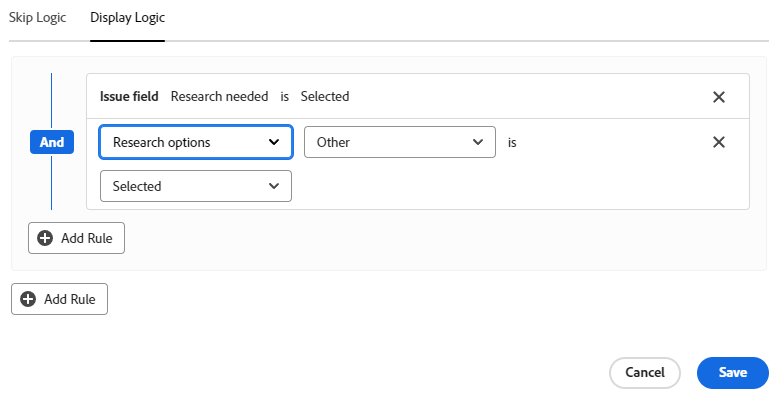
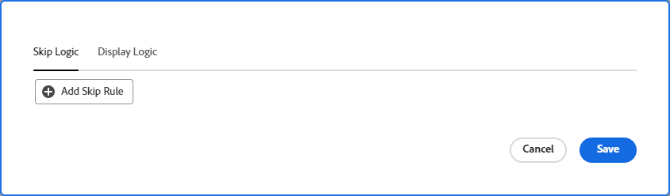
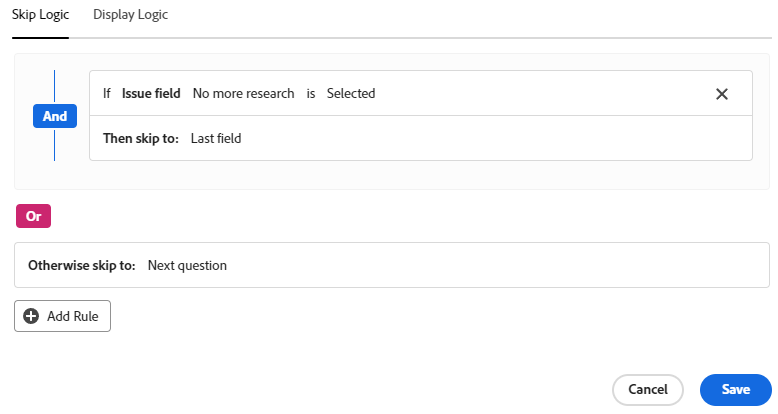

# Add display logic and skip logic with the form designer

The information on this page refers to functionality not yet generally available. It is available only in the Preview environment for all customers, or in the Production environment for customers who enabled fast releases.

For information about fast releases, see [Enable or disable fast releases for your organization](/help/quicksilver/administration-and-setup/set-up-workfront/configure-system-defaults/enable-fast-release-process.md).

For information about the current release, see [Second Quarter 2024 release overview](/help/quicksilver/product-announcements/product-releases/24-q2-release-activity/24-q2-release-overview.md).

You can decide which sections of a custom form should be displayed or skipped based on the choices that a user makes when filling it out.

>[!NOTE]
>
>Logic only applies within one form and can't be based on selections from a different form.

## Access requirements

You must have the following to perform the steps in this article:

<table style="table-layout:auto"> 
 <col> 
 <col> 
 <tbody> 
  <tr data-mc-conditions=""> 
   <td role="rowheader">Adobe Workfront plan </td> 
   <td>Any</td> 
  </tr> 
  <tr> 
   <td role="rowheader">Adobe Workfront license</td> 
   <td>
   
New: Standard

   
or

   
Current: Plan
</td> 
  </tr> 
  <tr data-mc-conditions=""> 
   <td role="rowheader">Access level configurations</td> 
   <td>Administrative access to custom forms </td> 
  </tr>  
 </tbody> 
</table>

For more detail about the information in this table, see [Access requirements in Workfront documentation](/help/quicksilver/administration-and-setup/add-users/access-levels-and-object-permissions/access-level-requirements-in-documentation.md).

## Display and skip logic icons

Custom forms display icons to indicate which logic is applied to certain fields. Icons on a field in the form designer indicate that logic is applied to the field.

   | Icon | Location on field in form designer | Definition |
   |--- |--- |--- |
   |  | Bottom left | The field is the target field for display logic. If a specific selection is made on the form, then this field is displayed. |
   |  | Bottom right | The field defines display logic. A specific selection or value on this field displays the target field. |
   |  | Bottom left | The field is the target field for skip logic. If a specific selection is made on the form, then the form skips ahead to this field and fields in between are hidden. |
   |  | Bottom right | The field defines skip logic. A specific selection or value on this field skips other fields and goes directly to the target field. |

   

Select a field with logic applied to display the existing logic rules in the field settings.

   

## Considerations for using display logic and skip logic

* To add display logic on a custom field, widget, or section break, at least one multiple choice field (radio buttons, dropdown, or check boxes) must be positioned prior to it on the form.
For information about custom fields and widgets in custom forms, see [Design a form with the form designer](/help/quicksilver/administration-and-setup/customize-workfront/create-manage-custom-forms/form-designer/design-a-form/design-a-form.md).
* You cannot add skip logic to a widget or section break. You can add it only to a multiple choice field (radio buttons, dropdown, or check boxes).
* You can add both display logic and skip logic to a custom field if all of the following is true about the custom field:

  * It is a multiple choice field (radio buttons, dropdown, or check boxes)
  * It is preceded by a multiple choice field
  * It is followed by another custom field

* When copying forms with display logic or skip logic, the logic is copied to the new custom form.
* When editing objects in bulk, all custom fields display in the Edit objects box, including the fields that are skipped or hidden.
* Keep the following in mind when you create a display logic rule for a custom form:

  * Custom fields not included in a display logic statement show on a custom form, by default.
  * You can create multi-field display logic statements.
  * If all of the fields under a section break have display logic applied to them and they are all hidden as a result of the logic, the entire section will be hidden on the custom form.

## Add display logic to a custom form

Display logic defines which custom fields appear on the form when the user selects a specific value in a multiple choice field. The logic is added to the target field, which is only displayed when the value is selected.

{{step-1-to-setup}}

1. Click **Custom Forms**.
1. Create a new custom form or open an existing form. See [Design a form with the form designer](/help/quicksilver/administration-and-setup/customize-workfront/create-manage-custom-forms/form-designer/design-a-form/design-a-form.md) for details.
1. Add fields to the form as needed. At least one multiple choice field (radio button, dropdown, or check box) must be positioned prior to the target field that will display.
1. Select the target field and click **Add Logic** on the lower left of the screen.
1. Select the **Display Logic** tab.
1. Click **Add Display Rule** on the logic builder.

   

1. Follow the steps below in the builder to create the logic statement.

   1. The first option is to choose the defining field. This is the field with the selection value that displays the target. It must be a multiple choice field.
   1. The second option is to choose the selection value. Only the values already defined for that field are available.
   1. The third option is **Selected** or **Not Selected**. Choosing **Selected** means that when the value is selected, the target field is displayed. Choosing **Not Selected** means that when any other value is selected in the defining field, the target field is displayed.
   1. To add an **And** rule to the logic statement, click **Add Rule** directly underneath the rule you just created. Follow the same prompts to build the rule. All of the And rules must be met for the target field to be displayed.

      

   1. To add an **Or** rule to the logic statement, click **Add Rule** near the bottom of the logic builder. Then, click **Add Rule** inside the Or area and follow the same prompts to build the rule. When one Or rule is met, the target field is displayed.

1. Click **Save** when you are finished building the logic statement.

   The display logic icons are added to the target field and the defining field in the form designer.

>[!NOTE]
>
>Display logic is only available when you preview your form in the form designer in the Preview environment.

## Add skip logic to a custom form

Skip logic defines custom form fields that are skipped when the user selects a specific value in a multiple choice field. Skipped fields are hidden on the form. The logic is applied to the defining field where the selection is made, not to the fields that are skipped.

{{step-1-to-setup}}

1. Click **Custom Forms**.
1. Create a new custom form or open an existing form. See [Design a form with the form designer](/help/quicksilver/administration-and-setup/customize-workfront/create-manage-custom-forms/form-designer/design-a-form/design-a-form.md) for details.
1. Add fields to the form as needed. The defining field for skip logic must be a multiple choice field (radio button, dropdown, or check box).
1. Select the defining field and click **Add Logic** on the lower left of the screen.
1. Select the **Skip Logic** tab.
1. Click **Add Skip Rule** on the logic builder.

   

1. Follow the steps below in the builder to create the logic statement.

   1. The defining field is shown on the builder. It is the field you selected to apply the skip logic to.
   1. The first option is to choose the selection value. Only the values already defined for the field are available.
   1. The second option is **Selected** or **Not Selected**. Choosing **Selected** means that when the value is selected, the target field is displayed and the fields in between are skipped. Choosing **Not Selected** means that when any other value is selected in the defining field, the target field is displayed and the fields in between are skipped.
   1. The third option is the target field, or where to skip to. Select a field name or **End of form**. You might need to click the word "empty" first before selecting an option.

      

   1. To add an **Or** rule to the logic statement, click **Add Rule** near the bottom of the logic builder. Then, select the options following the same prompts to build the rule. When one **Or** rule is met, the target field is displayed.

1. Click **Save** when you are finished building the logic statement.

   The skip logic icons are added to the target field and the defining field in the form designer.

>[!NOTE]
>
>Skip logic is only available when you preview your form in the form designer in the Preview environment.
