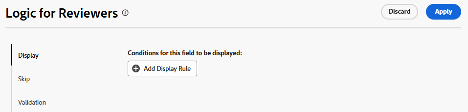
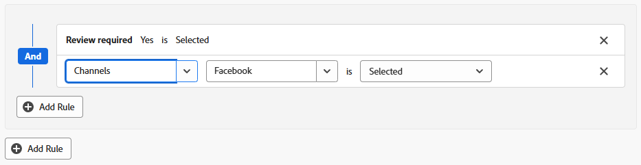
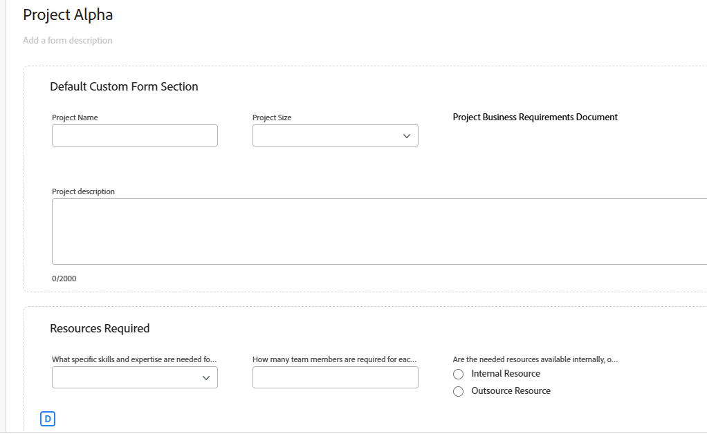
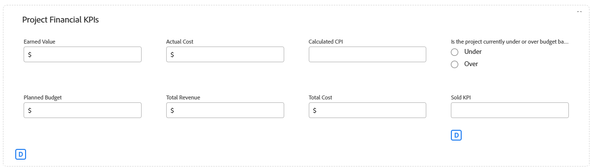
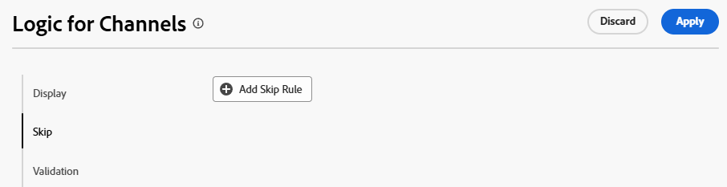
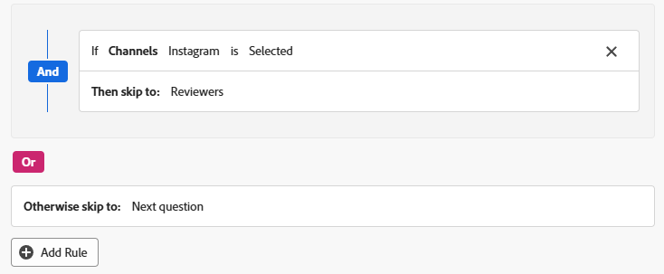
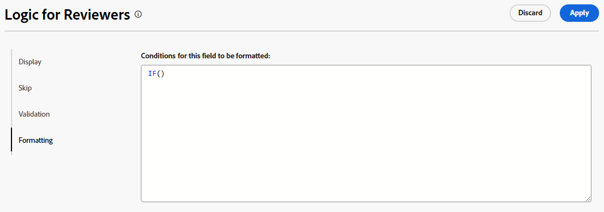

# Add logic rules to custom forms and fields

Logic rules allow you to further customize the fields on your form.

For example, you can display or skip fields or sections in a custom form based on the choices that a user makes when filling it out.

>[!NOTE]
>
>Logic only applies within one form and can't be based on selections from a different form.

## Access requirements

+++ Expand to view access requirements for the functionality in this article.

You must have the following access to perform the steps in this article:

<table style="table-layout:auto"> 
 <col> 
 <col> 
 <tbody> 
  <tr data-mc-conditions=""> 
   <td role="rowheader">Adobe Workfront plan </td> 
   <td>Any</td> 
  </tr> 
  <tr> 
   <td role="rowheader">Adobe Workfront license</td> 
   <td>
   <p>New: Standard</p>
   <p>or</p>
   <p>Current: Plan</p></td> 
  </tr> 
  <tr data-mc-conditions=""> 
   <td role="rowheader">Access level configurations</td> 
   <td>Administrative access to custom forms </td> 
  </tr>  
 </tbody> 
</table>

For more detail about the information in this table, see [Access requirements in Workfront documentation](/help/quicksilver/administration-and-setup/add-users/access-levels-and-object-permissions/access-level-requirements-in-documentation.md).

+++

## Display and skip logic icons

Custom forms display icons to indicate when display or skip logic is applied to certain fields. Icons on a field in the form designer indicate that logic is applied to the field.

   | Icon | Location on field in form designer | Definition |
   |--- |--- |--- |
   |  | Bottom left | The field is the target field for display logic. If a specific selection is made on the form, then this field is displayed. |
   |  | Bottom right | The field defines display logic. A specific selection or value on this field displays the target field. |
   |  | Bottom left | The field is the target field for skip logic. If a specific selection is made on the form, then the form skips ahead to this field and fields in between are hidden. |
   |  | Bottom right | The field defines skip logic. A specific selection or value on this field skips other fields and goes directly to the target field. |

   

Select a field with logic applied to display the existing logic rules in the field settings.

   

## Considerations for using display logic and skip logic

* To add display logic on a custom field, widget, or section break, at least one multiple choice field (radio buttons, dropdown, or check boxes) must be positioned prior to it on the form.
For information about custom fields and widgets in custom forms, see [Create a custom form](/help/quicksilver/administration-and-setup/customize-workfront/create-manage-custom-forms/form-designer/design-a-form/design-a-form.md).
* You cannot add skip logic to a widget or section break. You can add it only to a multiple choice field (radio buttons, dropdown, or check boxes).
* You cannot apply display or skip logic to show or hide the choices of a multi-option field. For example, you cannot restrict the choices that display for a Dropdown, a Checkbox group, or a Radio Button field, based on the display or skip logic of another field. 
* You can add both display logic and skip logic to a custom field if all of the following is true about the custom field:

  * It is a multiple choice field (radio buttons, dropdown, or check boxes)
  * It is preceded by a multiple choice field
  * It is followed by another custom field

* When copying forms with display logic or skip logic, the logic is copied to the new custom form.
* When editing objects in bulk, all custom fields display in the Edit objects box, including the fields that are skipped or hidden.
* Keep the following in mind when you create a display logic rule for a custom form:

  * Custom fields not included in a display logic statement show on a custom form, by default.
  * You can create multi-field display logic statements.
  * If all of the fields under a section break have display logic applied to them and they are all hidden as a result of the logic, the entire section will be hidden on the custom form.

## Add display logic to a custom form

Display logic defines which custom fields appear on the form when the user selects a specific value in a multiple choice field. The logic is added to the target field, which is only displayed when the value is selected.

<!--
>[!NOTE]
>
><span class="preview">This procedure describes the basic mode for display logic. Advanced display logic is also available. For more information, see [Add advanced display logic to a custom form](#add-advanced-display-logic-to-a-custom-form), in this article.</span>
-->

{{step-1-to-setup}}

1. Click **Custom Forms**.
1. Create a new custom form or open an existing form. See [Create a custom form](/help/quicksilver/administration-and-setup/customize-workfront/create-manage-custom-forms/form-designer/design-a-form/design-a-form.md) for details.
1. Add fields to the form as needed. At least one multiple choice field (radio button, dropdown, or check box) must be positioned prior to the target field that will display.
1. Select the target field and click **Add Logic**.
1. Select the **Display** tab on the logic builder.
1. Click **Add Display Rule**.

   

1. Follow the steps below to create the logic statement in the builder.

   1. The first option is to choose the defining field. This is the field with the selection value that displays the target. It must be a multiple choice field.
   1. The second option is to choose the selection value. Only the values already defined for that field are available.
   1. The third option is **Selected** or **Not Selected**. Choosing **Selected** means that when the value is selected, the target field is displayed. Choosing **Not Selected** means that when any other value is selected in the defining field, the target field is displayed.
   1. To add an **And** rule to the logic statement, click **Add Rule** directly underneath the rule you just created. Follow the same prompts to build the rule. All of the And rules must be met for the target field to be displayed.

      

   1. To add an **Or** rule to the logic statement, click **Add Rule** near the bottom of the logic builder. Then, click **Add Rule** inside the Or area and follow the same prompts to build the rule. When one Or rule is met, the target field is displayed.

1. Click **Apply** when you are finished building the logic statement.

   The display logic icons are added to the target field and the defining field in the form designer.

<!--
<div class="preview">

## Add advanced display logic to a custom form

The advanced display logic for custom form fields allows you to build complex logic using formulas. You can apply this logic to the following field types: drop-down, radio button, checkbox, typeahead, single line text, paragraph text, date field, text with formatting, and calculated fields.

### Examples

You can use advanced display logic to control the visibility of custom form sections based on user roles and the visibility of a field based on another field's status.

No logic is applied to the default section on the form, so it is always visible to all users.

Using the following condition, the Resources Required section is only displayed when a user with the job role of Resource Manager views the form.

```IF($$USER.{roleID}="123abc", true)```

Note that ```123abc``` represents the role ID of the Resource Manager.



The same condition with a different role ID is applied to the Project Financial KPIs section to define that  only the Financial Advisor role can view the section.

Using the following condition, the Sold KPI field only becomes visible when the project is complete. This logic is applied directly to the field instead of to a form section. There is no need to specify which role can view the field, because that is already defined in the section that the field is in.

```IF({status}="CPL", true)```



### Define advanced display logic

{{step-1-to-setup}}

1. Click **Custom Forms**.
1. Create a new custom form or open an existing form. See [Create a custom form](/help/quicksilver/administration-and-setup/customize-workfront/create-manage-custom-forms/form-designer/design-a-form/design-a-form.md) for details.
1. Add fields to the form as needed.
1. Select the field to apply logic to, and click **Add Logic**.
1. Select the **Display** tab on the logic builder.
1. Turn on **Advanced mode**.
   
   This option might be turned on automatically, for fields that do not support the simple mode of display logic.

   

1. Build the display condition in the editor.

   For more information about calculations and expressions, see [Add calculated fields to a form](/help/quicksilver/administration-and-setup/customize-workfront/create-manage-custom-forms/form-designer/design-a-form/add-a-calculated-field.md) and [Overview of calculated data expressions](/help/quicksilver/reports-and-dashboards/reports/calc-cstm-data-reports/calculated-data-expressions.md).

1. Click **Apply**.
   
   The logic is applied to the field and the display logic icon is added in the form designer.

</div>
-->

## Add skip logic to a custom form

Skip logic defines custom form fields that are skipped when the user selects a specific value in a multiple choice field. Skipped fields are hidden on the form. The logic is applied to the defining field where the selection is made, not to the fields that are skipped.

{{step-1-to-setup}}

1. Click **Custom Forms**.
1. Create a new custom form or open an existing form. See [Create a custom form](/help/quicksilver/administration-and-setup/customize-workfront/create-manage-custom-forms/form-designer/design-a-form/design-a-form.md) for details.
1. Add fields to the form as needed. The defining field for skip logic must be a multiple choice field (radio button, dropdown, or check box).
1. Select the defining field and click **Add Logic** on the lower left of the screen.
1. Select the **Skip** tab on the logic builder.
1. Click **Add Skip Rule**.

   

1. Follow the steps below to create the logic statement in the builder.

   1. The defining field is shown on the builder. It is the field you selected to apply the skip logic to.
   1. The first option is to choose the selection value. Only the values already defined for the field are available.
   1. The second option is **Selected** or **Not Selected**. Choosing **Selected** means that when the value is selected, the target field is displayed and the fields in between are skipped. Choosing **Not Selected** means that when any other value is selected in the defining field, the target field is displayed and the fields in between are skipped.
   1. The third option is the target field, or where to skip to. Select a field name or **End of form**. You might need to click the word "empty" first before selecting an option.

      

   1. To add an **Or** rule to the logic statement, click **Add Rule** near the bottom of the logic builder. Then, select the options following the same prompts to build the rule. When one **Or** rule is met, the target field is displayed.

1. Click **Apply** when you are finished building the logic statement.

   The skip logic icons are added to the target field and the defining field in the form designer.

## Add validation logic to a custom form

Validation logic is built using formulas, and you can make the logic as simple or as complex as you need. The validation can be based on the values of other fields or the status of objects, and you can provide an error message for when the validation fails.

If the field with the logic applied meets the defined validation conditions when a user fills out the custom form, the field is highlighted and the error message is displayed.

You can apply validation logic to the following field types: single line text, paragraph, single-select dropdown, multi-select dropdown, external lookup, typeahead, date, checkbox group, and radio buttons.

### Examples

Using the following condition, the Budget field displays a message underneath the field when the user enters a value that triggers the message. For example, if the entered value is negative, the first message is displayed. If the user tries to change the project status to Current before entering a budget value, the second message is displayed.

```
IF({DE:Budget Field} < 0,
     "Budget cannot be negative",
     IF({DE:Budget Field} == 0 && {status} == "CUR", "Budget must be specified before moving to Current status")
)
```

Another simple example is that a phone number field must contain a certain number of digits to be valid.

An additional example for validation based on other fields is a field for meeting room size (small, medium, or large) and a separate field for the number of meeting attendees. The number of people for each room size is written in the validation formula. If the number of attendees the user enters is too many for the chosen meeting room, the error message is displayed.

For additional examples of validation logic, see [Examples of advanced logic in custom forms](/help/quicksilver/administration-and-setup/customize-workfront/create-manage-custom-forms/form-designer/design-a-form/advanced-logic-examples.md).

### Define validation logic

{{step-1-to-setup}}

1. Click **Custom Forms**.
1. Create a new custom form or open an existing form. See [Create a custom form](/help/quicksilver/administration-and-setup/customize-workfront/create-manage-custom-forms/form-designer/design-a-form/design-a-form.md) for details.
1. Add fields to the form as needed.
1. Select the field to apply logic to, and click **Add Logic**.
1. Select the **Validation** tab on the logic builder.

   

1. Build the validation condition in the editor, including the error message to display when the validation is not met.

   For more information about calculations and expressions, see [Add calculated fields to a form](/help/quicksilver/administration-and-setup/customize-workfront/create-manage-custom-forms/form-designer/design-a-form/add-a-calculated-field.md) and [Overview of calculated data expressions](/help/quicksilver/reports-and-dashboards/reports/calc-cstm-data-reports/calculated-data-expressions.md).

1. Click **Apply**.
   
   The logic is applied to the field in the form designer.

   >[!NOTE]
   >
   >Validation logic is not supported in the form designer preview mode.

<!--
<div class="preview">

## Add formatting logic to a custom form

Formatting logic highlights a field value when it meets the defined conditions. The applied formatting will work on multiple fields at once.

You can apply formatting logic to the following field types: single line text, paragraph, single-select dropdown, multi-select dropdown, external lookup, typeahead, calculated, date, checkbox group, and radio buttons.

Formatting applied to custom forms is separate from formatting applied to lists and reports. For information on report formatting, see [Use conditional formatting in views](/help/quicksilver/reports-and-dashboards/reports/reporting-elements/use-conditional-formatting-views.md).

### Example

Using the following condition, the Budget field appears red when the user enters a value of 1000 or more. The field appears yellow when the user enters a value of 500 or more.

To add a hover-over definition of the formatting, use the Instructions field in the custom form. For example, a message on the Budget field could say "Please enter a budget within a reasonable range. Values over 500 are a warning notice, and above 1000 is considered too high."

```
IF(
     {DE:Budget Field} >=1000,
     FORMAT($$NEGATIVE),
     IF({DE:Budget Field} >= 500, FORMAT($$NOTICE))
)
```

### Define formatting logic

{{step-1-to-setup}}

1. Click **Custom Forms**.
1. Create a new custom form or open an existing form. See [Create a custom form](/help/quicksilver/administration-and-setup/customize-workfront/create-manage-custom-forms/form-designer/design-a-form/design-a-form.md) for details.
1. Add fields to the form as needed.
1. Select the field to apply logic to, and click **Add Logic**.
1. Select the **Formatting** tab on the logic builder.

   

1. Build the formatting condition in the editor.

   You can add up to five formatting rules per field.

   The field highlighting color options are:

   * `$$POSITIVE (green)`
   * `$$INFORMATIVE (blue)`
   * `$$NEGATIVE (red)`
   * `$$NOTICE (orange)`
   
   The text formatting options are:
   
   * `$$BOLD`
   * `$$ITALIC`
   * `$$UNDERLINE`

   Only one color option may be used per function, along with up to three additional text formatting options. If no color option is specified, the system's default color is applied.

   For more information about calculations and expressions, see [Add calculated fields to a form](/help/quicksilver/administration-and-setup/customize-workfront/create-manage-custom-forms/form-designer/design-a-form/add-a-calculated-field.md) and [Overview of calculated data expressions](/help/quicksilver/reports-and-dashboards/reports/calc-cstm-data-reports/calculated-data-expressions.md).

1. Click **Apply**.
   
   The logic is applied to the field in the form designer.

</div>
-->
