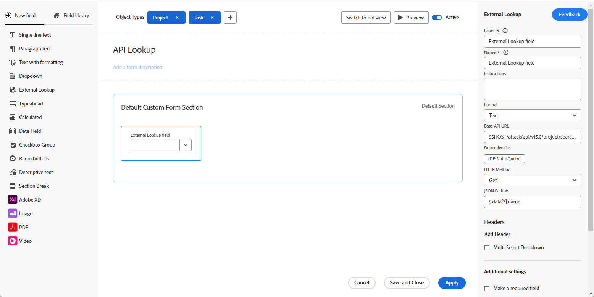
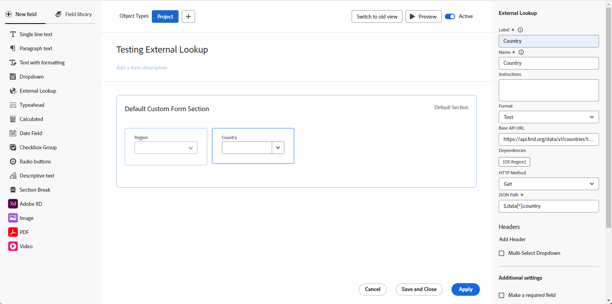

# Examples of the External Lookup field in a custom form

An External Lookup field in a custom form calls an external API and returns values as options in a dropdown field. Users who work with the object the custom form is attached to can select one or more of these options from the dropdown.

This article provides examples of using the External Lookup field to call the same instance of Workfront or a public API. You can also use the External Lookup to communicate with an external system such as Jira, Salesforce, or ServiceNow.

For more information about adding an External Lookup field to a custom form and additional definitions of the external lookup components, see [Design a form with the form designer](/help/quicksilver/administration-and-setup/customize-workfront/create-manage-custom-forms/form-designer/design-a-form/design-a-form.md).

## Set up an External Lookup field for the same instance of Workfront

You can use the External Lookup to bring data from your Workfront instance into the custom form.

This example shows how to call the Workfront API and bring data from the existing "Status Query" field into your External Lookup field.

1. Open the custom form.
1. On the left side of the screen, find **External lookup** and drag it to a section on the canvas.
1. Enter the **Label** and **Name** for the field.
1. Select the **Format** for the field.
1. Enter the API URL call in the **Base API URL** field.

   * You can add $$HOST to reference the same instance.
   * You can add $$QUERY to filter the results based on querying a different field.

   **Example**
   `$$HOST/attask/api/v15.0/project/search?status={DE:StatusQuery}&$$QUERY`

1. Review the **Dependencies** for the fields that this lookup field is referencing in the API.   

   A dependency field can be any custom or native field existing in the object's details page.

   In this example, the `{DE:StatusQuery}` will be replaced with the value of the StatusQuery custom field.

1. Select the **HTTP Method**.

   This will mostly likely be **Get**.

1. Enter the **JSON Path** to get the results from your API call.
   
   **Example**
   `$.data[*].name`

   >[!NOTE]
   >
   >**Header** information is not required for a call to the same Workfront instance.

1. Click **Apply**.

   

## Set up an External Lookup field for a public API

You can use the External Lookup to call an external, public API and retrieve data.

This example shows how to call an API of countries (such as <https://api.first.org/data/v1/countries>) so that you don't have to hard code all of the country names in the dropdown options.

1. Open the custom form.
1. On the left side of the screen, find **External lookup** and drag it to a section on the canvas.
1. Enter the **Label** and **Name** for the field.
1. Select the **Format** for the field.
1. Enter the API URL call in the **Base API URL** field.

   * You can add $$QUERY to implement query filtering for your end users.

   **Examples**
   Lists all countries: <https://api.first.org/data/v1/countries>

   Allows the user to search for any country in the dropdown field: <https://api.first.org/data/v1/countries?q=$$QUERY>

   Allows the user to search for a country in a region: <https://api.first.org/data/v1/countries?region={DE:Region}&q=$$QUERY>

     * The available regions are defined in a separate custom field in Workfront.
     * When the user selects a region on the form, then the External Lookup field shows only the countries in that region (which country is in which region is defined in the API). The user can also search for a country in the selected region.

1. Review the **Dependencies** for the fields that this lookup field is referencing in the API.   

   A dependency field can be any custom or native field existing in the object's details page.

   In this example, the `{DE:Region}` will be replaced with the value of the Region custom field.

1. Select the **HTTP Method**.

   This will mostly likely be **Get**.

1. Enter the **JSON Path** to get the results from your API call.

   This option allows extracting data from the JSON returned by the API URL. It serves as a way to select which values from inside the JSON will appear in the dropdown options.
   
   **Example**
   `$.data[*].country`

1. (Optional) Click **Add Header**, and type or paste the key-value pair required for authentication with the API.

   >[!NOTE]
   >
   >The Header fields are not a secure place to store credentials, and you should be careful of what you enter and save.

1. (Optional) Select **Multi-Select Dropdown** to allow the user to select more than one value in the dropdown.

1. Click **Apply**.

   

