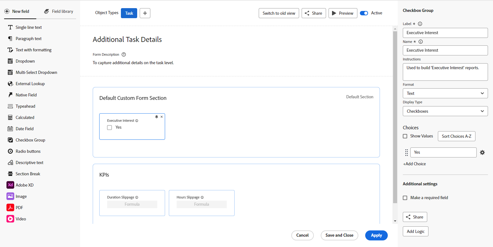

# Form designer overview

You can use the new form designer to design a custom form that users can attach to a Workfront object. Users who work on the object can fill out the custom form to supply information about the object.

The new form designer has a new canvas-style workspace that allows you to view the fields, canvas, and field settings all at the same time. It also allows you to drag-and-drop fields within the sections while designing your form.

## How to access the form designer

A button at the top of both the new form designer and the legacy form builder allows you to switch between the versions.

## New functionality available with the form designer

With the new form designer, we've added the ability to:

* **Copy a field**: You can now copy existing fields by clicking on the Copy icon on the fields directly from the canvas.

* **Change the size for Descriptive text**: You can now assign small, medium, or large sizes to Descriptive text fields. You can also use them on the same row with other fields.

* **Use a Default section**: If the form creator has not added a section at the top of the form, a Default section is now visible in the canvas, so that users can adjust the permissions for fields that have no custom section assigned.

    >[!NOTE]
    >
    >The Default section is not visible within objects once the form is attached to the object.

* **Use an External Lookup field**: This field type calls an external API and returns values as options in a dropdown field.

## Functionality removed from the form designer

We've removed the following functionality from inside the form designer:

* Form settings are now available at the top of the canvas

* Track field changes in update feeds

    >[!NOTE]
    >
    >You can find this option in Setup > Interface > Update Feeds

