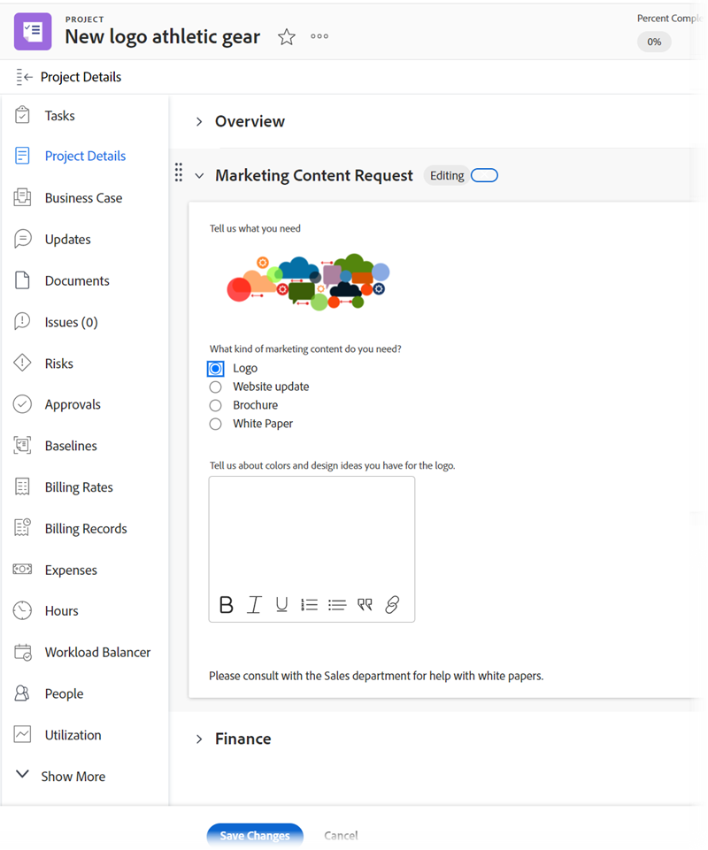

# Form designer overview

You can design a custom form that users can attach to a Workfront object. Users who work on the object can fill out the custom form to supply information about the object.

For example, a user can attach the following custom form to a project so that users on the project can request marketing content for the project:

## New funtionality available with the form designer

With the new form designer, we've added the ability to 

* **Copy a field**: You can now copy existing fields by clicking on the copy icon on the fields from the canvas 

* **Change the size for Descriptive text**: You can now assign small, medium or large size to Descriptive text fields and use them on the same row with other fields. 

* **Use a Default section**: In case the user has not added a section at the top of the form,a Default section is visible, so that users can adjust the permissions for fields that have no custom section assigned. Default section is not visible within objects once the form is attached to the object.  

* **Updated layout**: Add new/existing fields 

Form canvas 

Field settings 

All 3 sections are visible together at all times

## Functionality coming soon

Below functionalities are not available right now in the form designer and will be added shortly. The existing configurations for logic and typeahead filters will not be affected when you work with the new form designer.  

* Display/Skip logic  

* Filter for typeahead fields 

## Functionlity removed from the form designer

We've removed the following functionality from the form designer:

* Form Settings, Form Sharing, Field Sharing tabs  

    * Form settings are now available at the top of the canvas. 

    * Form Sharing main tab and Field Sharing subtab available in Add Field tab of the legacy builder are not available in the new form designer.  

    * You can control the form and field sharing from the forms/fields list toolbar.  

* Track field changes in update feeds – available in Setup > Interface > Update Feeds 

<!--

## Custom fields and widgets

Workfront provides many built-in fields for each object type. In a custom form, you can create additional fields that prompt users for information that is unique to their workflows. These custom fields are the building blocks of a custom form.

You can add the following types of custom fields to a custom form in Workfront:

* Single line text field
* Paragraph text field
* Text field with formatting 
* Dropdown
* Calculated
* Date
* Checkboxes
* Radio buttons
* Descriptive text

For more information, see [Add a custom field to a custom form]().

You can also add visual asset widgets to a custom form. This is useful when you need to include content such as branding images or visual instructions. For more information, see [Add or edit an asset widget in a custom form]().

For instructions on creating a custom form, see [Create or edit a custom form]().

## Objects where users can attach a custom form

Users can attach custom forms to the following object types:

* Project (including Business Cases)
* Task
* Issue
* Company
* Document
* User
* Program
* Portfolio
* Expense
* Group

For instructions, see [Add a custom form to an object](../../../workfront-basics/work-with-custom-forms/add-a-custom-form-to-an-object.md).

Users who create a custom form can configure it to work with more than one object type. For more information, see [Create or edit a custom form](../../../administration-and-setup/customize-workfront/create-manage-custom-forms/create-or-edit-a-custom-form.md).
-->