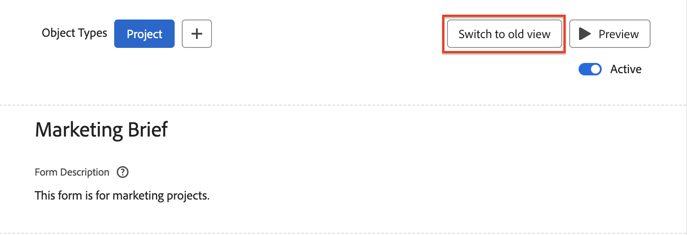
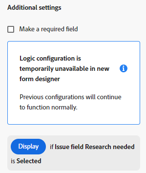

# Form designer overview

You can use the new form designer to design a custom form that users can attach to a Workfront object. Users who work on the object can fill out the custom form to supply information about the object.

The new form designer has a new canvas-style workspace that allows you to view the fields, canvas, and field settings all at the same time. It also allows you to drag-and-drop fields within the sections while designing your form. 

<!-- add screenshot when field settings empty state is ready -->

## How to access the new form designer

There is a new button at the top of both the new form designer and the legacy form builder. You can use this button to switch between the legacy builder and the new designer.

## New functionality available with the form designer

With the new form designer, we've added the ability to 

* **Copy a field**: You can now copy existing fields by clicking on the Copy icon on the fields directly from the canvas. 

* **Change the size for Descriptive text**: You can now assign small, medium, or large sizes to Descriptive text fields. You can also use them on the same row with other fields. 

* **Use a Default section**: If the form creator has not added a section at the top of the form, a Default section is now visible in the canvas, so that users can adjust the permissions for fields that have no custom section assigned. 

    >[!NOTE]
    >
    >Default section is not visible within objects once the form is attached to the object.  

## Functionality coming soon

The following are not currently available in the form designer but will be added soon:

* Display/Skip logic  

* Filter for typeahead fields 

>[!IMPORTANT]
>
>The existing configurations for logic and typeahead filters will not be affected when you work with the new form designer.

### Display/Skip logic

Although you can't yet add display/skip logic when designing a new custom form, you can view existing display/skip logic on forms that were created in the legacy form builder.

Icons on a field in the form designer indicate that logic is applied to the field.

   The  icon on the bottom left means that the field is the target field for display logic (if a specific selection is made on the form, then this field is displayed). The  icon on the bottom right means that the field is used to define display logic (a specific selection or value on this field will display the target field).

   The  icon on the bottom left means that the field is the target field for skip logic (if a specific selection is made on the form, then the form skips ahead to this field). The  icon on the bottom right means that the field is used to define skip logic (a specific selection or value on this field will skip other fields and go directly to the target field).

   

Selecting a field with logic applied displays the existing logic rules in the field settings.

   

## Functionality removed from the form designer

We've removed the following functionality from inside form designer:

* Form Settings, Form Sharing, Field Sharing tabs  

    * Form settings are now available at the top of the canvas

    * Form Sharing main tab and Field Sharing subtab

    >[!NOTE]
    >
    >You can control the form and field sharing from Setup > Custom Forms > Forms or Fields tab.  

* Track field changes in update feeds
    >[!NOTE]
    >
    >You can find this in Setup > Interface > Update Feeds
