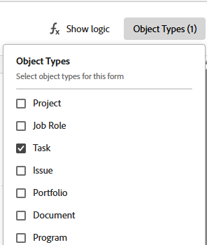

# Add or delete object types from an existing custom form

You can add or delete object types from an existing custom form with the form designer.

## Access requirements

+++ Expand to view access requirements for the functionality in this article.

<table style="table-layout:auto"> 
 <col> 
 <col> 
 <tbody> 
  <tr> 
   <td>Adobe Workfront package</td> 
   <td>
Any
</td> 
  </tr> 
  <tr> 
   <td>Adobe Workfront license</td> 
   <td>
Standard

       
Plan
</td>
  </tr> 
  <tr> 
   <td>Access level configurations</td> 
   <td> 
Administrative access to custom forms
 </td> 
  </tr>  
 </tbody> 
</table>

For information, see [Access requirements in Workfront documentation](/help/quicksilver/administration-and-setup/add-users/access-levels-and-object-permissions/access-level-requirements-in-documentation.md).

+++

## Add object types to an existing custom form 

You can add additional object types to the form so that it can be attached to multiple objects. 

>[!NOTE]
>
>Section break permissions can be impacted by the object type. The Limited Edit permission for custom form section breaks is available for only the Project, Task, Issue, and User object types.
>
>For more information, see [How multiple object types can affect section break permissions](/help/quicksilver/administration-and-setup/customize-workfront/create-manage-custom-forms/form-designer/design-a-form/organize-a-form.md#how-multiple-object-types-can-affect-section-break-permissions).

{{step-1-to-setup}}

1. Click **Custom Forms** in the left panel.

   In the view that appears, you can review all custom forms that have been created for your organization. You can also see who created each form, which object type it works with, and whether it is active.

1. Select the custom form you want to add additional object types to, then click .

1. At the top of the form, click **Object Types**, then select the type you want to add in the menu that displays. You can repeat this to add as many object types as you want. 

   

1. Click **Save and Close**.

   >[!TIP]
   >
   >You can click **Apply** at any point while you are creating a custom form to save your changes and keep the form open.

## Delete object types on a custom form

You can delete object types from an existing custom form. A custom form must have at least one object type.

>[!CAUTION]
>
>If people have already attached the custom form to objects of the type you want to delete and added data to it, that data is permanently deleted when you delete that object type on the form. It might include historical information that users will need later.
>
>In general, we recommend minimizing the number of times you edit a custom form that is already in use. There is no notification system to alert people who use the custom form about your changes.

To delete an object type:

{{step-1-to-setup}}

1. Click **Custom Forms** in the left panel.
1. Select the custom form you want to edit, then click .
1. At the top of the form, click **Object Types**, then clear the check boxes for the objects you want to delete from the form.
1. Click **Apply**, then click **Save and Close**.
