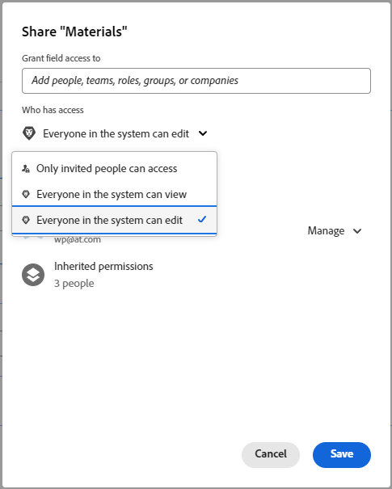

# Configure sharing for custom fields and widgets

By default, when you add a new custom field or widget to a custom form, anyone in the system with access to custom forms can edit the properties for that item, such as its label and name. You can change this by controlling who it can be shared with.

For information about custom fields and widgets in custom forms, see [Design a form with the form designer](/help/quicksilver/administration-and-setup/customize-workfront/create-manage-custom-forms/form-designer/design-a-form/design-a-form.md).

## Access requirements

+++ Expand to view access requirements for the functionality in this article.

You must have the following to perform the steps in this article:

<table style="table-layout:auto"> 
 <col> 
 <col> 
 <tbody> 
  <tr data-mc-conditions=""> 
   <td role="rowheader"> 
Adobe Workfront plan
 </td> 
   <td>Any</td> 
  </tr> 
  <tr> 
   <td role="rowheader">Adobe Workfront license</td> 
   <td>
   
New: Standard

   
or

   
Current: Plan
</td>
  </tr> 
  <tr data-mc-conditions=""> 
   <td role="rowheader">Access level configurations</td> 
   <td> 
Administrative access to custom forms
 </td> 
  </tr> 
 </tbody> 
</table>

For more detail about the information in this table, see [Access requirements in Workfront documentation](/help/quicksilver/administration-and-setup/add-users/access-levels-and-object-permissions/access-level-requirements-in-documentation.md).

+++

## Configure sharing a custom field or widget from the list of forms

{{step-1-to-setup}}

1. In the left panel, click **Custom Forms**.
1. Click **Fields** to open the Fields area.
1. Select the item you want to configure sharing for, then click .
1. In the Custom Field Access box that displays, specify who you want to share the item with and how you want to share it:

   1. Near the lower-left corner of the **Custom Field Access** box, under **Give custom field access to**, start typing the name of a user, team, job role, group, or company you want to share the item with, then click the name when it appears.

      

   1. If you want to be more specific about how you want to share the item, click the drop-down list to the right of the name, then use any of the following options:

      

      <table style="table-layout:auto"> 
       <col> 
       <col> 
       <tbody> 
        <tr> 
         <td role="rowheader">View it</td> 
         <td> 
You can click <strong>Advanced Settings</strong> to specify whether you want the user or users to be able to use their access to add the item to a custom form or share it with other users.
 </td> 
        </tr> 
        <tr> 
         <td role="rowheader">Manage it</td> 
         <td> 
Allows access to edit the custom field and to see it in the Field Library and on the page where you build custom forms.
 
You can click <strong>Advanced Settings</strong> to specify whether you want the user or users to be able to use their access to delete the item from the system or share it with other users.
 </td> 
        </tr> 
       </tbody> 
      </table>   

1. (Optional) Repeat the previous step to add other names to the list and configure their options.
1. (Optional) Click the gear icon  in the top-right corner if you want to choose a system-wide sharing option for the field.

   Not all of the following options display in this drop-down menu at the same time. For example, the second one displays only when one of the other two are selected.

   * **Make this editable system-wide so that everyone in Workfront can edit it** (the default option)

     When you add a custom field or widget and you don't limit sharing for it, everyone in the system who has access to custom forms can view it and edit its properties.
   
   * **Remove system-wide edit access**

     Limits access to only those whom you added to the list. 
   
   * **Make this visible system-wide so that everyone in Workfront can see it**

1. Click **Save**.

## Configure sharing a custom field or widget from the form designer

{{step-1-to-setup}}

1. In the left panel, click **Custom Forms**.
1. Open a custom form or create a new custom form.
1. In the form designer, select the item you want to configure sharing for, then click **Share** in the field editing area on the right.
1. In the box that displays, under **Grant custom form access to**, start typing the name of the user, team, job role, group, or company you want to share the item with, then press **Enter** when the name displays.
1. If you want to be more specific about how you share the item, click the drop-down menu to the right of the name, then use any of the following options:

    <table style="table-layout:auto"> 
    <col> 
    <col> 
      <tbody> 
       <tr> 
        <td role="rowheader">View it</td> 
        <td> 
Click <strong>Advanced Settings</strong> to specify whether you want the users to be able to add the item to a custom form or share it with other users.
 </td> 
       </tr> 
       <tr> 
        <td role="rowheader">Manage it</td> 
        <td> 
Allows access to edit the custom field and see it both in the Field library and in the form designer.
 
Click <strong>Advanced Settings</strong> to specify whether you want the users to be able to delete the item from the system or share it with other users.
 </td> 
       </tr> 
     </tbody> 
    </table> 

1. (Optional) Repeat Steps 5-6 to add other names to the list and configure their options.
1. (Optional) Choose a system-wide sharing option for the field:

   * **Everyone in the system can edit** (the default option)

     When you add a custom field or widget and you don't limit sharing for it, everyone in the system who has access to custom forms can view it and edit its properties.

   * **Everyone in the system can view**
   * **Only invited people can access**

     Limits access to only those you added to the list.

   

1. Click **Save**.

## Inherited access to custom fields and widgets when a custom form is shared

When someone shares a custom form with a group, job role, team, or company, the recipients inherit View access to any custom fields and widgets that are on the form. This level of access to those items on the form is always retained so that the form can function for the recipients as intended by the person who created it. This is true even for recipients who have Edit access to the form.

You can find out who has inherited access to a custom field or widget and you can remove access to it.

>[!NOTE]
>
>If a recipient has Manage access to a custom field or widget on the shared custom form, that access is retained for the recipient.

### Find out who has inherited access to a custom field or widget {#find-out-who-has-inherited-access-to-a-custom-field-or-widget}

{{step-1-to-setup}}

1. In the left panel, click **Custom Forms**.
1. Click **Fields**, then select the field, image, or access widget.
1. In the box that displays, click **Inherited Permissions** and view the names that display.
1. Click **Cancel**.

### Remove access to a custom field or widget in a custom form that was shared {#remove-access-to-a-custom-field-or-widget-in-a-custom-form-that-was-shared}

If you need to remove access to a custom field or widget in a custom form that was shared, you need to unshare the form. For instructions, see the section [Remove access to a custom form](/help/quicksilver/administration-and-setup/customize-workfront/create-manage-custom-forms/share-access-to-a-custom-form.md#remove-access-to-a-custom-form-from-the-list-of-forms) in the article [Share a custom form](/help/quicksilver/administration-and-setup/customize-workfront/create-manage-custom-forms/share-access-to-a-custom-form.md).
