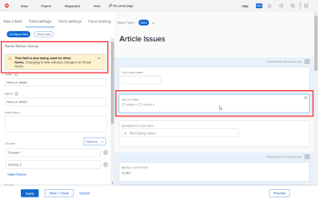

# View all custom forms that use a particular custom field or widget

You can find out which custom forms are using a custom field or widget that you want to change or delete. It’s important to assess whether those custom forms will need adjustments to keep working properly or to continue to be useful after you change or delete the field or widget.

For information about custom fields and widgets in custom forms, see [Add a custom field to a custom form](../../../administration-and-setup/customize-workfront/create-manage-custom-forms/add-a-custom-field-to-a-custom-form.md) and [Add or edit an asset widget in a custom form](../../../administration-and-setup/customize-workfront/create-manage-custom-forms/add-widget-or-edit-its-properties-in-a-custom-form.md).

##  

## Access requirements

You must have the following to perform the steps in this article:

<table cellspacing="0"> 
 <col> 
 <col> 
 <tbody> 
  <tr data-mc-conditions=""> 
   <td role="rowheader"> 
Adobe Workfront plan*
 </td> 
   <td>Any</td> 
  </tr> 
  <tr> 
   <td role="rowheader">Adobe Workfront license*</td> 
   <td> 
Plan 
 </td> 
  </tr> 
  <tr data-mc-conditions=""> 
   <td role="rowheader">Access level configurations*</td> 
   <td> 
Administrative access to custom forms
 
For information about how Workfront administrators grants this access, see <a href="../../../administration-and-setup/add-users/configure-and-grant-access/grant-users-admin-access-certain-areas.md" class="MCXref xref">Grant users administrative access to certain areas</a>.
 </td> 
  </tr> 
 </tbody> 
</table>

&#42;To find out what plan, license type, or access level configurations you have, contact your Workfront administrator.

## Find out which custom forms use a particular custom field or widget

1. Click the **Main Menu** icon  in the upper-right corner of Adobe Workfront, then click **Setup** .

1. In the left panel, click **Custom Forms**.
1. Open the **Fields** tab, look for the field or widget in the **Name** column, then view the **Forms** column to see which custom forms are using the field or widget.

   <!--
   <li value="4" data-mc-conditions="QuicksilverOrClassic.Draft mode"> 
Open the custom form containing the field<!--
   <MadCap:conditionalText class="preview" data-mc-conditions="QuicksilverOrClassic.Draft mode">
   , image widget, or
   video widget
   </MadCap:conditionalText>
   --> that you want to change or delete, then select the custom field<!--
    or widget
   --> on the right side of the screen. <!--
   These 2 steps are drafted because it's a less straightforward way to do this. Check with Lilit before deleting this to make sure that the Field List view is always available. Can't remember why I documented this way in the first place.
   -->
 
 <!--
   <MadCap:conditionalText data-mc-conditions="QuicksilverOrClassic.Draft mode">
   If you selected a custom field,
   </MadCap:conditionalText>
   -->A warning message displays if the field is used on another custom form.
 
  
 </li>
   -->

   <!--
   <li value="5" data-mc-conditions="QuicksilverOrClassic.Draft mode"> 
Click the blue arrow in the warning message to see which custom forms are using the field<!--
   <MadCap:conditionalText class="preview" data-mc-conditions="QuicksilverOrClassic.Draft mode">
   or widget
   </MadCap:conditionalText>
   -->.
 </li>
   -->

1. (Optional) Click the name of any of those custom forms to go to the form and consider what changes you might need to make there if you modify the field or widget.

