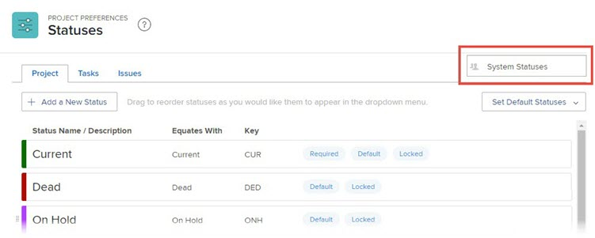
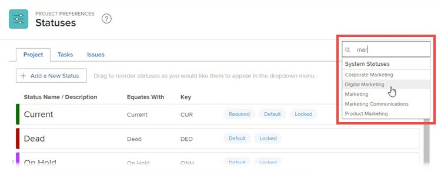
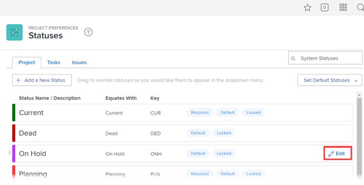
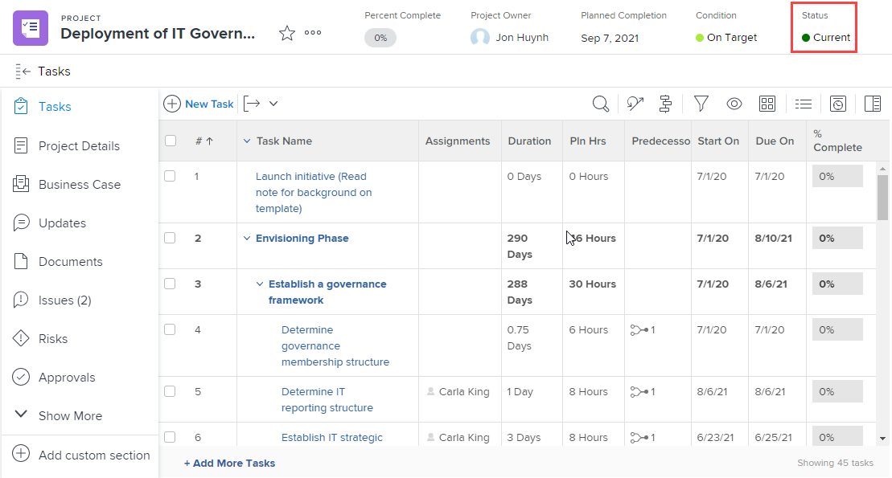

# Create or edit a status

<!-- Audited: 1/2024 -->

<!--DON'T DELETE, DRAFT OR HIDE THIS ARTICLE. IT IS LINKED TO THE PRODUCT THROUGH CONTEXT SENSITIVE HELP LINKS.-->

As an Adobe Workfront administrator, you can create custom statuses for projects, tasks, and issues. These can be for users throughout the entire Workfront system, or for specific groups or subgroups. For more information about statuses, see [Statuses overview](../../../administration-and-setup/customize-workfront/creating-custom-status-and-priority-labels/statuses-overview.md).

>[!NOTE]
>
>Group administrators can also create their own group statuses, for use only by their groups. For more information, see [Create or edit a group status](../../../administration-and-setup/manage-groups/manage-group-statuses/create-or-edit-a-group-status.md).

## Access requirements

You must have the following access to perform the steps in this article: 

<table style="table-layout:auto"> 
 <col> 
 <col> 
 <tbody> 
  <tr> 
   <td role="rowheader">Adobe Workfront plan</td> 
   <td>Any</td> 
  </tr> 
  <tr> 
   <td role="rowheader">Adobe Workfront license</td> 
   <td>
     
New: Standard

     
or

     
Current: Plan

   </td> 
  </tr> 
  <tr> 
   <td role="rowheader">Access level configurations</td> 
   <td> 
You must be a Workfront administrator.
  </td> 
  </tr> 
 </tbody> 
</table>

For more detail about the information in this table, see [Access requirements in Workfront documentation](/help/quicksilver/administration-and-setup/add-users/access-levels-and-object-permissions/access-level-requirements-in-documentation.md).

## Create or edit a custom status

You can add a custom status for use by your entire organization or by a single group.

When you create a custom status for the entire organization, you can configure it so that all groups in the system can use it without editing it. Or you can configure it so that group administrators can modify it for their groups, as explained in [Create or edit a group status](../../../administration-and-setup/manage-groups/manage-group-statuses/create-or-edit-a-group-status.md).

1. Click the **Main Menu** icon  in the upper-right corner of Adobe Workfront, then click **Setup** .

1. In the left panel, click **Project Preferences** > **Statuses**.

1. (Conditional) If you are creating or editing a status for use system wide, ensure that **System Statuses** is selected in the box in the upper-right corner.

   

   Or

   If the status is for a group or subgroup, start typing the name of the group in the upper-right corner, then select it when it appears.

   

1. Select the tab of the object type (**Project**, **Tasks**, or **Issues**) that you want to associate with the status.

1. If you are creating a new status, click **Add a New Status**.

   Or

   If you are editing an existing status, hover over it, then click the **Edit** icon that displays to the far-right.

   

1. Configure the status using the following options:

   <table style="table-layout:auto"> 
    <col> 
    <col> 
    <tbody> 
     <tr> 
      <td role="rowheader">Status Name</td> 
      <td> 
Type a name for the status. This is a required field.
 
When you create a status name, be aware that others in the system can create a status with the same name. We recommend using a unique name to avoid confusion when selecting statuses in Workfront.
 </td> 
     </tr> 
     <tr> 
      <td role="rowheader">Description</td> 
      <td>(Optional) Type a description of the status. This communicates its purpose to those who use it.</td> 
     </tr> 
     <tr> 
      <td role="rowheader">Color</td> 
      <td> 
Customize the color of the status by clicking the color field and selecting a color from the swatch panel. You can also enter a hex number in the field.
 
The status color displays in the upper-right corner of Workfront when a user views the object.
  
 </td> 
     </tr> 
     <tr> 
      <td role="rowheader">Equates With</td> 
      <td> 
Select one of the options from the list that best describes the function of the status. For example, if the status name is Done, the option it equates with should be Complete.
 
Every status must equate with one of these options because this determines how the status functions.
 
This option cannot be modified after the status is created.
 </td> 
     </tr> 
     <tr> 
      <td role="rowheader">Key</td> 
      <td> 
If you are creating a new status, type a code or abbreviation for the status or use the one generated for you. This key must be unique in Workfront because it can be used for reporting purposes. If you attempt to specify a key that is already in use in the system, the field turns red.
 
It might be useful to use an abbreviation that is recognizable to those who will use it.
 
This option cannot be modified after the status is created.
 
You cannot change the key code for Planning, Current, and Complete statuses. This is important if you are building a report in text mode.
 </td> 
     </tr> 
     <tr> 
      <td role="rowheader">Hide Status</td> 
      <td> 
(Project and Task statuses only)
 
Enable this option if you want the status hidden from users. When it is disabled (the default setting), all users in the system can use the status.
 
You can hide an Issue status by disabling all 4 issue types (Bug Report, Change Order, Issue, Request).
 </td> 
     </tr> 
     <tr> 
      <td role="rowheader">Lock for all groups</td> 
      <td>
       
When a status is locked, users throughout the system can see and use it and group administrators cannot customize it for their groups.
 
       
When a status is unlocked, group administrators can customize it for their individual groups.

      

       
You can use both locked and unlocked statuses in a system approval process. If you create a system approval process with an unlocked system status, users throughout the system can attach the approval process to any project, task, or issue in the system.

       
 In the following scenarios, warning messages display to help you and your users understand outcomes of unlocking a status:

       <ul>
       <li>An administrator unlocks a system-level status that is used in an approval process. A message warns that  might delete the unlocked status for their groups, which would prevent group members from using that approval process properly for objects assigned to their group.</li>
       <li>A user starts to edit an approval process that uses an unlocked status. A message alerts the user about the unlocked status so they can evaluate whether it would be a good idea to re-lock or replace it.</li>
       <li>A system-level approval process with an unlocked status is attached on an object, and the status was deleted for the group assigned to the object. When a group member goes to the Approvals section for the object, a message explains that the approval process can't be initiated for the object.</li>
       </ul>
       
For more information about locking statuses, see <a href="../../../administration-and-setup/customize-workfront/creating-custom-status-and-priority-labels/lock-or-unlock-a-custom-system-level-status.md" class="MCXref xref">Locked and unlocked system-level statuses</a>.

       

      </td>
     </tr> 
    </tbody> 
   </table>

1. Click **Save**.

   For instructions on making this status a default status, see [Use custom statuses as default statuses](../../../administration-and-setup/customize-workfront/creating-custom-status-and-priority-labels/use-custom-statuses-as-default-statuses.md).

For information about reordering group statuses, see [Reorder system-level and group statuses](../../../administration-and-setup/customize-workfront/creating-custom-status-and-priority-labels/reorder-system-statuses.md).
