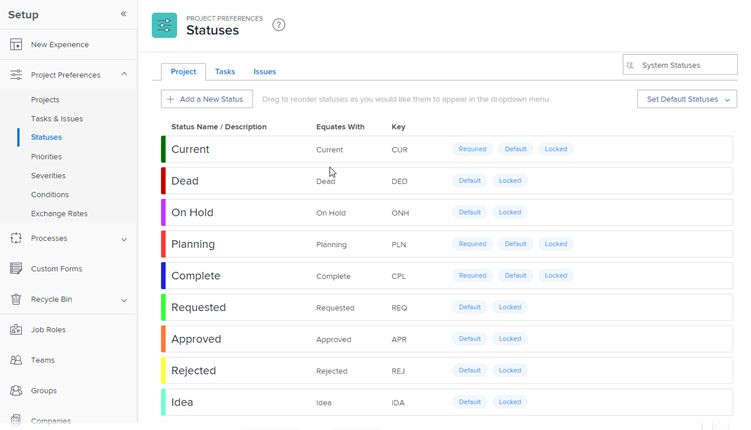

# Access the list of system project statuses

Users can specify the status of a project so that other users can see the project's current stage of development at a given time.

Workfront comes with 9 system project statuses. You can change the name of these statuses, but you cannot delete them.

You can also add custom project statuses to match the needs in your organization.

As a Workfront administrator, you configure the default status for all new projects in the system. For instructions, see [Configure system-wide project preferences](../../../administration-and-setup/set-up-workfront/configure-system-defaults/set-project-preferences.md).

## Access requirements

You must have the following access to perform the steps in this article: 

<table style="table-layout:auto"> 
 <col> 
 <col> 
 <tbody> 
  <tr> 
   <td role="rowheader">Adobe Workfront plan</td> 
   <td>Any</td> 
  </tr> 
  <tr> 
   <td role="rowheader">Adobe Workfront license</td> 
   <td>Plan</td> 
  </tr> 
  <tr> 
   <td role="rowheader">Access level configurations</td> 
   <td> 
You must be a Workfront administrator.
 
<b>NOTE</b>: If you still don't have access, ask your Workfront administrator if they set additional restrictions in your access level. For information on how a Workfront administrator can modify your access level, see <a href="../../../administration-and-setup/add-users/configure-and-grant-access/create-modify-access-levels.md" class="MCXref xref">Create or modify custom access levels</a>.
 </td> 
  </tr> 
 </tbody> 
</table>

## Access the project statuses

As a Workfront administrator, you can access the list of system-level project statuses.

For information about editing a system status and creating custom statuses, see [Create or edit a status](../../../administration-and-setup/customize-workfront/creating-custom-status-and-priority-labels/create-or-edit-a-status.md).

1. Click the **Main Menu** icon  in the upper-right corner of Adobe Workfront, then click **Setup** .

1. Click **Project Preferences** > **Statuses**.

1. Click the **Project** tab.

   The project statuses available in Workfront are listed on this tab.

   

   For details about each of the built-in system project statuses, see [Overview of system project statuses](../../../administration-and-setup/customize-workfront/creating-custom-status-and-priority-labels/system-project-statuses.md).

## Creating custom project statuses and customize system statuses

As a Workfront administrator you can add system project statuses to Workfront. As a group owner, you can add a custom status specific to one group. For more information about creating custom statuses or editing the system ones, see [Create or edit a status](../../../administration-and-setup/customize-workfront/creating-custom-status-and-priority-labels/create-or-edit-a-status.md).

When you create a custom project status, you must always equate the new status with an existing system status. You must understand the behavior of the system statuses to know which status is appropriate to equate your custom status with. After you have selected your equal status this selection cannot be changed. For more information about the system project statuses, see [Overview of system project statuses](../../../administration-and-setup/customize-workfront/creating-custom-status-and-priority-labels/system-project-statuses.md).
