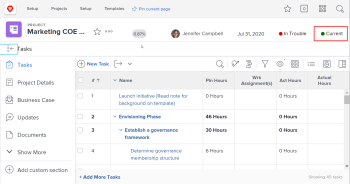

# Statuses overview

To find out what the current state of development is for a project, task, or issue, a user can view its status.

For example, in this project, the status Planning indicates that the project’s manager is currently planning aspects of the project such as its timeline, task assignments, and approvals.

Changing the status of a project, task, or issue is usually a manual process. However, there are times when the status of an issue is changed automatically, depending on other factors happening in the system.

Workfront comes with 9 project statuses, 3 task statuses, and 10 issue statuses. For details about these, see [Access the list of system project statuses](../../../administration-and-setup/customize-workfront/creating-custom-status-and-priority-labels/project-statuses.md), [Access the list of system task statuses](../../../administration-and-setup/customize-workfront/creating-custom-status-and-priority-labels/task-statuses.md), and [Access the list of system issue statuses](../../../administration-and-setup/customize-workfront/creating-custom-status-and-priority-labels/issue-statuses.md).

## Creating custom statuses

In addition to the default statuses that come with Workfront, a Workfront administrator can add custom project, task, and issue statuses to match the needs in your organization. You can create system-wide statuses used by everyone in your Workfront instance, or group statuses used by only certain groups. For more information, see [Create or edit a status](../../../administration-and-setup/customize-workfront/creating-custom-status-and-priority-labels/create-or-edit-a-status.md).

Group administrators can also do this to meet the needs of their groups. For more information, see [Create or edit a group status](../../../administration-and-setup/manage-groups/manage-group-statuses/create-or-edit-a-group-status.md).
