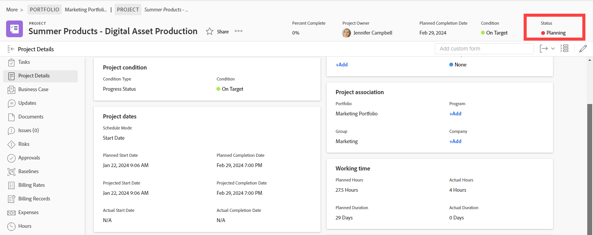

# Statuses overview

<!-- Audited: 01/2024 -->

To find out what the current state of development is for a project, task, or issue, a user can view its status.

For example, in this project, the status Planning indicates that the project's manager is currently planning aspects of the project such as its timeline, task assignments, and approvals.

You must have the following access and permissions to a project, task, or issue to view their status: 

* View or higher access in your access level to Projects, Tasks, and Issues 
* View or higher permissions on the object

You must have the following access and permissions to a project, task, or issue to manually change their status: 

* Edit access in your access level to Projects, Tasks, and Issues 
* Contribute or higher permissions on the task or issue
* Manage permissions on the project. 

Changing the status of a project, task, or issue is usually a manual process. However, there are times when the status of an issue is changed automatically, depending on other factors happening in the system.

Adobe Workfront comes with 9 project statuses, 3 task statuses, and 10 issue statuses. For details about these, see the following articles:

* [Access the list of system project statuses](../../../administration-and-setup/customize-workfront/creating-custom-status-and-priority-labels/project-statuses.md) 
* [Access the list of system task statuses](../../../administration-and-setup/customize-workfront/creating-custom-status-and-priority-labels/task-statuses.md) 
* [Access the list of system issue statuses](../../../administration-and-setup/customize-workfront/creating-custom-status-and-priority-labels/issue-statuses.md)

## Custom statuses

In addition to the default statuses that come with Workfront, a Workfront administrator can add custom project, task, and issue statuses to match the needs in your organization. You can create system-level statuses used by everyone in your Workfront instance, or group-level statuses used only by certain groups. For more information, see [Create or edit a status](../../../administration-and-setup/customize-workfront/creating-custom-status-and-priority-labels/create-or-edit-a-status.md).

## Group statuses

Group administrators can create group-level custom statuses to meet the needs of their groups. For more information, see [Manage group statuses](../../../administration-and-setup/manage-groups/manage-group-statuses/manage-group-statuses.md).
