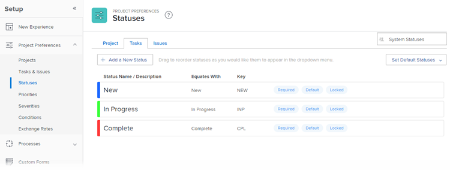

# Access the list of system task statuses

You can use the status of a task to show users what stage of development a task is in at a given time.

## Access requirements

+++ Expand to view access requirements for the functionality in this article.

You must have the following access to perform the steps in this article: 

<table style="table-layout:auto"> 
 <col> 
 <col> 
 <tbody> 
  <tr> 
   <td role="rowheader">Adobe Workfront plan</td> 
   <td>Any</td> 
  </tr> 
  <tr> 
   <td role="rowheader">Adobe Workfront license</td> 
   <td>Plan</td> 
  </tr> 
  <tr> 
   <td role="rowheader">Access level configurations</td> 
   <td> 
You must be a Workfront administrator.
 
<b>NOTE</b>: If you still don't have access, ask your Workfront administrator if they set additional restrictions in your access level. For information on how a Workfront administrator can modify your access level, see <a href="../../../administration-and-setup/add-users/configure-and-grant-access/create-modify-access-levels.md" class="MCXref xref">Create or modify custom access levels</a>.
 </td> 
  </tr> 
 </tbody> 
</table>

+++

## Access task statuses

For information about editing the system statuses or creating new custom statuses, see [Create or edit a status](../../../administration-and-setup/customize-workfront/creating-custom-status-and-priority-labels/create-or-edit-a-status.md).

{{step-1-to-setup}}

1. Click **Project Preferences** > **Statuses**.

1. Click the **Tasks** tab.

   The tasks statuses available in Workfront are listed on this tab.

   

   For details about each of the built-in system task statuses, see [System task statuses](../../../administration-and-setup/customize-workfront/creating-custom-status-and-priority-labels/system-task-statuses.md).

## About creating custom task statuses

As a Workfront administrator you can add custom system task statuses to Workfront.

As a group owner, you can add custom task statuses for your group.

When you create a custom task status, you must always equate the new status with an existing system status. You must understand the behavior of the system statuses to know which status is appropriate to equate your custom status with. After you have selected your equal status, this selection cannot be changed.

For more information about creating custom statuses, editing system ones, or selecting new default statuses for your tasks, see [Create or edit a status](../../../administration-and-setup/customize-workfront/creating-custom-status-and-priority-labels/create-or-edit-a-status.md).
