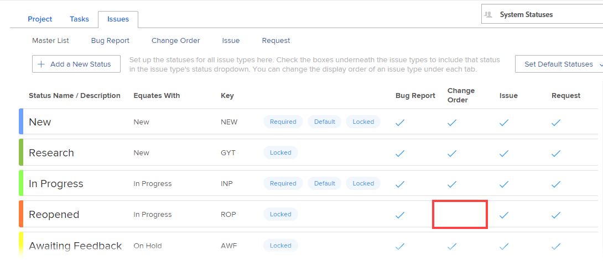

# Use custom statuses as default statuses

When a custom status is set as a default status, the new default status is used throughout the system in various ways. The ways in which it's used depends on whether it is set as a default system-level status, or a default group-level status.

## Access requirements

+++ Expand to view access requirements for the functionality in this article.

You must have the following access to perform the steps in this article: 

<table style="table-layout:auto"> 
 <col> 
 <col> 
 <tbody> 
  <tr> 
   <td role="rowheader">Adobe Workfront plan</td> 
   <td>Any</td> 
  </tr> 
  <tr> 
   <td role="rowheader">Adobe Workfront license</td> 
   <td>Plan</td> 
  </tr> 
  <tr> 
   <td role="rowheader">Access level configurations</td> 
   <td> 
You must be a Workfront administrator.
 
<b>NOTE</b>: If you still don't have access, ask your Workfront administrator if they set additional restrictions in your access level. For information on how a Workfront administrator can modify your access level, see <a href="../../../administration-and-setup/add-users/configure-and-grant-access/create-modify-access-levels.md" class="MCXref xref">Create or modify custom access levels</a>.
 </td> 
  </tr> 
 </tbody> 
</table>

+++

## Custom default system-level statuses

When you set a custom status as a default system status, any new groups created in the system inherit that status.

Groups that already existed when you set the new default system status do not automatically inherit it.

For example, suppose there are two groups already created in your Adobe Workfront environment (Marketing and Sales). You create a new custom status that equates with Current, and call the status In Process. You now create a new group called Engineering. In this scenario, the Engineering group inherits the new default status; the Marketing and Sales groups do not.

## Custom default group-level statuses

A custom status that you set as a default group status is used in the following circumstances:

* **When the Workfront system chooses a status automatically, the default group status is used:** The custom status that you set as the default group status is used when the Workfront system automatically assigns a status to an object.

  For example, a task can be configured to automatically change to Complete status when the percent complete reaches 100%. If you create a custom status that equates with Complete and you set that custom status as a default status, Workfront changes the status of the task to the new default status.

  Custom statuses are used in this way only with group statuses that are associated with a task or issue. Custom statuses cannot be used in this way for statuses associated with a project.

* The **status of a project is determined by the group associated with the project**: If the group associated with a given project changes, the status of the project changes depending on the default statuses defined for the group. (A group can be associated with a project via the Groups field when editing the project.)

  If that group changes, the status of the project changes if the new group has a different default status defined that equates with the current status of the project.

  For example, a project can be associated with the Marketing group, and the status of the project is set to Planning. The project is edited so that it is now associated with the Sales group. The Sales group has a custom default group status called Thinking (and this status equates with Planning). Because the Group on the project was changed, the status of the project changes now to Thinking.

If you are a group administrator, see [Set a status as a default status for a group](/help/quicksilver/administration-and-setup/manage-groups/manage-group-statuses/use-custom-statuses-as-default-statuses-group.md). 

## Issue statuses

If the custom status is an Issue status, all four issue types must be enabled for it (Bug Report, Change Order, Issue, and Request). For example, in the issue status shown below, the status Reopened cannot be used as a default status because the Change Order issue type is not selected:

## Set a custom status as a default status

{{step-1-to-setup}}

1. In the left panel, click **Project Preferences** > **Statuses**.
1. (Conditional) If you are setting a default status for a group, begin typing the name of the group in the menu in the upper-right corner, then select it when it appears.
1. Open the **Project**, **Tasks**, or **Issues** tab, depending on the type of status you want to set as a default status.
1. Click the **Set Default Statuses** drop-down menu.
1. In the drop-down area that displays, next to the status where you want to set the default status, select the default status you want.
1. Click **Save**.
1. Associate the project with the group where the status resides. 

   >[!NOTE]
   >
   >If you are setting the custom status for a group, and you later assign the project to a different group, the project status will reload and could change.

   1. Go to the project where you want to use the custom status.
   1. Click the More menu , then click **Edit**.  
   1. In the **Edit Project** box that displays, in the **Group** field under **Project association**, select the group where the status resides.
   1. Click **Save Changes**.
