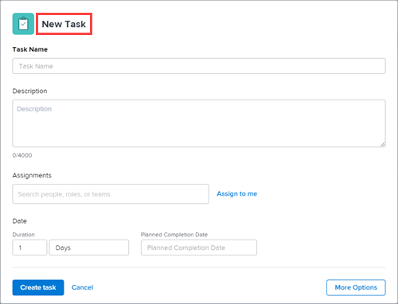
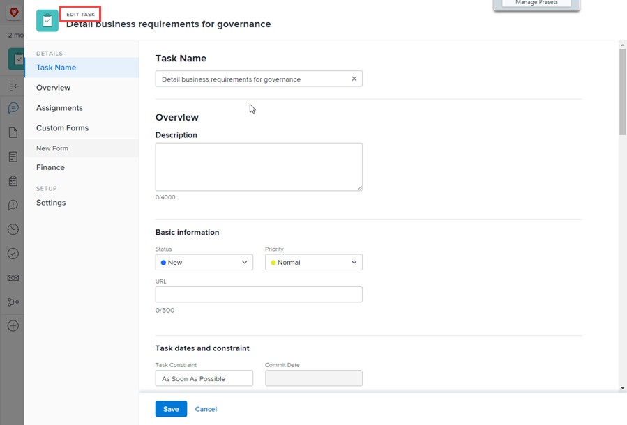
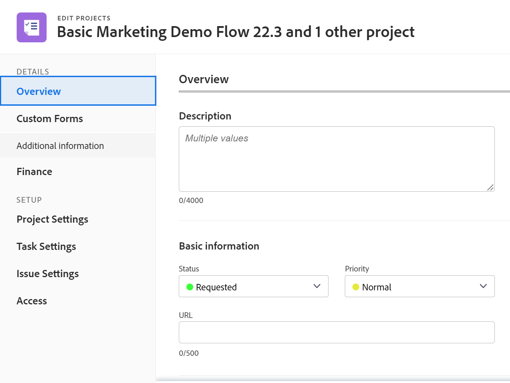
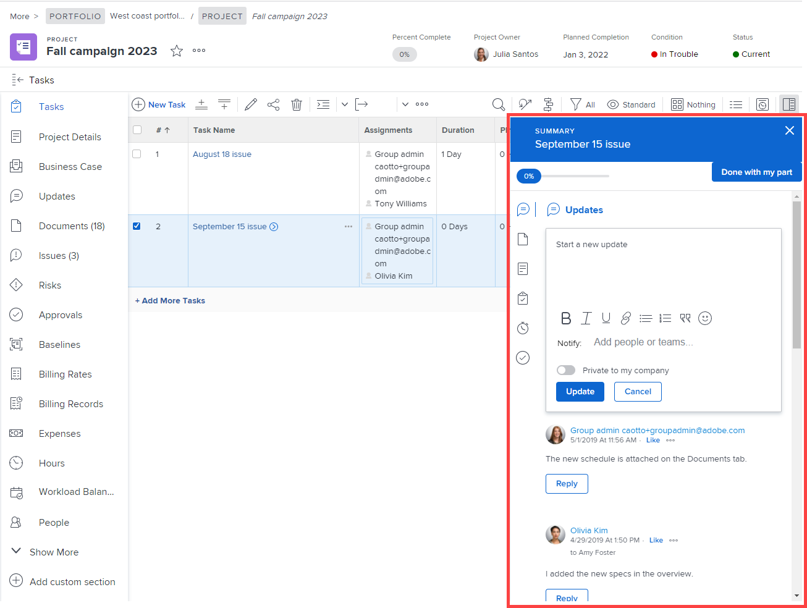
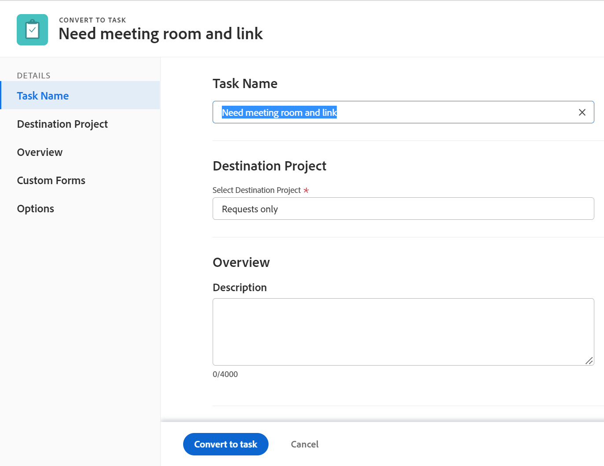
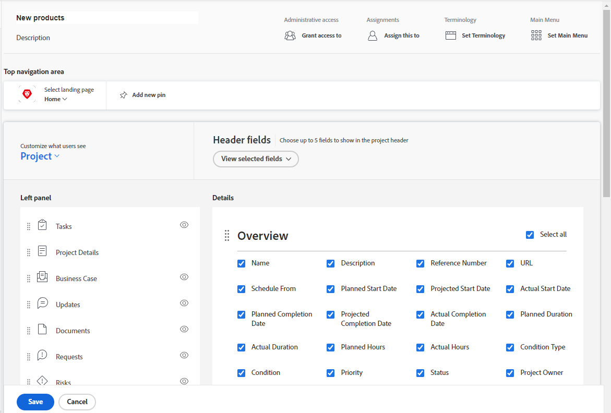

# Customize the Details view using a layout template

<!--The highlighted information on this page refers to functionality not yet generally available. It is available for all customers in the Preview environment and for a select group of customers in the Production environment.-->

As an Adobe Workfront administrator, you can use a layout template to determine what information appears when a user clicks the Details icon  in the left panel while viewing a task, issue, document, program, or portfolio.

<!--
or billing record
-->

You can also change the order of the information in which this information appears. For example, for all tasks that your users see, you can move Custom Forms information to the top of the Details view for all tasks that your users see.

For information about creating layout templates, see [Create and manage layout templates](../use-layout-templates/create-and-manage-layout-templates.md). 

For information about layout templates for groups, see [Create and modify a group's layout templates](../../../administration-and-setup/manage-groups/work-with-group-objects/create-and-modify-a-groups-layout-templates.md).

After configuring a layout template, you must assign it to users for changes you made to be visible to others. For information about assigning a layout template to users, see [Assign users to a layout template](../use-layout-templates/assign-users-to-layout-template.md).

The changes you make to the Details view for an object also determine the availability and order of fields that users see in the following areas:

* "Create object" boxes, such as Create Task

  

* "Edit object" screens when editing an object, such as Edit Task, Edit Issue, and Edit Project

  

* "Edit objects" screens when editing objects in bulk. Currently this is supported for editing projects in bulk.

  
  

* Summary  panel for lists of tasks and issues

  

  >[!NOTE]
  >
  >Changes to the layout templates affect the order and availability of fields in the Summary panel only for the tasks and issues that are assigned to the logged-in user.

* Conversion boxes, such as the Convert issue to task or Convert issue to project boxes. 

  

For information about layout templates for groups, see [Create and modify a group's layout templates](../../../administration-and-setup/manage-groups/work-with-group-objects/create-and-modify-a-groups-layout-templates.md).

## Access requirements

+++ Expand to view access requirements for the functionality in this article.

You must have the following access to perform the steps in this article: 

<table style="table-layout:auto"> 
 <col> 
 <col> 
 <tbody> 
  <tr> 
   <td role="rowheader">Adobe Workfront plan</td> 
   <td>Any</td> 
  </tr> 
  <tr> 
   <td role="rowheader">Adobe Workfront license</td> 
   <td>Plan</td> 
  </tr> 
  <tr> 
   <td role="rowheader">Access level configurations</td> 
   <td> 
To perform these steps at the system level, you need the System Administrator access level.
To perform them for a group, you must be a manager of that group
 
<b>NOTE</b>: If you still don't have access, ask your Workfront administrator if they set additional restrictions in your access level. For information on how a Workfront administrator can modify your access level, see <a href="../../../administration-and-setup/add-users/configure-and-grant-access/create-modify-access-levels.md" class="MCXref xref">Create or modify custom access levels</a>.
 </td> 
  </tr> 
 </tbody> 
</table>

+++

## Customize what users see in the Details view

1. Begin working on a layout template, as described in [Create and manage layout templates](../../../administration-and-setup/customize-workfront/use-layout-templates/create-and-manage-layout-templates.md).
1. Click the down arrow  under **Customize what users see**, then click **Project**, **Task**, **Issue**, **Program**, or **Portfolio.**
<!--
, or billing record
-->

1. In the **Details** section, do any of the following to customize what users see in the Details view:

   * Drag any section headers  to change their order.
   * Enable or disable options under the various areas (such as **Overview**, **Finance**, and **Custom Forms**) to show or hide them.

     If you hide all fields in one of these sections, the entire section is hidden.

     All of the fields are enabled by default. You can select or clear the **Select all** check box in an area to display or hide all of the fields in that area.

   

1. Continue customizing the layout template.

   Or

   If you are finished customizing, click **Save**.

   >[!TIP]
   >
   >You can click Save at any time to save your progress, then continue to modify the template later.
