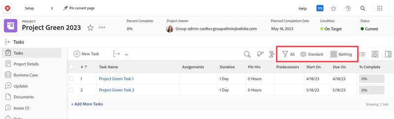
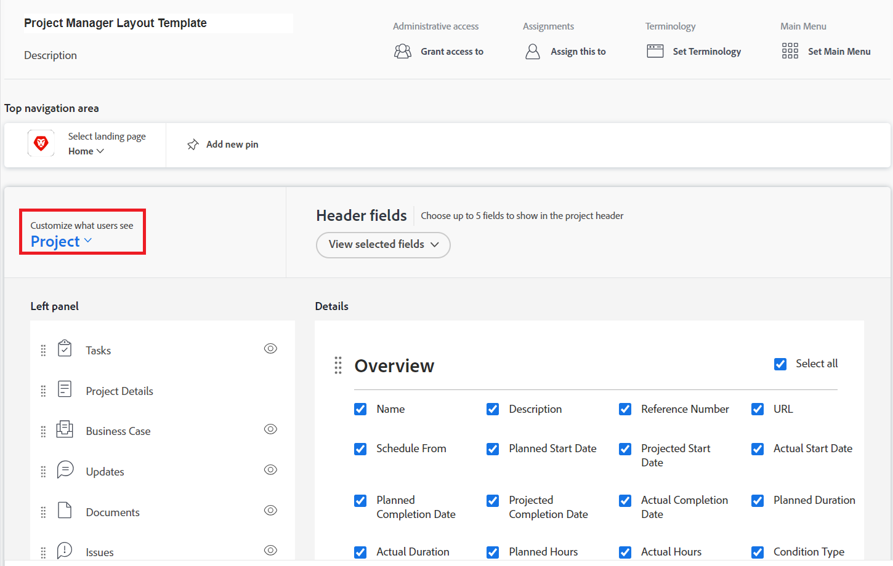
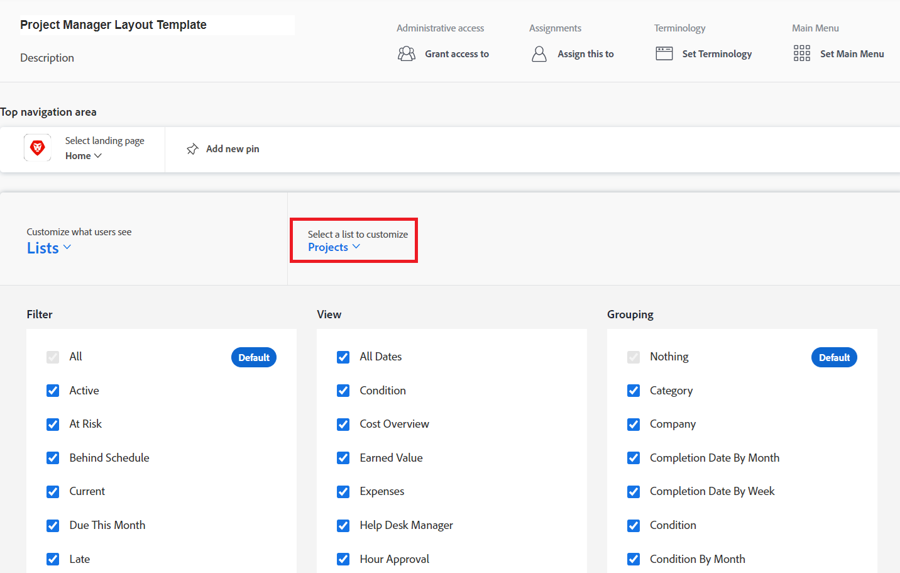
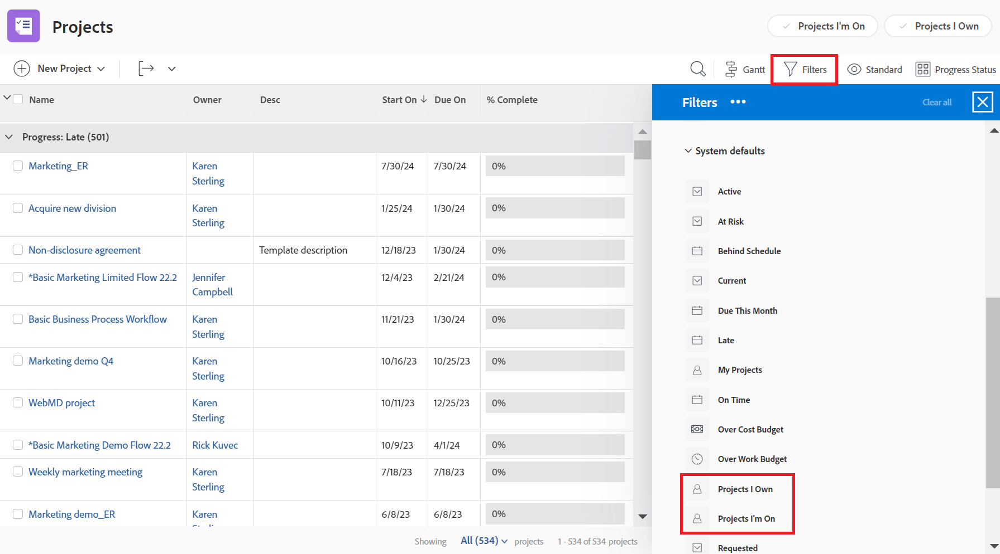

# Customize Filters, Views, and Groupings using a layout template

As an Adobe Workfront administrator, you can use a layout template to specify which list controls appear in the Filter, View, and Grouping drop-down menus. These menus appear above lists throughout Workfront, such as the list of tasks for a project:

For more information about layout templates, see [Create and manage layout templates](../../../administration-and-setup/customize-workfront/use-layout-templates/create-and-manage-layout-templates.md).

For information about layout templates for groups, see [Create and modify a group's layout templates](../../../administration-and-setup/manage-groups/work-with-group-objects/create-and-modify-a-groups-layout-templates.md).

After configuring a layout template, you must assign it to users for changes you made to be visible to others. For information about assigning a layout template to users, see [Assign users to a layout template](../use-layout-templates/assign-users-to-layout-template.md).

## Access requirements

You must have the following access to perform the steps in this article: 

<table style="table-layout:auto"> 
 <col> 
 <col> 
 <tbody> 
  <tr> 
   <td role="rowheader">Adobe Workfront plan</td> 
   <td>Any</td> 
  </tr> 
  <tr> 
   <td role="rowheader">Adobe Workfront license</td> 
   <td>Plan</td> 
  </tr> 
  <tr> 
   <td role="rowheader">Access level configurations</td> 
   <td> 
To perform these steps at the system level, you need the System Administrator access level.
To perform them for a group, you must be a manager of that group.
 
<b>NOTE</b>: If you still don't have access, ask your Workfront administrator if they set additional restrictions in your access level. For information on how a Workfront administrator can modify your access level, see <a href="../../../administration-and-setup/add-users/configure-and-grant-access/create-modify-access-levels.md" class="MCXref xref">Create or modify custom access levels</a>.
 </td> 
  </tr> 
 </tbody> 
</table>

## Customize Filter, View, and Grouping list controls:

1. Begin working on a layout template, as described in [Create and manage layout templates](../../../administration-and-setup/customize-workfront/use-layout-templates/create-and-manage-layout-templates.md).
1. Click the down arrow  under **Customize what users see**, then click **Lists** in the drop-down menu that displays.

   

1. Click the down arrow  under **Select a list to customize**, then select the type of Workfront object for which you want to customize the Filter, View, and Grouping list controls.

   

   >[!NOTE]
   >
   >If you select Projects as the list to customize, then disable Projects I'm On or Projects I Own in the Filter section, users will no longer see or be able to use that filter:
   >
   >* In the list of filters that displays when they click the filter icon  above a list:
   >   
   >  
   >   
   >* In the header on the Projects area header:
   >   
   >  

1. (Optional) If you want to change the default filter, view, or grouping for the layout template, hover over the filter, view, or grouping, then click **Set as default**.

   The defaults you choose determine which Filter, View, and Grouping users will see in lists throughout Workfront when the layout template is assigned to them. If you don't change these defaults, users see all lists as follows:

   * **Filters**: All
   * **View**: Standard (where applicable; some lists do not have this view)
   * **Grouping**: Nothing

   You can hide the options All, Standard, and Nothing after selecting different defaults (see Step 5), but they can't be deleted.

   You can delete any other option being used as a default, but you have to select a different default first.

   For information about deleting filters, views, and groupings, see [Create, edit, and share default filters, views, and groupings](../../../administration-and-setup/set-up-workfront/configure-system-defaults/create-and-share-default-fvgs.md).

1. Hide and add list controls as follows:

   <table style="table-layout:auto"> 
    <col> 
    <col> 
    <tbody> 
     <tr> 
      <td role="rowheader">Hide a list control</td> 
      <td> 
Clear or check the box next to the list control you want to hide or show.
 
If a checkbox is dimmed, you cannot hide that list control. The Default  setting for each list control is dimmed because you can't hide the setting that is currently configured as the default.
 </td> 
     </tr> 
     <tr> 
      <td role="rowheader">Add a custom list control</td> 
      <td> 
 
        <ol> 
         <li value="1"> Click <strong>Add Filter</strong>, <strong>Add View</strong>, or <strong>Add Grouping</strong> at the bottom of the Filter, View, or Grouping list. In the box that displays, start typing the name of an existing custom list control previously created for your organization, then click the name when it appears.</li> 
         <li value="2"> If you want the new custom list control set as the default filter, view, or grouping for the layout template, click <strong>Set as Default</strong>. </li> 
         <li value="3"> 
Click <strong>Add</strong> when you are finished.
 
<b>NOTE</b>: 
Users can add custom list controls to their own lists. If you add custom list controls in a layout template, your list controls are added and theirs move to the bottom of the panel; yours do not replace theirs.
 
This is also true if you assign the user to a new layout template that has custom list controls. 
 
For information about customizing list controls, see <a href="../../../reports-and-dashboards/reports/reporting-elements/filters-overview.md" class="MCXref xref">Filters overview</a>, <a href="../../../reports-and-dashboards/reports/reporting-elements/views-overview.md" class="MCXref xref">Views overview in Adobe Workfront</a>, and <a href="../../../reports-and-dashboards/reports/reporting-elements/groupings-overview.md" class="MCXref xref">Groupings overview in Adobe Workfront</a>.
 
 </li> 
        </ol> 
 </td> 
     </tr> 
    </tbody> 
   </table>

1. Continue customizing the layout template.

   Or

   If you are finished customizing, click **Save**.

   >[!TIP]
   >
   >You can click Save at any time to save your progress, then continue to modify the template later.
