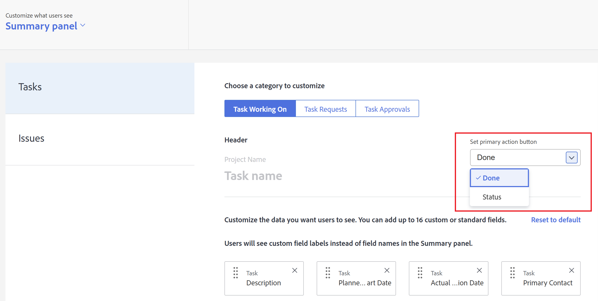

# Customize the Summary panel using a layout template

<!--Audited: 11/2024-->

<!--The highlighted information on this page refers to functionality not yet generally available. It is available only in the Preview environment for all customers. After the monthly releases to Production, the same features are also available in the Production environment for customers who enabled fast releases.    

For information about fast releases, see [Enable or disable fast releases for your organization](/help/quicksilver/administration-and-setup/set-up-workfront/configure-system-defaults/enable-fast-release-process.md).    -->

You can use a Layout Template to configure what users see in the Summary panel when they click a task or an issue. Each configuration you make using the steps below affects the the Summary panel. These customizations don't apply to the Document Summary panel.

You can configure:

* What fields display for a task or issue in the Details area, and in what order
* Whether updates, logged time, attached documents, and timestamps display for a selected task or issue

You can also customize the fields that users see in the Home area when users click a project approval, document approval, or document version approval that is assigned to them.

For information about the Summary panel, see [Summary overview](../../../workfront-basics/the-new-workfront-experience/summary-overview.md).

For information about creating layout templates, see [Create and manage layout templates](../use-layout-templates/create-and-manage-layout-templates.md). 

For information about layout templates for groups, see [Create and modify a group's layout templates](../../../administration-and-setup/manage-groups/work-with-group-objects/create-and-modify-a-groups-layout-templates.md).

After configuring a layout template, you must assign it to users for changes you made to be visible to others. For information about assigning a layout template to users, see [Assign users to a layout template](../use-layout-templates/assign-users-to-layout-template.md).

## Access requirements

+++ Expand to view access requirements for the functionality in this article.

You must have the following access to perform the steps in this article: 

<table style="table-layout:auto"> 
 <col> 
 <col> 
 <tbody> 
  <tr> 
   <td role="rowheader">Adobe Workfront plan</td> 
   <td>Any</td> 
  </tr> 
  <tr> 
   <td role="rowheader">Adobe Workfront license*</td> 
   <td>
New: Standard

  
 Current: Plan

   </td> 
  </tr> 
  <tr> 
   <td role="rowheader">Access level configurations</td> 
   <td> 
To perform these steps at the system level, you need the System Administrator access level.
To perform them for a group, you must be a manager of that group.
 </td> 
  </tr> 
 </tbody> 
</table>

*For more information, see [Access requirements in Workfront documentation](/help/quicksilver/administration-and-setup/add-users/access-levels-and-object-permissions/access-level-requirements-in-documentation.md). 

+++

## Customize the Summary panel using a layout template

1. Begin working on a layout template, as described in [Create and manage layout templates](../../../administration-and-setup/customize-workfront/use-layout-templates/create-and-manage-layout-templates.md).

1. Click the down arrow  under **Customize what users see**, then click **Summary panel**. 

1. In the list that displays underneath, click the object type for which you want to customize the Summary panel. 

   The table below explains what you can customize for each object

   <table style="table-layout:auto"> 
    <col> 
    <col> 
    <tbody> 
     <tr> 
      <td role="rowheader">Tasks</td> 
      <td> 
In a list of tasks, this setting affects the Summary panel that displays on the right side of the page when a user selects a task, then clicks the Open Summary icon .

      
      
  
 </td> 
     </tr> 
     <tr> 
      <td role="rowheader">Issues</td> 
      <td>
In a list of issues, this setting affects the Summary panel that displays on the right side of the page when a user selects an issue, then clicks the Open Summary icon .
 </td> 
     </tr> 
    </tbody> 
   </table>

<!--These were removed with the new Home: 

<tr> 
      <td role="rowheader">Projects</td> 
      <td><ul><li>
In Home, when a user clicks a project approval assigned to them, your configuration for this setting affects the area to the right of the approval.

      
<b>IMPORTANT:</b> 

This is a deprecated feature. Any changes you make to this area are related to a feature that Workfront has removed. This option will be removed from Workfront with a later maintenance update.
</li>
      </ul> 
      </td> 
     </tr> 
     <tr> 
      <td role="rowheader">Documents</td> 
      <td>
     <ul><li>
In Home, when a user clicks a document approval assigned to them, your configuration for this setting affects the area to the right of the approval.

      
<b>IMPORTANT:</b> 

 This is a deprecated feature. Any changes you make to this area are related to a feature that Workfront has removed. This option will be removed from Workfront with a later maintenance update.
</li>
      </ul>
      </td> 
     </tr> 
     <tr> 
      <td role="rowheader">Document Versions</td> 
      <td><ul><li>
In Home, when a user clicks an approval assigned to them for a particular version of a document, your configuration for this setting affects the area to the right of the approval.

      

<b>IMPORTANT:</b>
 This is a deprecated feature. Any changes you make to this area are related to a feature that Workfront has removed. This option will be removed from Workfront with a later maintenance update.
</li>
      </ul>
      </td> 
     </tr> -->

   >[!IMPORTANT]
   >
   >If a task is unassigned, the user assigned to the layout template will not see the field customizations in the Summary.

1. (Conditional) If you clicked Tasks or Issues in the previous step, select the category of task or issue that you want to customize.

   

1. (Conditional) If the **Set primary action button** drop-down menu appears (if you select **Tasks** or **Issues** in the list on the left), click the primary action (**Done** or **Status**) that you want available for users in the Summary panel when they view a task or an issue.

   

1. Add  or hide  fields for the selected object type.

   

1. Repeat steps 3-6 to customize the Summary panel for any other object types.
1. Click **Global settings**, near the lower left corner, then enable or disable any of the following options related to Adobe Workfront objects in the Summary:

   <table style="table-layout:auto"> 
    <col> 
    <col> 
    <tbody> 
     <tr> 
      <td role="rowheader">Show updates for work</td> 
      <td>Displays any updates made on a selected task or issue in the Summary panel. This includes both system updates and updates made by a user. Users can still filter out system updates, as described in <a href="../../../workfront-basics/updating-work-items-and-viewing-updates/update-work.md#enable" class="MCXref xref">Enable or disable system updates</a> in <a href="../../../workfront-basics/updating-work-items-and-viewing-updates/update-work.md" class="MCXref xref">Update work</a>.</td> 
     </tr> 
     <tr> 
      <td role="rowheader">Log time against work</td> 
      <td>Displays the Log time against work option when a task or issue is selected, allowing users to log time on work items directly from the Home and Summary areas.</td> 
     </tr> 
     <tr> 
      <td role="rowheader">View documents associated with work</td> 
      <td>Displays a Documents area in the Summary panel when a task or issue is selected, listing any documents attached to the task or issue. Users can click documents to view them in a preview window.</td> 
     </tr> 
     <tr> 
      <td role="rowheader">Hide timestamp</td> 
      <td>Hides timestamps for the following date fields in the Summary panel:
       <ul>
        <li>Planned Completion Date</li>
        <li>Commit Date</li>
        <li>Submitted Date</li>
       </ul></td> 
     </tr> 
    </tbody> 
   </table>

1. Continue customizing the layout template.

   Or

   If you are finished customizing, click **Save**.

For more information about layout templates, see [Create and manage layout templates](../../../administration-and-setup/customize-workfront/use-layout-templates/create-and-manage-layout-templates.md).
