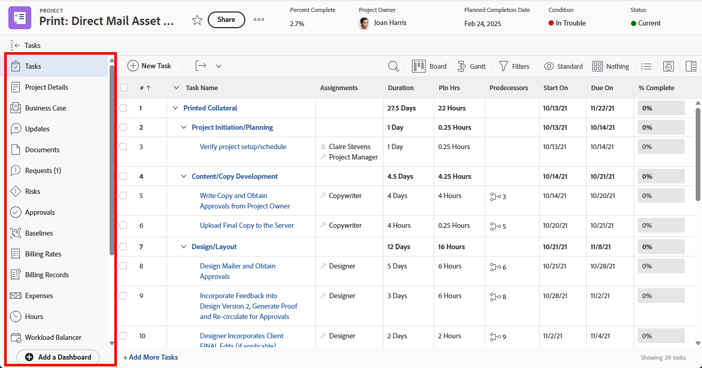

# Customize the left panel using a layout template

<!--Audited: 10/2024-->

In a layout template, you can customize what users see in the left panel area throughout [!DNL Adobe Workfront].

For example, you can determine which of the following items users see in the left panel when viewing a project:

>[!IMPORTANT]
>
>Changes made to order and visibility are reflected in the mobile app.

For information about creating layout templates, see [Create and manage layout templates](../use-layout-templates/create-and-manage-layout-templates.md). 

For information about layout templates for groups, see [Create and modify a group's layout templates](../../../administration-and-setup/manage-groups/work-with-group-objects/create-and-modify-a-groups-layout-templates.md).

After configuring a layout template, you must assign it to users for changes you made to be visible to others. For information about assigning a layout template to users, see [Assign users to a layout template](../use-layout-templates/assign-users-to-layout-template.md).

## Access requirements

+++ Expand to view access requirements for the functionality in this article.

You must have the following access to perform the steps in this article:

<table style="table-layout:auto"> 
 <col> 
 <col> 
 <tbody> 
  <tr> 
   <td role="rowheader">Adobe Workfront plan</td> 
   <td>
Any

   
Adding custom applications to the Main Menu is only available for organizations licensed for Adobe App Builder.
</td> 
  </tr> 
  <tr> 
   <td role="rowheader">Adobe Workfront license*</td> 
   <td>
New: Standard

  
 Current: Plan

   </td> 
  </tr> 
  <tr> 
   <td role="rowheader">Access level configurations</td> 
   <td> 
To perform these steps at the system level, you need the System Administrator access level.
To perform them for a group, you must be a manager of that group.
 </td> 
  </tr> 
 </tbody> 
</table>

*For more information, see [Access requirements in Workfront documentation](/help/quicksilver/administration-and-setup/add-users/access-levels-and-object-permissions/access-level-requirements-in-documentation.md). 

+++

## Customize the left panel for an area in [!DNL Workfront]:

1. Begin working on a layout template, as described in [Create and manage layout templates](../../../administration-and-setup/customize-workfront/use-layout-templates/create-and-manage-layout-templates.md).
1. Click the down arrow  under **[!UICONTROL Customize what users see]**, then click the name of an object type or a [!DNL Workfront] area whose left panel you want to customize.

   The object types and [!DNL Workfront] areas whose left panel you can customize are listed in the following table: 

   <table style="table-layout:auto"> 
    <col> 
    <col> 
    <col> 
    <thead> 
     <tr> 
      <th>Object type or [!DNL Workfront] area</th> 
      <th>When users click the following...</th> 
      <th>Sections in the left panel that users see after you show them in the layout template:</th> 
     </tr> 
    </thead> 
    <tbody> 
     <tr> 
      <td>[!UICONTROL Project]</td> 
      <td>The name of a project</td> 
      <td>[!UICONTROL Tasks], [!UICONTROL Project Details], [!UICONTROL Business Case], [!UICONTROL Updates], [!UICONTROL Documents], [!UICONTROL Issues], [!UICONTROL Risks], [!UICONTROL Approvals], [!UICONTROL Baselines], [!UICONTROL Billing Rates], [!UICONTROL Billing Records], [!UICONTROL Expenses], [!UICONTROL Hours], [!UICONTROL Workload Balancer], [!UICONTROL People], [!UICONTROL Utilization], [!UICONTROL Queue Details], [!UICONTROL Routing Rules], [!UICONTROL Queue Topic], [!UICONTROL Topic Group], [!UICONTROL Metrics], [!UICONTROL Planning]*, [!UICONTROL Custom application]**</td> 
     </tr> 
     <tr> 
      <td>[!UICONTROL Task]</td> 
      <td>The name of a task</td> 
      <td> [!UICONTROL Updates], [!UICONTROL Documents], [!UICONTROL Task Details], [!UICONTROL Subtask], [!UICONTROL Issues], [!UICONTROL Hours], [!UICONTROL Approvals], [!UICONTROL Expenses], [!UICONTROL Predecessors], [!UICONTROL Custom application]**</td> 
     </tr> 
     <tr> 
      <td>[!UICONTROL Issue]</td> 
      <td>The name of an issue</td> 
      <td> [!UICONTROL Updates], [!UICONTROL Documents], [!UICONTROL Issue Details], [!UICONTROL Hours], [!UICONTROL Approvals], [!UICONTROL Custom application]**</td> 
     </tr> 
     <tr> 
      <td>[!UICONTROL Portfolio]</td> 
      <td>The name of a portfolio</td> 
      <td>[!UICONTROL Projects], [!UICONTROL Programs], [!UICONTROL Portfolio Details], [!UICONTROL Portfolio] [!UICONTROL Optimization], [!UICONTROL Documents], [!UICONTROL Updates], [!UICONTROL Planning]*, [!UICONTROL Custom application]**</td> 
     </tr> 
     <tr> 
      <td>[!UICONTROL Program]</td> 
      <td>The name of a program</td> 
      <td>[!UICONTROL Projects], [!UICONTROL Program Details], [!UICONTROL Updates], [!UICONTROL Documents], [!UICONTROL Planning]*, [!UICONTROL Custom application]**</td> 
     </tr> 
     <tr> 
      <td>[!UICONTROL Template]</td> 
      <td>The name of a project template</td> 
      <td>[!UICONTROL Template Tasks], [!UICONTROL Template Details], [!UICONTROL Updates], [!UICONTROL Documents], [!UICONTROL Risks], [!UICONTROL Expenses], [!UICONTROL People], [!UICONTROL Approvals], [!UICONTROL Billing Rates], [!UICONTROL Queue Details], [!UICONTROL Routing Rules], [!UICONTROL Queue Topic], [!UICONTROL Topic Group]</td> 
     </tr> 
     <tr> 
      <td>[!UICONTROL Template Task]</td> 
      <td>The name of a template task</td> 
      <td>[!UICONTROL Updates], [!UICONTROL Documents], [!UICONTROL Template Task Details], [!UICONTROL Subtasks], [!UICONTROL Expenses], [!UICONTROL Approvals], [!UICONTROL Predecessors]</td>
     </tr>
     <!--
      <tr> 
       <td>Document</td> 
       <td>Document Details (for a document uploaded to Workfront)</td> 
       <td>Updates, Approvals, All Versions, Custom Forms</td> 
      </tr>
     --> 
     <tr> 
      <td> [!UICONTROL Billing Record]</td> 
      <td>The name of a billing record for a project</td> 
      <td>[!UICONTROL Billing Record Details], [!UICONTROL Billable Hours], [!UICONTROL Billable Expenses], [!UICONTROL Fixed Revenues]</td> 
     </tr> 
     <tr> 
      <td>[!UICONTROL Projects]</td> 
      <td>Projects  in the [!UICONTROL Main menu] </td> 
      <td>[!UICONTROL Projects]</td> 
     </tr> 
     <tr> 
      <td>[!UICONTROL Requests]</td> 
      <td>The name of a request</td> 
      <td>[!UICONTROL New Request], [!UICONTROL Submitted requests], [!UICONTROL All Requests], [!UICONTROL Drafts]</td> 
     </tr> 
     <tr> 
      <td>[!UICONTROL Dashboards]</td> 
      <td>The name of a dashboard</td> 
      <td>[!UICONTROL My Dashboards], [!UICONTROL Shared Dashboards], [!UICONTROL All Dashboards]</td> 
     </tr> 
     <tr> 
      <td>[!UICONTROL Scrum Team]</td> 
      <td>The name of a Scrum team</td> 
      <td>
[!UICONTROL Iterations], [!UICONTROL Current iteration], [!UICONTROL Backlog], [!UICONTROL Workload Balancer], [!UICONTROL Updates], [!UICONTROL Team Settings]
 
<strong>NOTE:</strong> The <strong>[!UICONTROL Current iteration]</strong> item only displays in the left panel when there is at least one task or issue on the iteration.
</td> 
     </tr> 
     <tr> 
      <td>[!UICONTROL Kanban Team]</td> 
      <td>The name of a Kanban team</td> 
      <td>[!UICONTROL Workload Balancer], [!UICONTROL Kanban board], [!UICONTROL Backlog], [!UICONTROL Updates], [!UICONTROL Team Settings]</td> 
     </tr> 
     <tr> 
      <td>[!UICONTROL Waterfall Team]</td> 
      <td>The name of a Waterfall team</td> 
      <td>[!UICONTROL Workload Balancer], [!UICONTROL Updates], [!UICONTROL Team Requests], [!UICONTROL Team Settings]</td> 
     </tr> 
     <tr> 
      <td>[!UICONTROL Iteration]</td> 
      <td>The name of an iteration</td> 
      <td>[!UICONTROL Stories], [!UICONTROL Issues], [!UICONTROL Story Board], [!UICONTROL Overview], [!UICONTROL Custom Forms], [!UICONTROL Updates] </td> 
     </tr> 
     <!--
      <tr> 
       <td>Company</td> 
       <td>The name of the company</td> 
       <td> 
People (cannot be hidden), Billing Rates, Custom Forms 
 </td> 
      </tr>
     --> 
     <!--
      <tr> 
       <td>Timesheets</td> 
       <td>The name of the timesheet</td> 
       <td>My Timesheets, Timesheets I Approve, All Timesheets (cannot be hidden) </td> 
      </tr>
     --> 
     <!--
      <tr> 
       <td>Resourcing</td> 
       <td>The name of the resource</td> 
       <td>Planner (cannot be hidden), Workload Balancer, Utilization, Resource Pools </td> 
      </tr>
     --> 
     <!--
      <tr> 
       <td>User Details</td> 
       <td>____________</td> 
       <td>Details (cannot be hidden), Org Chart, Time Off, Custom Forms </td> 
      </tr>
     --> 
    </tbody> 
   </table>

   *Your company must purchase an additional license for Workfront Planning to be able to add this area to the left panel of projects, portfolios, and programs. For more information, see [Adobe Workfront Planning overview](/help/quicksilver/planning/general/planning-overview.md)

   **Custom applications must be created separately before they become available as Main Menu options. For more information, see [Create a custom application for Workfront with Adobe App Builder](/help/quicksilver/app-builder/app-builder.md).

1. In the **[!UICONTROL Left panel]** list, do any of the following to determine what users will see in the left panel for the [!DNL Workfront] area or object type you have selected:

   * Click the **Show**  or **Hide**  icons to display or hide sections in the left panel. You cannot hide items that do not have a **Show** or **Hide** icon.

   * Drag items  to change their order on the left panel.

   >[!NOTE]
   >
   >The following items in the **[!UICONTROL Customize what users see]** drop-down list refer to areas other than the left panel:
   >* [!UICONTROL Lists]
   >* [!UICONTROL Summary panel]
   >* [!UICONTROL Home]
   >* [!UICONTROL Branding]
   > 
   >For information about how to customize the additional areas, see the following articles:
   >
   >* [Customize Filters, Views, and Groupings using a layout template](../../../administration-and-setup/customize-workfront/use-layout-templates/customize-fvg-list-controls-layout-template.md)
   >* [Customize the [!UICONTROL Summary panel] using a layout template](/help/quicksilver/administration-and-setup/customize-workfront/use-layout-templates/customize-home-summary-layout-template.md) 
   >* [Customize Home using a layout template](/help/quicksilver/administration-and-setup/customize-workfront/use-layout-templates/customize-new-home-layout-template.md)
   >* [Brand Adobe [!DNL Workfront] using a layout template](../../../administration-and-setup/customize-workfront/use-layout-templates/brand-wf-using-a-layout-template.md)

1. (Optional) If you want to add a left panel item that links to one of your organization's dashboards, click **[!UICONTROL Add dashboard]**, type the **[!UICONTROL Quick link name]** for the item, then choose the dashboard.

   You must build the dashboard before it appears in the list.
   
   Dashboard items appear at the bottom of the left panel.

   >[!NOTE]
   >
   >Users can add custom dashboard items to their own left panel. When you add custom dashboard items in a layout template, your items display in addition to the ones they add, without overwriting or resetting them. This is also true if you assign users to a new layout template with custom dashboard items. For information about how users can customize the left panel, see [Add a dashboard in the left panel of a Workfront object or area](../../../workfront-basics/manage-your-account-and-profile/configuring-your-user-profile/create-custom-tabs.md).
   >
   >For information about dashboards, see [Dashboards](../../../reports-and-dashboards/dashboards/dashboards-overview.md).

1. Continue customizing the layout template.

   Or

   If you are finished customizing, click **[!UICONTROL Save]**.

   >[!TIP]
   >
   >You can click [!UICONTROL **Save**] at any time to save your progress, which closes the layout template editor, then continue to modify the template later.
