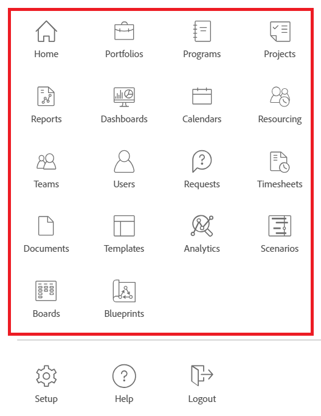

# Customize the Main Menu using a layout template

<!--Audited: 01/2024-->

As an Adobe Workfront administrator or a group administrator, you can use a layout template to configure the options users see when they open the Main Menu in Workfront. 

>[!NOTE]
>
>The Main Menu options that users see depend on their license type and what settings are configured in their access level. Some users who will use this layout template may not see all the options you choose here. For more information see [How access levels and permissions work together](../../../administration-and-setup/add-users/access-levels-and-object-permissions/how-access-levels-permissions-work-together.md) and [Configurable access to functionality for each object type](../../../administration-and-setup/add-users/access-levels-and-object-permissions/configurable-functionality-in-each-access-level-by-object-type.md).

For information about creating layout templates, see [Create and manage layout templates](../use-layout-templates/create-and-manage-layout-templates.md). 

For information about layout templates for groups, see [Create and modify a group's layout templates](../../../administration-and-setup/manage-groups/work-with-group-objects/create-and-modify-a-groups-layout-templates.md).

After configuring a layout template, you must assign it to users for changes you made to be visible to others. For information about assigning a layout template to users, see [Assign users to a layout template](../use-layout-templates/assign-users-to-layout-template.md).

## Access requirements

+++ Expand to view access requirements for the functionality in this article.

You must have the following access to perform the steps in this article: 

<table style="table-layout:auto"> 
 <col> 
 <col> 
 <tbody> 
  <tr> 
   <td role="rowheader"><strong>Adobe Workfront plan</strong></td> 
   <td>Any</td> 
  </tr> 
  <tr> 
   <td role="rowheader"><strong>Adobe Workfront license*</strong></td> 
   <td>
Current:Plan

   Or
   
New: Standard
</td> 
  </tr> 
  <tr> 
   <td role="rowheader"><strong>Access level configuration</strong></td> 
   <td> 
To perform these steps at the system level, you need the System Administrator access level.

    
To perform them for a group, you must be a manager of that group.
 
     </td> 
  </tr> 
 </tbody> 
</table>

*For more information about access requirements, see [Access requirements in Workfront documentation](/help/quicksilver/administration-and-setup/add-users/access-levels-and-object-permissions/access-level-requirements-in-documentation.md). 

+++

## Customize the Main Menu

1. Begin working on a layout template, as described in [Create and manage layout templates](../../../administration-and-setup/customize-workfront/use-layout-templates/create-and-manage-layout-templates.md).
1. Click **Set Main Menu** in the upper-right corner of the template.

   The Main Menu box opens and you can see the areas that currently display in the Main Menu for the template, as well as the items that are available to add. The following are all the possible items that you can add:
   * Home

     >[!TIP]
     >
     >By default, Home icon in the Main Menu displays the My Updates area for Review-license users (in the current license plan), unless they have a layout template associated with their profile that includes the My Updates area in the Main Menu, in addition to the Home area.

   * Portfolios
   * Programs
   * Projects
   * Reports
   * Dashboards
   * Calendars
   * Resourcing
   * Scenarios

     >[!NOTE]
     >
     >The Scenario Planner requires an additional license. For information about the Workfront Scenario Planner, see [The Scenario Planner overview](../../../scenario-planner/scenario-planner-overview.md).

   * Teams
   * Users

     >[!NOTE]
     >
     >Only users with a Plan license (in the current license model), or the users with a Standard license (in the new license model) can see the Users area  in the Main Menu.

   * Requests
   * Timesheets
   * Documents
   * Templates
   * Analytics
   * Proofing
   * Goals

     >[!NOTE]
     >
     >Goals require an additional license. For information about Workfront Goals, see [Adobe Workfront Goals overview](../../../workfront-goals/goal-management/wf-goals-overview.md).

   * My Updates
   * Boards
   * Blueprints

1. Do any of the following:

   * Hide  **Active items** that you don't want to display
   * Show  **Available items** that you do want to display on the Main Menu.
   * Drag  **Active items** to change their display order on the Main Menu.

1. Click **Done**.

   You can also click **Cancel** at any time if you want to discard your changes.

1. Continue customizing the layout template.

   Or

   If you are finished customizing, click **Save**.

   >[!TIP]
   >
   >You can click Save at any time to save your progress, then continue to modify the template later.

For more information about layout templates, see [Create and manage layout templates](../../../administration-and-setup/customize-workfront/use-layout-templates/create-and-manage-layout-templates.md).
