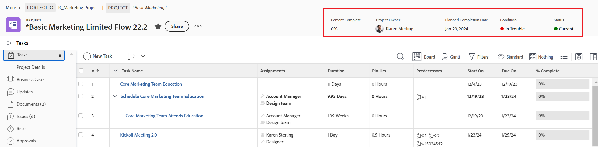
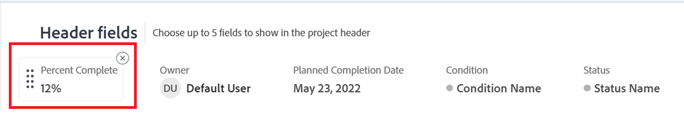
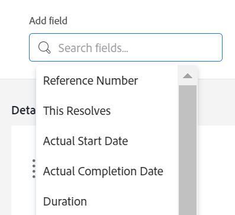

# Customize object headers using a layout template

{{preview-fast-release-general}}

As an Adobe Workfront administrator or a group administrator, you can use a layout template to configure the fields users see in the object header when they open an object's page.

>[!IMPORTANT]
>
>Customizing object headers is currently available for projects, tasks, and issues.

For information about creating layout templates, see [Create and manage layout templates](../use-layout-templates/create-and-manage-layout-templates.md). 

For information about layout templates for groups, see [Create and modify a group's layout templates](../../../administration-and-setup/manage-groups/work-with-group-objects/create-and-modify-a-groups-layout-templates.md).

After configuring a layout template, you must assign it to users for changes you made to be visible to others. For information about assigning a layout template to users, see [Assign users to a layout template](../use-layout-templates/assign-users-to-layout-template.md).

## Access requirements

+++ Expand to view access requirements for the functionality in this article.

<table style="table-layout:auto"> 
 <col> 
 <col> 
 <tbody> 
  <tr> 
   <td>Adobe Workfront package</td> 
   <td>
Any
</td> 
  </tr> 
  <tr> 
   <td>Adobe Workfront license</td> 
   <td>
Standard

       
Plan
</td>
  </tr> 
  </tr> 
  <tr> 
   <td>Access level configurations</td> 
   <td> 
To perform these steps at the system level, you need the System Administrator access level.

        
To perform them for a group, you must be a manager of that group.
 </td> 
  </tr> 
 </tbody> 
</table>

For information, see [Access requirements in Workfront documentation](/help/quicksilver/administration-and-setup/add-users/access-levels-and-object-permissions/access-level-requirements-in-documentation.md). 

+++

## Customize object headers

1. Begin working on a layout template, as described in [Create and manage layout templates](../../customize-workfront/use-layout-templates/create-and-manage-layout-templates.md).
1. In the **Customize what users see** drop-down menu, select **Projects**, **Tasks**, or **Issues**.

    <!--when this will be possible for more than 3 objects, at production, make this more general: update the sentence above to say "select an object you want to customize in the Customize what users see drop-down menu). -->

1. In the [!UICONTROL Header fields] section, hover over the current fields and do one of the following:
    * Click the **x** icon to remove a field
        
        Or
    
    * Click and hold the **grab** icon to drag and drop the field in a new location.

    <!--(NOTE: make sure the default names of these fields have not changed; otherwise, update screen shot)-->

    

1. You can have up to five fields in the header of an object.
If you already have five fields selected, you must remove a field before you can add a new one.
1. In the **Add field** box, start typing the name of a a custom field or a native Workfront field that you want to add, then select it when it displays in the list. The field is added to the immediate right of the Add field box and will display as the first field in the upper-right corner of the object's header.

    >[!TIP]
    >
    >* ou can add any custom field, or any native field available in the Overview area of an object's Details section. For example, only issues have the Severity field and that field is not available to add to projects or tasks.
    >
    >* When you add the "Resolved By" field to the header of an issue, the field changes to "Resolving Issue, Task, or Project", when there is a resolving object associated with the issue.
   
      
  

1. (Optional) Drag and drop the fields in a different order.       
    
1. In the Preview environment: Continue customizing the layout template. You can click **Apply** at any time to save your progress.

   Or

   If you are finished customizing, click **Save and Close**.

1. In the Production environment: Continue customizing the layout template.

   Or

   If you are finished customizing, click **Save**.

   >[!TIP]
   >
   >You can click **Save** at any time to save your progress, then continue to modify the template later.
