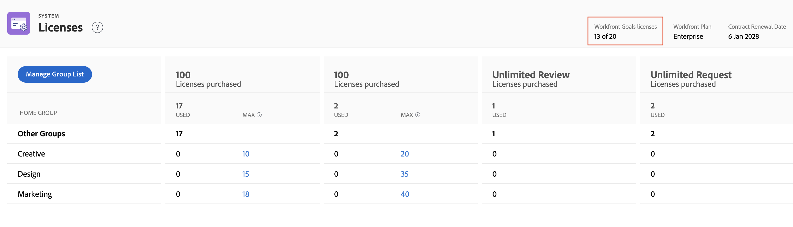
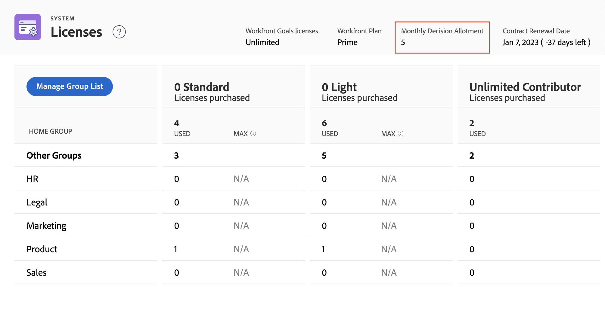
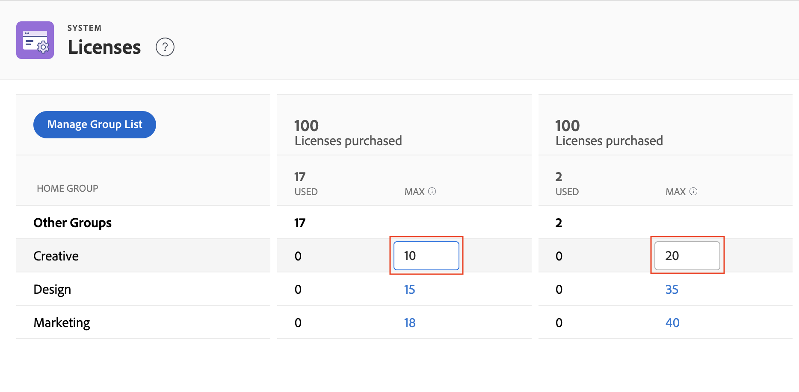

# Manage available licenses in your system

<!-- Audited: 12/2023 -->

As an Adobe Workfront administrator, you can access information about your Workfront account, including the number of licenses purchased for your organization, as well as the number of those licenses currently in use.

## Access requirements

You must have the following access to perform the steps in this article:

<table style="table-layout:auto">
 <col> 
 <col> 
 <tbody> 
  <tr> 
   <td role="rowheader">Adobe Workfront plan</td> 
   <td>Any</td> 
  </tr> 
  <tr> 
   <td role="rowheader">Adobe Workfront license</td> 
   <td>
    
New: Standard

    
or

    
Current: Plan
</td> 
  </tr> 
  <tr> 
   <td role="rowheader">Access level configurations</td> 
   <td> 
You must be a Workfront administrator.
 </td> 
  </tr> 
 </tbody> 
</table>

For more detail about the information in this table, see [Access requirements in Workfront documentation](/help/quicksilver/administration-and-setup/add-users/access-levels-and-object-permissions/access-level-requirements-in-documentation.md).

## View your organization's licenses

The number of licenses in use updates automatically as you assign access levels to users you add to Workfront. For more information, see [Add users](../../administration-and-setup/add-users/create-and-manage-users/add-users.md).

To view license information in your system:

{{step-1-to-setup}}

1. At the bottom of the left panel, click **System** > **Licenses**.

   For more information about the licenses listed on this page, see [Licenses overview](../../administration-and-setup/add-users/access-levels-and-object-permissions/wf-licenses.md).

   >[!NOTE]
   >
   >Proof licenses are available only to customers who have purchased the paid Workfront Proof add-on in addition to their Workfront license. For information about this add-on, see [Workfront Proof: article index](../../workfront-proof/workfront-proof.md).

1. (Conditional) If you see the message **To set a maximum, you must add a Home Group**, add a Home Group in your system as explained in the section [Add or remove a Home Group to the Licenses page](#add-or-remove-a-home-group-to-the-licenses-page) in this article.

   >[!NOTE]
   >
   >For the new plans, the Select plan does not allow administrators to view licenses by Home Group. You can only see the overall number of used licenses. The Prime and Ultimate plans provide the ability to set the maximum count of licenses per Home Group.

## View information about licenses for Workfront add-ons

If your organization has the paid Workfront Proof add-on, the number of used licenses and the number of available licenses are displayed. For example, **5 of 10 Proof licenses** indicates that the organization is currently using 5 of the 10 Workfront Proof licenses they purchased.

If your organization has purchased Workfront Goals, the license information for this product also displays here. In this case, you can view the following information:

* The total number of Workfront Goals licenses that your company has purchased
* The number of Workfront Goals licenses associated with users. This is the number of users to whom to have granted at least View access to Goals in their access level.

For information about Workfront Goals, see [Adobe Workfront Goals overview](../../workfront-goals/goal-management/wf-goals-overview.md). For information about access to Workfront Goals, see [Grant access to Adobe Workfront Goals](../../administration-and-setup/add-users/configure-and-grant-access/grant-access-goals.md).

>[!NOTE]
>
>Workfront allows you to assign more Workfront Goals licenses that you have purchased. However, when you assign more licenses than what your Workfront Goals contract allows, a Workfront account manager will contact you to let you know that you have exceeded your contractual number.
>

<!--
If an organization has other paid add-on products, their license information also displays here. If the organization doesn't have any paid add-on products, nothing displays here. (Drafted this because not sure this is accurate: Scenario Planner is an add-on product and its licenses are not displayed there.)
-->

>[!TIP]
>
>Users without administrative access can use a Group report to view license count. In the Report tab, create a new group report and add the following columns:
>
>* License Type Limit: Worker Limit
>* License Type Limit: Planner Limit 
>
>To learn more about creating a report, see [Create a custom report](../../reports-and-dashboards/reports/creating-and-managing-reports/create-custom-report.md).

## View information about monthly proof and document decision allotments

>[!IMPORTANT]
>
>Proof and document decision limits apply only to users on the new licenses. For more information, see [New licenses overview](/help/quicksilver/administration-and-setup/add-users/how-access-levels-work/licenses-overview.md).

Proof and document decisions are limited for all non-paid Workfront licenses. Limits reset on a per-user basis each month.

The decision limits for each license differ depending on the plan you're on. You can view your monthly allotment in Setup > Licenses.

For more information about proof and document decision limits, see [Limited document and proof decision for non-paid users overview](/help/quicksilver/review-and-approve-work/proof-doc-decision-limits.md).

## Add or remove a Home Group to the Licenses page {#add-or-remove-a-home-group-to-the-licenses-page}

<!--A Business or Enterprise Workfront Plan is required to use this feature. For more information about the various plans available, see [Workfront Plans.](https://www.workfront.com/plans)-->

Each user can be assigned to only one Home Group. Workfront provides a group-oriented license count by calculating how many licenses are allocated and currently used in each Home Group.

If you see the message **To set a maximum, you must add a Home Group** on the Licenses page, you need to add at least one Home Group to the Licenses page.

>[!IMPORTANT]
>
>* To effectively manage licenses with home groups, we recommend setting up specific Home Groups for business units before updating the max license count. For more information, see [Home Groups overview](../../administration-and-setup/manage-groups/groups-overview/home-groups.md).
>* You can add only top-level groups as Home Groups, not subgroups. If a user has a subgroup assigned as their Home Group, their license is added to the license count for the top-level group above that subgroup.
>

To add or remove a Home Group to the Licenses page:

{{step-1-to-setup}}

1. At the bottom of the left panel, click **System** > **Licenses**.

1. Click **Manage Group List**.
1. Start typing the top-level group's name in the **Home Groups** box.
1. To add the group, click its name when it appears.

   Or

   To remove the group, click the X icon to the right of its name.

1. Click **Save**.

As a Workfront administrator, you can set maximum license counts for the Home Groups to prevent a business unit from using Workfront licenses purchased for other business units. For instructions, see [Set the maximum license count for a Home Group](#set-the-maximum-license-count-for-a-home-group) in this article.

## Set the maximum license count for a Home Group {#set-the-maximum-license-count-for-a-home-group}

As a Workfront administrator, you can set maximum license counts for the top-level Home Groups in your system. This allows you to prevent a business unit from using Workfront licenses purchased for other business units within your organization.

By default, the max license count is set to N/A, which means there is no limit.

Group administrators can view the number of licenses allocated and used in a Home Group they manage. For more information, see [View the number of licenses allocated and used in a group](../../administration-and-setup/manage-groups/create-and-manage-groups/view-number-licenses-allocated-used-group.md).

To set the maximum license count for a Home Group:

{{step-1-to-setup}}

1. At the bottom of the left panel, click **System** > **Licenses**.

1. Locate the Home Group in the list.
1. In the **Max** column of the group, click the value that you want to set a maximum for.
1. Type the maximum number, then press Enter.

   

   >[!NOTE]
   >
   >To set a group's maximum license value back to the default, do not type 0. Instead, delete the number in the box. Setting the maximum license value to 0 indicates that there are no licenses allocated to that group.
