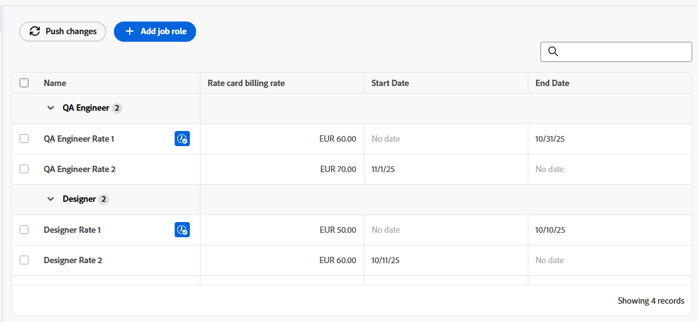

# Manage rate cards

A rate card represents the contractual agreement with your client in which hourly rates are defined for the job roles that will complete the work. In a rate card, you can define multiple billing rates per job role, based on attributes such as agency, location, or cost center. Your unique rate attributes are configured in the Setup area. For more information, see [Define rate attributes](/help/quicksilver/administration-and-setup/manage-enterprise-operations/define-rate-attributes.md).

For example, you could have a job role of Designer based in Paris for Agency A, another Designer based in Paris for Agency B, and a third Designer based in New York not assigned to an agency, each with different billing rates. However, attributes are not required for job roles on a rate card. The attributes serve as tools to establish more granular rates. A billing rate on a rate card can also be date effective, so that the rate starts and ends on specified dates.

You can also lock rates on a rate card to prevent them from being overridden at the project or task level. Locked rates are the highest in the billing rate hierarchy, except for preserved rates on a project. For more information, see [Overview of revenue and cost hierarchy](/help/quicksilver/manage-work/projects/project-finances/overview-revenue-cost-hierarchy.md).

## Access requirements

+++ Expand to view access requirements for the functionality in this article.

<table style="table-layout:auto"> 
 <col> 
 <col> 
 <tbody> 
  <tr> 
   <td>[!DNL Adobe Workfront] package</td> 
   <td>Workflow Ultimate</td> 
  </tr> 
  <tr> 
   <td>[!DNL Adobe Workfront] license</td> 
   <td>[!UICONTROL Standard]</td>
  </tr> 
  <tr> 
   <td>Access level configurations</td> 
   <td>Edit access to [!UICONTROL Rate Cards]</td> 
  </tr> 
  <tr> 
   <td>Object permissions</td> 
   <td>To edit a rate card shared with you, you must have Manage permissions to the rate card.</td> 
  </tr> 
 </tbody> 
</table>

For information, see [Access requirements in Workfront documentation](/help/quicksilver/administration-and-setup/add-users/access-levels-and-object-permissions/access-level-requirements-in-documentation.md).

+++

## Add a rate card

{{step-1-to-setup}}

1. In the left panel, click [!UICONTROL **Rate cards**].
1. Click [!UICONTROL **New rate card**], then click [!UICONTROL **Create new rate card**].
1. Type a name and a description for the rate card in the [!UICONTROL **New rate card**] box.

   The name must be unique.

   

1. (Optional) Select a [!UICONTROL **Group**] for the rate card. This is the agency that defines the rate card.
1. (Optional) Select a [!UICONTROL **Company**] for the rate card. This is the client that the rates are contracted for.

   >[!NOTE]
   >
   >The Group and the Company are used not only in the rate card details, but also as filters when attaching a rate card to a project.

1. Click **Create**.

   The Rate Card > Job Roles and Rates screen appears.

1. Click [!UICONTROL **Add job role**].
1. In the [!UICONTROL **New Billing Rate**] box, select a [!UICONTROL **Job Role**] to define billing rates for.

   

1. (Optional) Select attributes for the billing rate such as Agency, Location, or Cost Center.

   >[!NOTE]
   >
   >These attributes are defined separately and may affect revenue and cost calculations. For more information, see [Define rate attributes](/help/quicksilver/administration-and-setup/manage-enterprise-operations/define-rate-attributes.md).

1. Select a [!UICONTROL **Currency**] for the billing rate.
1. (Optional) Enter a [!UICONTROL **Job role alias**] for the job role.

   If the alias name you type does not already exist, you can add it.
   
   When the rate card is attached to a project, the alias appears on information such as placeholder assignments, expenses, and reports, instead of the internal job role name.

   >[!NOTE]
   >
   >* Only one alias can exist for each job role and attribute combination within a single rate card.
   >* An alias must be updated on the rate card and cannot be edited on a project.

1. In the [!UICONTROL **Billing Rate**] field, enter the billing rate for this job role and its attributes.
1. (Optional) Select [!UICONTROL **Lock rate**] to lock this rate and not allow it to be changed at the project or task level. You can unlock it later if needed.
1. (Optional) Click [!UICONTROL **Add date effective rate**] to apply effective dates to the billing rate.
1. (Optional) Click [!UICONTROL **Add date effective rate**] again to add more billing rates with effective dates for this job role and its attributes.
1. (Conditional) If you are adding more than one billing rate for this job role, enter the following information:

   * [!UICONTROL **Billing Rate**]: The value of the billing rate for the time period.
   * [!UICONTROL **Start Date**]: The date when the rate begins.
   * [!UICONTROL **End Date**]: The date when the rate ends.

     The first billing rate is not required to have a start date, and the last billing rate is not required to have an end date. Gaps are permitted between the rate dates, but overlapping dates are not permitted. During a gap, other areas of the billing rate hierarchy are used to determine the billing rate, based on a task's revenue type. For more information, see [Overview of revenue and cost hierarchy](/help/quicksilver/manage-work/projects/project-finances/overview-revenue-cost-hierarchy.md).

1. Click [!UICONTROL **Save**].
1. (Optional) To add another billing rate, either for the same job role with different attributes or for a separate job role, click [!UICONTROL **Add job role**].

   The rates for each role are added to the rate card as you create them. The currently effective rate, based on the dates, is indicated with an icon .
   
   

## Edit rate card details and rates

{{step-1-to-setup}}

1. In the left panel, click [!UICONTROL **Rate cards**].
1. To edit an existing rate card, click the rate card name in the Rate Cards list.
1. To update the rate card details, click [!UICONTROL **Details**] in the left panel.
1. (Optional) To attach a custom form to the rate card, click the [!UICONTROL **Add custom form**] field in the upper-right corner of the Details page, and select a custom form from the list that displays.

   For more information on attaching a custom form, see [Add a custom form to an object](/help/quicksilver/workfront-basics/work-with-custom-forms/add-a-custom-form-to-an-object.md).

1. Click [!UICONTROL **Save Changes**] after editing the rate card details.
1. Click [!UICONTROL **Job Roles and Rates**] in the left panel to edit the billing rates.
1. To edit a rate, select the check box next to the rate and click [!UICONTROL **Edit**] in the action bar at the bottom of the screen.

   For more information about the action bar, see [Use enhanced lists](/help/quicksilver/workfront-basics/navigate-workfront/use-lists/enhanced-lists.md).

   >[!NOTE]
   >
   >Because each rate is associated with the combination of the role and attributes to create a unique rate, the role and the attributes cannot be changed when you edit a rate.

1. To delete a billing rate from the rate card, select the check box next to the rate and click [!UICONTROL **Delete**] on the action bar.
1. To lock a rate, select the check box next to the rate and click [!UICONTROL **Lock**] on the action bar.

   Locked rates cannot be changed at the project or task level. A lock icon appears next to locked rates in the list.

   You can also unlock a locked rate from the action bar.

1. To adjust rates by a percentage, follow these steps:

   1. Select all of the rates you want to adjust on the Rate Card > Job Roles and Rates screen.

      You can choose one rate or multiple rates. All will be adjusted by the same percentage.

   1. Click [!UICONTROL **Adjust rates**] on the action bar.
   1. In the [!UICONTROL **Adjust job role rates**] box, choose whether you want the rate adjustment to happen during the selected time period (the existing effective dates) or a custom date range that you define.

      

   1. Enter the adjustment value for the rates.

      This value is applied as a percentage. For example, if you enter 10, the selected rates will increase by 10%.

   1. Click [!UICONTROL **Update rates**].
   1. Click [!UICONTROL **Update**] on the confirmation message.

      The selected rates are increased by the percentage.

## Import a rate card

See the article [Import rate cards from a template](/help/quicksilver/administration-and-setup/manage-enterprise-operations/import-rate-cards.md).

## Copy a rate card

{{step-1-to-setup}}

1. In the left panel, click [!UICONTROL **Rate cards**].
1. Select the check box next to the rate card in the list and click the **Copy** icon .
1. Type a name for the new rate card in the [!UICONTROL **Copy rate card**] box. Then, click [!UICONTROL **Create**].

   The new rate card is saved. Edit the rate card details, job roles, and rates as needed.

## Delete an entire rate card

{{step-1-to-setup}}

1. In the left panel, click [!UICONTROL **Rate cards**].
1. Select the check box next to the rate card in the list, and click the **Delete** icon .

   >[!NOTE]
   >
   >A rate card attached to a project will be deleted from the project.

