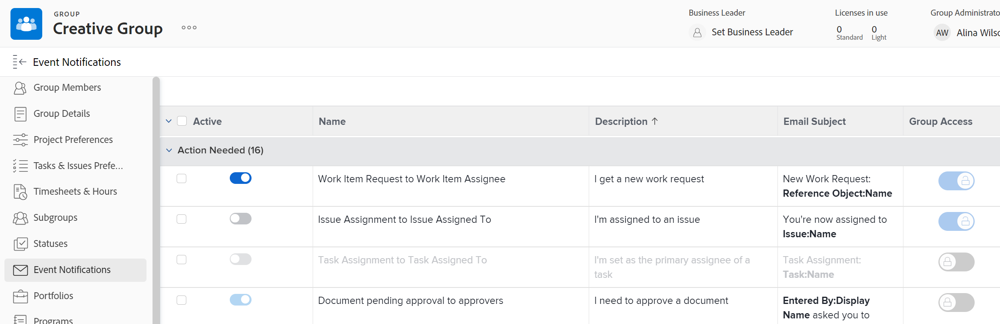

# View and configure event notifications for a group

As an group administrator, you can view the event notifications that are activated for a group you manage.

Also, if a Adobe Workfront administrator unlocks an event notification, you can configure it for a top-level group that you manage. Configuration of an event notification consists of activating or deactivating it.

A Workfront administrator can also do this for any group.

Configuring an event notification for a group affects users for whom that group, or one of its subgroups, is their Home Group. In their user profiles, these users see the event notifications that are activated for their Home Group instead of the event notifications that are activated system-wide.

For information on how a Workfront administrator unlocks an event notification, see [Unlock or lock configuration of event notifications for all groups](../../../administration-and-setup/manage-workfront/emails/unlock-configuration-of-event-notifications-for-groups.md).

For information about the default notification setting for an event, see [Event notification types](../../../administration-and-setup/manage-workfront/emails/event-notifications-available-in-wf.md).

## Access requirements

+++ Expand to view access requirements for the functionality in this article.

You must have the following to perform the steps in this article:

<table style="table-layout:auto"> 
 <col> 
 <col> 
 <tbody> 
  <tr> 
   <td role="rowheader">Workfront plan*</td> 
   <td> 
Any
 </td> 
  </tr> 
  <tr> 
   <td role="rowheader">Adobe Workfront license*</td> 
   <td> 
Plan 
 
You must be a group administrator of the group or a Workfront administrator. For more information, see <a href="../../../administration-and-setup/manage-groups/group-roles/group-administrators.md" class="MCXref xref">Group administrators</a> and <a href="../../../administration-and-setup/add-users/configure-and-grant-access/grant-a-user-full-administrative-access.md" class="MCXref xref">Grant a user full administrative access</a>.
 </td> 
  </tr> 
 </tbody> 
</table>

&#42;If you need to find out what plan or license type you have, contact your Workfront administrator.

+++

## View and configure a group's event notifications

1. (Conditional and optional) If you are a Workfront administrator and you are already on the Email Notifications page (Setup > Email > Notifications), you can do the following and then skip to step 6: Delete **System Event Notifications** in the box above the list, start typing the group's name in the box, then click it when it appears.

{{step-1-to-setup}}

1. In the left panel, click **Groups** .

1. Click the name of the top-level group.
1. In the left menu, click **Event notifications**.

   In the list that displays, the **Active** column on the left shows which notifications are active (blue) and inactive (grey) for the group.

1. To activate or deactivate an unlocked event notification: Click the button in the <strong>Active</strong> column to activate  or deactivate  it.
   
   >[!INFO]
   >
   >**Example:** You could configure the top two Marketing group event notifications shown below that have been unlocked for groups.
 
  
   >* If a button in the <strong>Active</strong> column is grey and dimmed , the event notification is deactivated for all users and group administrators can't activate it or edit its email subject line
   >* If a button in the <strong>Active</strong> column is grey and not dimmed , the event notification is <strong>deactivated for all users and</strong> group administrators can activate it for their groups.
   >* If a button in the <strong>Active</strong> column is blue and dimmed , the event notification is activated for all users and group administrators can't deactivate it or edit its email subject line for their groups.
   >* If a button in the <strong>Active</strong> column is blue and not dimmed , the event notification is <strong>activated for all users and</strong> group administrators can deactivate it for their groups.

<!--
This step (with substeps) is for functionality from a Sprint 3 2021 story that got put on hold. Also see the PDF on the story for some text earlier in the article that needs to be added. 

1. To customize the email subject line of an event notification,
  1. Click the name of the event notification.
  1. In the <strong>Event Notification</strong> box that displays, in the <strong>Email Subject Line</strong> box, change the text and fields, including custom fields, then click <strong>Update</strong> to save the new subject lines for your emails.
  IMPORTANT: The names of the fields added must match the camel case syntax of our database structure. For more information about how our objects and their fields are named in the Workfront database, see the <a href="../../../wf-api/workfront-api.md" class="MCXref xref">Adobe Workfront API</a>.
  For more information about customizing the email subject line of an event notification, see <a href="../../../administration-and-setup/manage-workfront/emails/custom-email-subjects-event-notification.md" class="MCXref xref">Customize email subjects for event notifications</a>. 
-->
    
