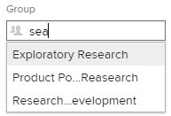

# Create a subgroup

You can create a subgroup under a group you manage to organize users and projects and to assign access rights within Adobe Workfront.

If there are any groups above the group you manage, their administrators can also do this for your group. The same is true for Workfront administrators (for any group).

Typically, however, group administrators manage groups and subgroups. They can use the Groups page to manage their groups and subgroups in one place. For information about how groups and subgroups work within Workfront, see [Groups overview](../../../administration-and-setup/manage-groups/groups-overview/groups.md) and [Subgroups overview](../../../administration-and-setup/manage-groups/groups-overview/subgroups.md).

## Access requirements

+++ Expand to view access requirements for the functionality in this article.

You must have the following to perform the steps in this article:

<table style="table-layout:auto"> 
 <col> 
 <col> 
 <tbody> 
  <tr> 
   <td role="rowheader">Workfront plan*</td> 
   <td>Any</td> 
  </tr> 
  <tr> 
   <td role="rowheader">Adobe Workfront license*</td> 
   <td> 
Plan 
 
You must be a group administrator of the group or a Workfront administrator. For more information, see <a href="../../../administration-and-setup/manage-groups/group-roles/group-administrators.md" class="MCXref xref">Group administrators</a> and <a href="../../../administration-and-setup/add-users/configure-and-grant-access/grant-a-user-full-administrative-access.md" class="MCXref xref">Grant a user full administrative access</a>.
 </td> 
  </tr> 
 </tbody> 
</table>

&#42;If you need to find out what plan or license type you have, contact your Workfront administrator.

+++

## Add a subgroup

{{step-1-to-setup}}

1. Click **Groups**.

   In the list that displays, you can see the groups you manage, along with any subgroups they have. Adobe Workfront administrators can see all groups.

1. Select the existing group or subgroup where you want to add a new subgroup.
1. Click **New Subgroup**.
1. In the **New Subgroup** box that appears, type a **Group Name** for the subgroup.
1. (Optional) specify any of the following information:

   <table style="table-layout:auto"> 
    <col> 
    <col> 
    <tbody> 
     <tr> 
      <td role="rowheader">Group Name</td> 
      <td>Change the name of the group.</td> 
     </tr> 
     <tr> 
      <td role="rowheader">Description</td> 
      <td>Type a description for the subgroup. You can type up to 512 characters.</td> 
     </tr> 
     <tr> 
      <td role="rowheader">Is Active</td> 
      <td> 
(Enabled by default) Makes the group active in your Workfront instance.
 
In type-ahead fields like the one shown below, when regular users search for a group to attach it to an object or to share an object with it, only active groups display in the list.
 
  
 
To streamline this for your users, you can disable the Is Active option for groups that are not currently in use.
 
You can easily view, filter and group the Groups list based on active or inactive status using this field. For information about using views, filters, and groupings in lists, see <a href="../../../reports-and-dashboards/reports/reporting-elements/reporting-elements-filters-views-groupings.md" class="MCXref xref" data-mc-variable-override="">Reporting elements: filters, views, and groupings</a>.
  </td> 
     </tr> 
     <tr> 
      <td role="rowheader">Make this group and its subgroups public</td> 
      <td> 
(Available only if you are viewing Details for a top-level group, not a subgroup.) Enable this option to allow users in the subgroup with edit-user access (who are not administrators of the group) to add this group and its subgroups to the user profile of other users.
 
For a public group, any user (in or out of the group) who has edit-user access can add the group to the profile of other users. They cannot do this for a private group.
 
You can edit this option only on the top parent group in a hierarchy of groups that has more than one level. All subgroups of the parent group inherit its setting.
 
<b>NOTE</b>:  
        <ul> 
         <li>You can't make a subgroup public by itself, but you can make it's top-level parent group public, which also makes all of the parent's subgroups public.</li> 
         <li>A subgroup that belongs to a public group is public by default, so any user with edit-user access can add the subgroup to other users, as well.</li> 
        </ul> 
 
If you need information about the access needed to edit users, see <a href="../../../administration-and-setup/add-users/configure-and-grant-access/grant-access-other-users.md" class="MCXref xref" data-mc-variable-override="">Grant access to users</a>. For information about editing users, see <a href="../../../administration-and-setup/add-users/create-and-manage-users/edit-a-users-profile.md" class="MCXref xref" data-mc-variable-override="">Edit a user's profile</a>.
 </td> 
     </tr> 
     <tr> 
      <td role="rowheader">Business Leader </td> 
      <td> 
You can assign one user as a Business Leader for a subgroup that you manage. A Business Leader is someone who makes business decisions for the subgroup. For more information, see <a href="../../../administration-and-setup/manage-groups/group-roles/business-leader-overview.md" class="MCXref xref" data-mc-variable-override="">Business Leader overview</a>.
 
If the person is not already a member of the subgroup, adding their name to this field also adds them to the group.
 
<b>NOTE</b>:  
        <ul> 
         <li>Before you can remove the Business Leader from a subgroup, you must remove their name from the Business Leader field.</li> 
         <li>If you remove the name from the Business Leader field, that user remains a member of the subgroup unless you remove them from it. For instructions on removing someone from a group, see the section <a href="../../../administration-and-setup/manage-groups/create-and-manage-groups/manage-a-group.md#manage" class="MCXref xref" data-mc-variable-override="">Manage a group's memberships</a> in the article <a href="../../../administration-and-setup/manage-groups/create-and-manage-groups/manage-a-group.md" class="MCXref xref" data-mc-variable-override="">Manage a group</a>.</li> 
        </ul> 
 
For more information, see <a href="../../../administration-and-setup/manage-groups/group-roles/business-leader-overview.md" class="MCXref xref" data-mc-variable-override="">Business Leader overview</a>.
 </td> 
     </tr> 
     <tr> 
      <td role="rowheader">Group Members and Group Administrators</td> 
      <td> 
       <ul> 
        <li> 
Group members: To add users and groups to the subgroup, start typing the name of an existing user or group you want to add, then select the name when it appears.
 
The users and groups that you add have access to all objects shared with the group.
 </li> 
        <li> 
Group administrators: A subgroup inherits the group administrators of the group above it, so specifying a user as a group administrator for a subgroup is optional. You can assign a group member as an administrator for the group using the drop-down menu to the right of the user's name.
 </li> 
       </ul> </td> 
     </tr> 
     <tr> 
      <td role="rowheader">Search people and groups in the list</td> 
      <td> If you need to find a user or group already assigned to this subgroup, you can type their name here and select it when it appears.</td> 
     </tr> 
    </tbody> 
   </table>

1. Click **Save.**
