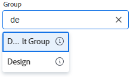

# Create a subgroup

You can create a subgroup under a group you manage to organize users and projects and to assign access rights within Adobe Workfront.

If there are any groups above the group you manage, their administrators can also do this for your group. The same is true for Workfront administrators (for any group).

Typically, however, group administrators manage groups and subgroups. They can use the Groups page to manage their groups and subgroups in one place. For information about how groups and subgroups work within Workfront, see [Groups overview](../../../administration-and-setup/manage-groups/groups-overview/groups.md) and [Subgroups overview](../../../administration-and-setup/manage-groups/groups-overview/subgroups.md).

## Access requirements

+++ Expand to view access requirements for the functionality in this article.

<table style="table-layout:auto"> 
 <col> 
 <col> 
 <tbody> 
  <tr> 
   <td>Adobe Workfront package</td> 
   <td>
Any
</td> 
  </tr> 
  <tr> 
   <td>Adobe Workfront license</td> 
   <td>
Standard

       
Plan
</td>
  </tr>
  <tr> 
   <td>Access level configurations</td> 
   <td>You must be a group administrator of the group or a system administrator.</td>
  </tr>
 </tbody> 
</table>

For information, see [Access requirements in Workfront documentation](/help/quicksilver/administration-and-setup/add-users/access-levels-and-object-permissions/access-level-requirements-in-documentation.md).

+++

## Add a subgroup

{{step-1-to-setup}}

1. Click **Groups**.

   In the list that displays, you can see the groups you manage, along with any subgroups they have. Adobe Workfront administrators can see all groups.

1. Select the existing group or subgroup where you want to add a new subgroup.
1. Click **New Subgroup**.
1. In the **New Subgroup** box that appears, type a **Group name** for the subgroup.
1. (Optional) Enter any of the following information:

   * **Description**: Type a description for the subgroup. You can type up to 512 characters.
   * **Is Active**: This option is enabled by default and makes the group active in your Workfront instance.
     
     In typeahead fields like the one shown below, when regular users search for a group to attach it to an object or to share an object with it, only active groups display in the list.

     

     To streamline this for your users, you can disable the **Is Active** option for groups that are not currently in use.

     You can easily view, filter and group the Groups list based on active or inactive status using this field. For information about using views, filters, and groupings in lists, see [Reporting elements: filters, views, and groupings](/help/quicksilver/reports-and-dashboards/reports/reporting-elements/reporting-elements-filters-views-groupings.md).

   * **Business Leader**: You can assign one user as a Business Leader for a subgroup that you manage. A Business Leader is someone who makes business decisions for the subgroup. For more information, see [Business Leader overview](/help/quicksilver/administration-and-setup/manage-groups/group-roles/business-leader-overview.md).
   
     If the person is not already a member of the subgroup, adding their name to this field also adds them to the group.

     >[!NOTE]
     >
     >* Before you can remove the Business Leader from a subgroup, you must remove their name from the Business Leader field.
     >* If you remove the name from the Business Leader field, that user remains a member of the subgroup unless you remove them from it. For instructions on removing someone from a group, see [View and manage a group's memberships](/help/quicksilver/administration-and-setup/manage-groups/create-and-manage-groups/view-and-manage-a-groups-memberships.md).
   
   * **Group members and Group administrators**: To add users and groups as members of the subgroup, start typing the name of an existing user or group you want to add, then select the name when it appears.
   
     The users and groups that you add have access to all objects shared with the group.

     A subgroup inherits the group administrators of the group above it, so specifying a user as a group administrator for a subgroup is optional. You can assign a group member as an administrator for the group using the drop-down menu to the right of the user's name.
   
   * **Search people and groups in the list**: If you need to find a user or group already assigned to this subgroup, you can type their name here and select it when it appears.

1. Click **Save.**
