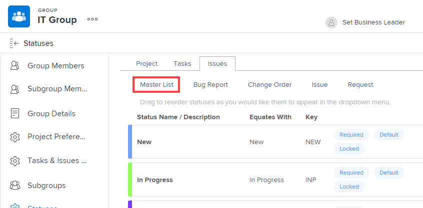
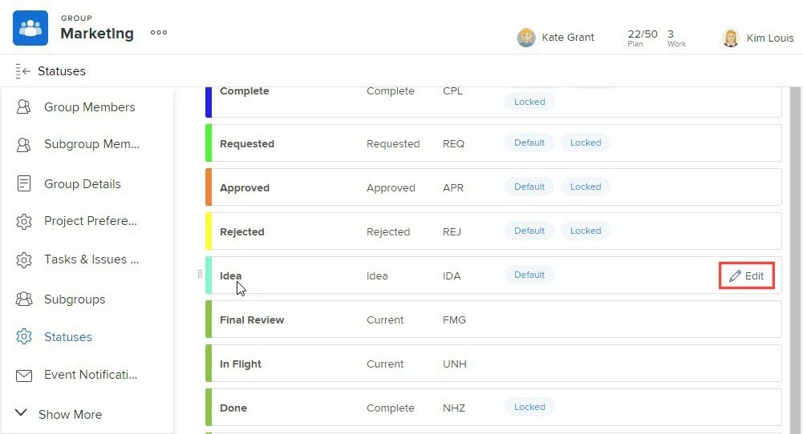
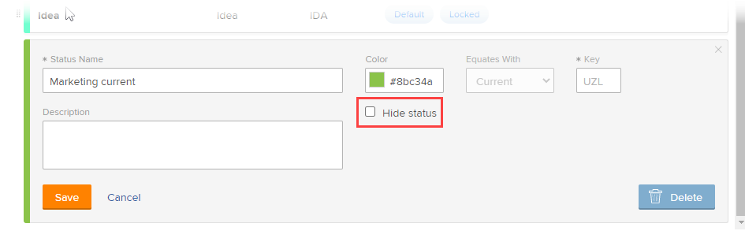

# Create or edit a group status

As a group administrator, you can create custom statuses for a group that you manage. This helps to eliminate the need for dozens of company-wide custom statuses and allows more autonomy in your group hierarchies.

You can also edit a system-level status for a group you manage if a Workfront administrator has unlocked the status. For more information, see [Locked and unlocked system-level statuses](../../../administration-and-setup/customize-workfront/creating-custom-status-and-priority-labels/lock-or-unlock-a-custom-system-level-status.md).

If there are any groups above your group, their administrators can also do these things for your group. The same is true for Workfront administrators (for any group).

>[!NOTE]
>
>Custom group statuses can't be displayed on a project when viewing the project in an agile view. Only default and custom locked statuses are visible when viewing a project in an agile view. For information about customizing an agile view for a project, see the section [Create or customize an Agile view](/help/quicksilver/reports-and-dashboards/reports/reporting-elements/create-edit-views.md#create-or-customize-an-agile-view) in the article [Create or edit views in Adobe Workfront](/help/quicksilver/reports-and-dashboards/reports/reporting-elements/create-edit-views.md).

For general information about statuses, see [Statuses overview](../../../administration-and-setup/customize-workfront/creating-custom-status-and-priority-labels/statuses-overview.md).

## Access requirements

You must have the following to perform the steps in this article:

<table style="table-layout:auto"> 
 <col> 
 <col> 
 <tbody> 
  <tr> 
   <td role="rowheader">Workfront plan*</td> 
   <td>Any</td> 
  </tr> 
  <tr> 
   <td role="rowheader">Adobe Workfront license*</td> 
   <td> 
Plan 
 
You must be a group administrator of the group or a Workfront administrator. For more information, see <a href="../../../administration-and-setup/manage-groups/group-roles/group-administrators.md" class="MCXref xref">Group administrators</a> and <a href="../../../administration-and-setup/add-users/configure-and-grant-access/grant-a-user-full-administrative-access.md" class="MCXref xref">Grant a user full administrative access</a>.
 </td> 
  </tr> 
 </tbody> 
</table>

&#42;If you need to find out what plan or license type you have, contact your Workfront administrator.

## Create or edit a status for a group

1. Click the **Main Menu** icon  in the upper-right corner of Adobe Workfront, then click **Setup** .

1. In the left panel, click **Groups** .

1. Click the name of the group where you want to create or customize statuses.
1. In the left panel, click **Statuses**. 

   If the group you are viewing is a top-level group, the list that displays includes the following:

   * System-level locked statuses.
   * Custom statuses already created for the group.

   In addition, if the group you are viewing is a subgroup, the list also includes:

   * Locked statuses belonging to the groups above the subgroup.
   * Unlocked statuses that belonged to the groups above the subgroup when it was created.

     After a subgroup is created, unlocked statuses that are created in the groups above it are not included in the subgroup's status list. However, if someone locks one of them later, it is then included in the subgroup's status list. For more information, see [How groups inherit statuses](../../../administration-and-setup/manage-groups/manage-group-statuses/how-groups-inherit-statuses.md).

1. Select the tab of the object type (**Project**, **Tasks**, or **Issues**) that you want to associate with the status.

1. (Conditional) If the status is an issue status, make sure that **Master List** is selected.

   

   For information about customizing the other issue types (Bug Report, Change Order, Issue, Request), see [Customize default issue types](../../../administration-and-setup/set-up-workfront/configure-system-defaults/customize-default-issue-types.md).

1. (Conditional) To create a new status, click **Add a New Status**.

   Or

   To edit an existing status, mouse over the status you want to edit, then click the **Edit** option that displays to the far right.

   

   >[!NOTE]
   >You can edit a status for your group only if:
   >      
   >* You manage the group that the status was created for
   >* A Workfront administrator unlocked the status at the system level
   >* A group administrator of a group above your group unlocked the status
   >      
   >      
   >When you are editing an existing status, you can change only its name, description, and color.
   >
   >When you edit a locked status, your changes affect all subgroups that inherited the status from your group.
   >   
   >Conversely, editing an unlocked status does not affect the subgroups that inherited the status from your group.  

1. Specify the following information.

   If you are editing a status, only the first 3 settings can be changed.

   <table style="table-layout:auto"> 
    <col> 
    <col> 
    <tbody> 
     <tr> 
      <td role="rowheader">Status Name</td> 
      <td> 
Type a name for the status. This is a required field.
 
When you create a status name, be aware that others in the system can create a status with the same name. We recommend using a unique name to avoid confusion when selecting statuses in Workfront.

If duplicate statuses exist, the group administrator should update the names to differentiate between them. The only uniqueness indicator in the system is the status Key.
 </td> 
     </tr> 
     <tr> 
      <td role="rowheader">Description</td> 
      <td>(Optional) Type a description of the status. This communicates its purpose to those who use it.</td> 
     </tr> 
     <tr> 
      <td role="rowheader">Color</td> 
      <td> 
Customize the color of the status by clicking the color field and selecting a color from the swatch panel. You can also enter a hex number in the field.
 
The status color displays in the upper-right corner of Workfront when a user views the object.
 
  
 </td> 
     </tr> 
     <tr> 
      <td role="rowheader">Equates With</td> 
      <td> 
Select one of the options from the list that best describes the function of the status. For example, if the status name is Done, the option it equates with should be Complete.
 
Every status must equate with one of these options because this determines how the status functions.
 
This option cannot be modified after the status is created.
 </td> 
     </tr> 
     <tr> 
      <td role="rowheader">Key</td> 
      <td> 
If you are creating a new status, type a code or abbreviation for the status or use the one generated for you. This key must be unique in Workfront because it can be used for reporting purposes. If you attempt to specify a key that is already in use in the system, the field turns red.
 
It might be useful to use an abbreviation that is recognizable to those who will use it.
 
This option cannot be modified after the status is created.
 
You cannot change the key code for Planning, Current, and Complete statuses. This is important if you are building a report in text mode.
 </td> 
     </tr> 
     <tr> 
      <td role="rowheader">Hide Status</td> 
      <td> 
(Project and Task statuses only)
 
Enable this option if you want the status hidden from users. When it is disabled (the default setting), all subgroups below the group can use the status.
 
Tip: You can hide an Issue status by disabling all 4 issue types (Bug Report, Change Order, Issue, Request).
 </td> 
     </tr> 
     <tr> 
      <td role="rowheader">Lock for all groups</td> 
      <td> 
       
If you leave this option enabled, the users in your group and its subgroups can see and use the status and group administrators cannot customize it for lower subgroups.
 
       
When this option is disabled, group administrators can customize the status for lower subgroups.
 
       
<b>NOTE</b>: You can use both locked and unlocked statuses in a group approval process. If you create a group approval process with an unlocked group status, users can attach the approval process to any project, task, or issue that is associated with the group.
 
       
For more information about locking statuses, see <a href="../../../administration-and-setup/manage-groups/manage-group-statuses/lock-or-unlock-a-custom-group-status.md" class="MCXref xref">Locked and unlocked group statuses</a>.
 
       </td> 
     </tr>
    </tbody> 
   </table>

1. Click **Save**.

   The status is now available for all projects associated with your group or subgroup. If you locked it, it is available for use by any lower subgroups.

   You can configure the status to be a default status for the group. For more information, see [Use a custom status as a default status for a group](../../../administration-and-setup/manage-groups/manage-group-statuses/use-custom-statuses-as-default-statuses-group.md).

## Create a custom status for multiple groups

If you are a Workfront administrator, you can create a custom status for multiple groups by creating a system-wide status, then hiding that status from any groups that don't need it.

If you are a group administrator (or a Workfront administrator), you can create a custom status for multiple subgroups within a group hierarchy you manage by creating a status for a higher level group, then hiding that status from any lower subgroups that don't need it.

1. If you are a Workfront administrator, create a system-wide unlocked status as described in [Create or edit a status](../../../administration-and-setup/customize-workfront/creating-custom-status-and-priority-labels/create-or-edit-a-status.md).
1. In the box in the upper-right corner, delete **System Statuses**, begin typing the name of a group where you want to hide the status, then click the name when it appears.
1. Hover over the status you want to hide from the group, then click **Edit** when it appears.

   

1. Enable the **Hide Status** option that appears.

   

1. Click **Save**.

   The status is dimmed and no longer visible to all users in that group.

1. Repeat steps 3 through 5 to hide the custom status from any other groups who don't need it.

