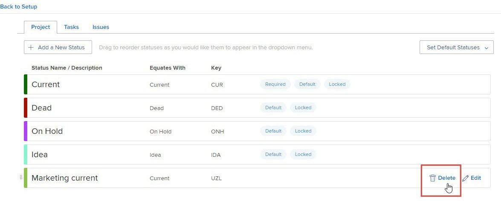

# Delete a group status

As a group administrator, you can delete a status for a group that you manage if it is not configured as a required or locked status on the system level, or for a higher group in the hierarchy.

If there are any groups above the group you manage, their administrators can also do this for your group. The same is true for Workfront administrators (for any group).

>[!NOTE]
>
>You cannot delete the following:
>
>* The built-in statuses Planning, Current, and Complete. You can update their names, edit their colors, and lock or unlock them, but they can't be deleted.
>* Statuses that are in a pending state of approval for at least one object associated with the group or one of its subgroups.

## Access requirements

+++ Expand to view access requirements for the functionality in this article.

<table style="table-layout:auto"> 
 <col> 
 <col> 
 <tbody> 
  <tr> 
   <td>Adobe Workfront package</td> 
   <td>
Any
</td> 
  </tr> 
  <tr> 
   <td>Adobe Workfront license</td> 
   <td>
Standard

       
Plan
</td>
  </tr>
  <tr> 
   <td>Access level configurations</td> 
   <td>You must be a group administrator of the group or a system administrator.</td>
  </tr>
 </tbody> 
</table>

For information, see [Access requirements in Workfront documentation](/help/quicksilver/administration-and-setup/add-users/access-levels-and-object-permissions/access-level-requirements-in-documentation.md).

+++

## Delete a group status

{{step-1-to-setup}}

1. In the left panel, click **Groups**.
1. Click the name of the top-level group.
1. In the left panel click **Statuses**.
1. In the list of statuses that displays, hover over the status you want to delete, then click **Delete** when it appears to the far right.

   

1. In the box that displays, select a status to designate a replacement status for objects (projects, tasks, issues, and approval processes) that were using the status that you are deleting.

   Only statuses that equate with the status you are deleting are available. For example, if you are deleting a status that equates with Current, you can see only statuses that equate with Current.

   Also, the statuses that display depend on whether the status you are deleting is unlocked or locked:

   * **If it's unlocked**: Non-hidden locked and unlocked statuses are available.

     Along with the statuses that were created for the subgroup, statuses inherited from system-level and upper level groups are included.
   
   * **If it's locked**: One of the following is true:

      * If there are other locked, non-hidden statuses, only those are available.
      * If there is no locked non-hidden status, the default Workfront status is available, even if it's hidden or unlocked.

        For information about the default Workfront statuses, see [Access the list of system project statuses](../../../administration-and-setup/customize-workfront/creating-custom-status-and-priority-labels/project-statuses.md), [Access the list of system task statuses](../../../administration-and-setup/customize-workfront/creating-custom-status-and-priority-labels/task-statuses.md), and the information about the 4 required issue statuses in [Access the list of system issue statuses](../../../administration-and-setup/customize-workfront/creating-custom-status-and-priority-labels/issue-statuses.md).

1. Click **Delete Status**.

   If the deleted status was the default status for that type in the group, the replacement status takes its place.

   If the deleted status was set as the default project status in project preferences, the preference is now set to the replacement status.

## When a group is deleted

When a group is deleted and replaced by another group, any unique statuses that the deleted group had are added to the statuses of the replacement group. For more information, see [Custom statuses in a group that is moved or deleted](../../../administration-and-setup/manage-groups/manage-group-statuses/custom-statuses-in-group-moved-or-deleted.md).
