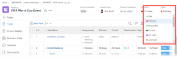

# Reorder group statuses

s mAs a ```group administrator```, you can change the order of project, task, and issue statuses for ```a group you manage```.



If there are any groups above the group you manage, their administrators can also do this for your group. The same is true for Workfront administrators (for any group).

>[!NOTE]
>
>* ```<MadCap:conditionalText data-mc-conditions="SnippetConditions-wf-groups.groups"> A Workfront administrator can reorder</MadCap:conditionalText>``` the statuses at the system level```<MadCap:conditionalText data-mc-conditions="SnippetConditions-wf-groups.groups"> . This</MadCap:conditionalText>``` does not affect the order of statuses within groups. 
>
>  However, the statuses within a newly created top-level group inherit the order of the system-level statuses. (A new subgroup inherits the order of the statuses in the group one level up.)
>
>* You can reorder locked statuses. For information about locked statuses, see [Create or edit a group status](../../../administration-and-setup/manage-groups/manage-group-statuses/create-or-edit-a-group-status.md).
>

## Access requirements

You must have the following to perform the steps in this article:

<table cellspacing="0"> 
 <col> 
 <col> 
 <tbody> 
  <tr> 
   <td role="rowheader"><a href="https://www.workfront.com/plans" target="_blank">Adobe Workfront plan</a>* </td> 
   <td> <p>Any</p> </td> 
  </tr> 
  <tr data-mc-conditions="SnippetConditions-wf-groups.groups"> 
   <td role="rowheader"><a href="https://one.workfront.com/s/document-item?bundleId=the-new-workfront-experience&amp;topicId=Content%2FAdministration_and_Setup%2FAdd_users%2FAccess_levels_and_object_permissions%2Fwf-licenses.html&amp;_LANG=en" target="_blank">Adobe Workfront license</a>*</td> 
   <td> <p>Plan </p> <p>You must be a group administrator of the group or a Workfront administrator. For more information, see <a href="../../../administration-and-setup/manage-groups/group-roles/group-administrators.md" class="MCXref xref">Group administrators</a> and <a href="../../../administration-and-setup/add-users/configure-and-grant-access/grant-a-user-full-administrative-access.md" class="MCXref xref">Grant a user full administrative access</a>.</p> </td> 
  </tr> 
 </tbody> 
</table>

&#42;If you need to find out what plan or license type you have, contact your Workfront administrator.

## Default order of statuses

By default, statuses display in the following order:

<table cellspacing="15"> 
 <col> 
 <col> 
 <col> 
 <thead> 
  <tr> 
   <th width="33.33%">Project</th> 
   <th width="33.33%">Task</th> 
   <th width="33.33%">Issue</th> 
  </tr> 
 </thead> 
 <tbody> 
  <tr> 
   <td> 
    <ul> 
     <li>Current</li> 
     <li>Dead</li> 
     <li> On Hold </li> 
     <li> Planning </li> 
     <li> Complete </li> 
     <li> Requested </li> 
     <li> Approved </li> 
     <li> Rejected </li> 
     <li> Idea </li> 
    </ul> </td> 
   <td> 
    <ul> 
     <li>New</li> 
     <li>In Progress</li> 
     <li>Complete</li> 
    </ul> </td> 
   <td> 
    <ul> 
     <li>New</li> 
     <li>In Progress</li> 
     <li>Reopened</li> 
     <li>Awaiting Feedback</li> 
     <li>On Hold</li> 
     <li>Cannot Duplicate</li> 
     <li>Closed</li> 
     <li>Resolved</li> 
     <li>Verified Complete</li> 
     <li>Won't Resolve</li> 
    </ul> </td> 
  </tr> 
 </tbody> 
</table>

## Reorder statuses for tasks and projects ```in a group```

1. Click the **Main Menu** icon  in the upper-right corner of Adobe Workfront, then click **Setup** .

1. In the left panel, click **Groups**, then click the name of the group.
1. In the left panel, click **Statuses**.
1. Above the Statuses list that displays, click the **Projects** or **Tasks** tab.

1. Drag and drop the statuses in the order you want.

   The new status order is saved automatically.

1. To test the new status order, go to a task or project ```associated with the group```, click the status in the upper-right corner, and make sure the statuses that display are in the order that you configured.

## Reorder statuses for issues

1. Click the **Main Menu** icon  in the upper-right corner of Adobe Workfront, then click **Setup** .

1. In the left panel, click **Groups**, then click the name of the group.
1. In the left panel, click **Statuses**.
1. Click the **Issues** tab.
1. (Optional) Select an issue type (**Bug Report**, **Change Order**, **Issue**, or **Request**).

   >[!NOTE]
   >
   >
   >   
   >   
   >   * You cannot customize the order of statuses for the Master List.
   >   * We recommend that you order of statuses for each issue type the same way. For more information about issue types, see [Configure request types](../../../administration-and-setup/set-up-workfront/configure-system-defaults/configure-request-types.md).
   >   
   >

1. Drag and drop the statuses in the order you want.

   The new status order is saved automatically.

1. To test the new status order, go to an issue ```associated with the group```, click the status in the upper-right corner, and make sure the statuses that display are in the order that you configured.

