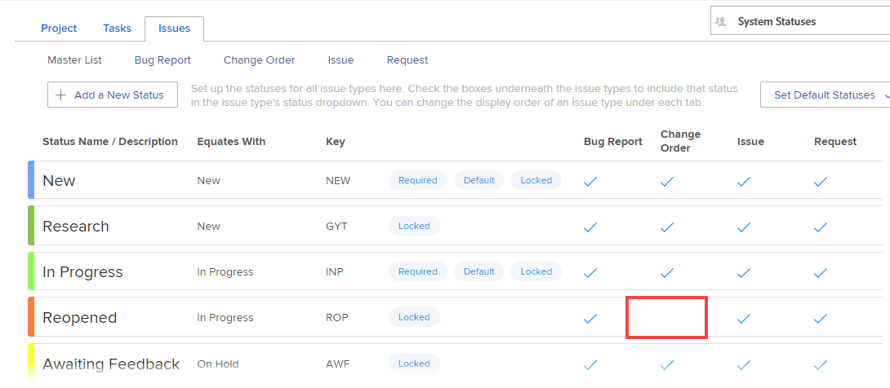
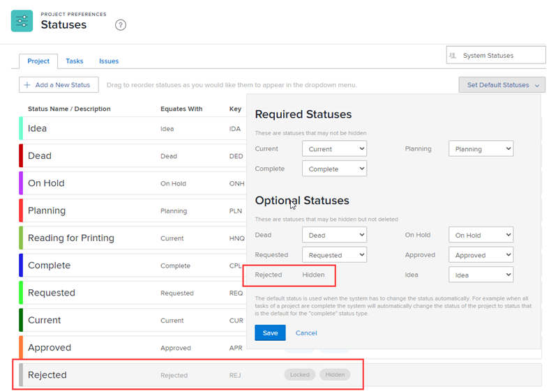

# Use a custom status as a default status for a group

As a group administrator, you can configure a custom status as a default status for a group or subgroup that you manage. This is useful when the system needs to automatically assign a Workfront status to a project, task, or issue. A project, task, or issue always displays the custom status that you set as a default status instead of displaying the Workfront status that it equates to.

The status you configure can be any custom status created for the group, inherited from a group above the group, or inherited from the system level.

If there are any groups above the group you manage, their administrators can also do this for your group. The same is true for Workfront administrators (for any group).

>[!INFO]
>
>**Example:** You could create a custom status called Finished and set it as a default status equated with the Workfront status Complete.
>
>Then, for tasks set to change to the status Complete when they reach 100%, the status displays as Finished instead of Complete.

## Access requirements

+++ Expand to view access requirements for the functionality in this article.

You must have the following to perform the steps in this article:

<table style="table-layout:auto"> 
 <col> 
 <col> 
 <tbody> 
  <tr> 
   <td role="rowheader">Workfront plan*</td> 
   <td>Any</td> 
  </tr> 
  <tr> 
   <td role="rowheader">Adobe Workfront license*</td> 
   <td> 
Plan 
 
You must be a group administrator of the group or a Workfront administrator. For more information, see <a href="../../../administration-and-setup/manage-groups/group-roles/group-administrators.md" class="MCXref xref">Group administrators</a> and <a href="../../../administration-and-setup/add-users/configure-and-grant-access/grant-a-user-full-administrative-access.md" class="MCXref xref">Grant a user full administrative access</a>.
 </td> 
  </tr> 
 </tbody> 
</table>

&#42;If you need to find out what plan or license type you have, contact your Workfront administrator.

+++

## Issue statuses

If the custom status is an Issue status, all four issue types must be enabled for it (Bug Report, Change Order, Issue, and Request). For example, in the issue status shown below, the status Reopened cannot be used as a default status because the Change Order issue type is not selected:

## Set a custom status as a default status for a group

{{step-1-to-setup}}

1. In the left panel, click **Groups** , then click the name of the group where you want to create or customize statuses.
1. In the left panel, click **Statuses** .
1. Open the **Project**, **Tasks**, or **Issues** tab, depending on the type of status you want to set as a default status.
1. Click **Set Default Statuses** near the upper-right corner.
1. In the drop-down area that displays, next to the status where you want to set the default status, select the default status you want to set.
1. Click **Save**.

   The status is now available as a default status for use with projects associated with the group.

1. Associate the custom status with the project where you want to use it.

   You associate the status with the project by associating the group where the status resides with the project. Users can use the custom status only if the group where the status resides is associated with the project.

   >[!NOTE]
   >
   >If you assign the project to a different group, the project status will reload and could change.

   1. Go to the project where you want to use the custom status.
   1. Click the More menu , then click **Edit**. 
   1. In the **Edit Project** box that displays, in the **Group** field under **Project association**, select the group that the custom status is associated with.
   
   1. Click **Save Changes**.

## Groups inherit default status configurations

After a Workfront administrator configures a custom status as a default status, new groups that are created inherit that configuration.

Similarly, after a group administrator sets a custom status as a default status, new subgroups created directly below the group inherit that configuration.

For more information, see [How groups inherit statuses](../../../administration-and-setup/manage-groups/manage-group-statuses/how-groups-inherit-statuses.md).

## When a default status is hidden

If you hide a default status (by enabling the Hide status option for it), the system tries to set another status of the equivalent type as the default instead.

If there is no available status of the equivalent type, the status type displays as **Hidden** and is not available for work items.

