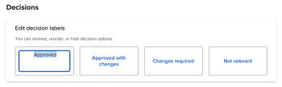
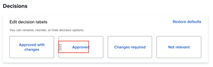
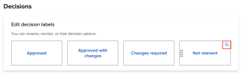

# Configure default proof settings

These settings allow you to set default values that apply to all new proofs created by your users. However, users can override most of these settings when creating a proof.

## Access requirements

+++ Expand to view access requirements for the functionality in this article.

You must have the following access to perform the steps in this article:

<table style="table-layout:auto"> 
 <col> 
 <col> 
 <tbody> 
  <tr> 
   <td role="rowheader">Adobe Workfront plan*</td> 
   <td>Any</td> 
  </tr> 
  <tr> 
   <td role="rowheader">Adobe Workfront license*</td> 
   <td>
   
New: Standard

   or
   
Current: Plan
</td> 
  </tr> 
  <tr> 
   <td role="rowheader">Access level configurations*</td> 
   <td> 
You must be a Workfront administrator. For information on Workfront administrators, see <a href="../../../administration-and-setup/add-users/configure-and-grant-access/grant-a-user-full-administrative-access.md" class="MCXref xref">Grant a user full administrative access</a>.
 </td> 
  </tr> 
 </tbody> 
</table>

&#42;To find out what plan, license type, or access you have, contact your Workfront administrator.

+++

## Configure new proof default settings

1. Click the **Main Menu** icon  in the upper-right corner of Adobe Workfront, then click **Setup**.
1. In the left panel, click **Proofs** > **Proof settings**.
1. In the **New proof defaults** section, configure the following settings:

   <table style="table-layout:auto"> 
    <col> 
    <col> 
    <tbody> 
     <tr> 
      <td role="rowheader" colspan="2"><b>Recipients</b></td> 
     </tr> 
     <tr> 
      <td role="rowheader">Require login</td> 
      <td> 
Reviewers are required to log in using their email and password before they are allowed to view proofs created in your organization's account. When enabled, users cannot share the proof with Guest reviewers.
 
<b>IMPORTANT</b>: When enabled, login is required for all newly created proofs.
 </td> 
     </tr> 
     <tr> 
      <td role="rowheader">Copy owner from original proof for new versions</td> 
      <td> 
The owner of the first version a proof is also the owner of all consecutive versions of the proof, regardless of who creates these versions. This setting is enabled by default.
 </td> 
     </tr> 
     <tr> 
      <td role="rowheader">Allow users to delete their proof comments</td> 
      <td>Users can delete their own comments. This setting is enabled by default.</td> 
     </tr> 
     <tr> 
      <td role="rowheader">Require decisions to be electronically signed </td> 
      <td> 
Decision makers are prompted to enter their Workfront login credential when they make a decision on a proof.
 
<b>IMPORTANT</b>: When enabled, users cannot share the proof with Guest reviewers who don't have login credentials.
 </td> 
     </tr> 
     <tr> 
      <td role="rowheader" colspan="2"><b>Deadline</b></td> 
     </tr> 
     <tr> 
      <td role="rowheader">Set the default deadline</td> 
      <td> 
The system applies this deadline to all new proofs in your account that do not have an Automated Workflow.
 </td> 
     </tr> 
     <tr> 
      <td role="rowheader">Notify recipients before proof is at-risk</td> 
      <td>Recipients are notified via email before the proof is considered at-risk depending on the deadline specified above.</td> 
     </tr> 
     <tr> 
      <td role="rowheader" colspan="2"><b>Email notifications</b></td> 
     </tr> 
     <tr> 
      <td role="rowheader">Notify recipients when they are added to a proof</td> 
      <td>Recipients are notified via email when they are added to a proof.</td> 
     </tr> 
    </tbody> 
   </table>

1. Click **Save**.

## Configure proof decisions

Users can use proof decisions to indicate the status of the proof after review.

>[!NOTE]
>
>The logic behind proof decisions is used to calculate the overall status of a proof workflow if there are multiple decisions of various levels. The decisions "Approved" and "Approved with changes" trigger the next stage in an automatic workflow.

To configure proof decisions:

1. Click the **Main Menu** icon  in the upper-right corner of Adobe Workfront, then click **Setup**.
1. In the left panel, click **Proofs** > **Proof settings**.
1. In the **Decisions**section, you can

   1. **Rename the decision**: Click on the text inside the decision box, and begin typing the new decision label.

      >[!TIP]
      >
      >Retain the logic for a decision when you rename it. For example, the default decision Rejected could be changed to *New version required*, but it should not be changed to *Send to Printers*.

      

   1. **Rearrange the decision order**: Drag the decision boxes in the order you want them to appear in the proofing viewer.

      

   1. **Hide a decision**: Hover over the decision box, and click the Hide icon in the upper-right corner.

      

1. (Optional) To go back to the Workfront defaults, click **Restore defaults**.
1. Click **Save**.
