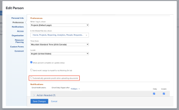

# Configure whether proofs are&nbsp;automatically generated

You can configure whether the system automatically generates proofs when users you specify add documents to Workfront. This setting is disabled by default.

## Access requirements

You must have the following:

<table style="table-layout:auto"> 
 <col> 
 <col> 
 <tbody> 
  <tr> 
   <td role="rowheader"><a href="https://www.workfront.com/plans" target="_blank">Adobe Workfront plan</a> </td> 
   <td> 
Any
 </td> 
  </tr> 
  <tr> 
   <td role="rowheader"><a href="../../../administration-and-setup/add-users/access-levels-and-object-permissions/wf-licenses.md" class="MCXref xref">Adobe Workfront licenses overview</a>*</td> 
   <td> 
Plan
 </td> 
  </tr> 
  <tr> 
   <td role="rowheader">Access configurations</td> 
   <td> 
You must be a Workfront administrator. For information on Workfront administrators, see <a href="../../../administration-and-setup/add-users/configure-and-grant-access/grant-a-user-full-administrative-access.md" class="MCXref xref">Grant a user full administrative access</a>.
 </td> 
  </tr> 
 </tbody> 
</table>

&#42;To find out what plan, license type, or access you have, contact your Workfront administrator.

## Configure whether proofs are&nbsp;automatically generated for a single user

1. Click the **Main Menu** icon  in the upper-right corner of Adobe Workfront, then click **Users** . 
1. Select a user with proofing access, then click **Edit**.
1. In the **Preferences**&nbsp;section, enable or disable the **Automatically generate proofs when uploading documents** checkbox.

   

1. Click **Save Changes**.

## Configure whether proofs are&nbsp;automatically generated for multiple users

1. Click the **Main Menu** icon  in the upper-right corner of Adobe Workfront, then click **Users** . 
1. Select users with proofing access, then click **Edit**.

   >[!IMPORTANT]
   >
   >If all users do not have proofing access, the Automatically generate proofs when uploading documents option does not appear.

1. In the **Preferences**&nbsp;section, enable **Automatically generate proofs when uploading documents** checkbox, then select **Yes** or **No**.

   

1. Click **Save Changes**.

