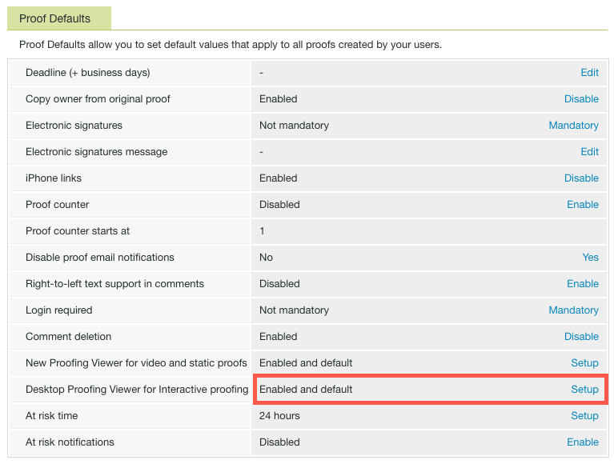

# Install the Desktop Proofing Viewer for your organization

<!--Audited: 05/2024-->

The Desktop Proofing Viewer, which is designed primarily for proofing interactive content, is an application that must be installed on each user's local machine. As an Adobe Workfront administrator or Workfront Proof administrator, you can perform this installation.

## Access requirements

You must have the following access to perform the steps in this article:

<table style="table-layout:auto">
 <col> 
 <col> 
 <tbody> 
  <tr> 
   <td role="rowheader">Adobe Workfront plan</td> 
   <td> 
Current plan: Pro or Higher
 
or
 
Legacy plan: Premium or Select
 
For more information about proofing access with the different plans, see <a href="../../../administration-and-setup/manage-workfront/configure-proofing/access-to-proofing-functionality.md" class="MCXref xref">Access to proofing functionality in Workfront</a>.
 </td> 
  </tr> 
  <tr> 
   <td role="rowheader">Adobe Workfront license</td> 
   <td> 
Current plan: Work or Plan
 
Legacy plan: Any (You must have proofing enabled for the user)
 </td> 
  </tr> 
  <tr> 
   <td role="rowheader">Access level configurations</td> 
   <td> 
You must have Administrator selected in your Proof Permission Profile. For more information, see <a href="../../../administration-and-setup/manage-workfront/configure-proofing/configure-a-users-proofing-access.md" class="MCXref xref">Configure a user's proofing access</a>.
 </td> 
  </tr> 
 </tbody> 
</table>

For more detail about the information in this table, see [Access requirements in Workfront documentation](/help/quicksilver/administration-and-setup/add-users/access-levels-and-object-permissions/access-level-requirements-in-documentation.md).

## System Requirements

The Desktop Proofing Viewer is supported on the following operating systems:

* Windows 7 and later, 32-bit and 64-bit
* Mac OS X 10.9 and later, 64-bit

## Prerequisites

To enable users to use the Desktop Proofing Viewer, you must configure the system to launch the Desktop Proofing Viewer as the default view for interactive proofs before installation.

## Configure the Desktop Proofing Viewer as the default for interactive proofs

After you install the Desktop Proofing Viewer for your organization, you can set it as the default viewer for interactive proofs.

{{step1-to-proofing}}

1. Click **Account settings** near the upper-right corner of Workfront Proof, then click the **Settings** tab.

1. Under **Proof Defaults**, at the end of the **Desktop Proofing Viewer for Interactive proofing** row, click **Setup**.

   

1. Click **Enabled and default**, then click **Save**.

## Installing the Desktop Proofing Viewer for Your Users

* [Installing the Desktop Proofing Viewer on Mac](#installing-the-desktop-proofing-viewer-on-mac) 
* [Installing the Desktop Proofing Viewer on Windows](#installing-the-desktop-proofing-viewer-on-windows)

### Installing the Desktop Proofing Viewer on Mac {#installing-the-desktop-proofing-viewer-on-mac}

1. On the user's machine, do one of the following to download the app:

   * If you are using the Production environment, click [Mac Production Download for the Desktop Proofing Viewer](https://assets.proofhq.com/nativeviewer/desktop_viewer/Workfront+Proof-2.1.19.pkg).
   * If you are using the Preview environment, click [Mac Preview Download for the Desktop Proofing Viewer](https://assets.preview.proofhq.com/nativeviewer/desktop_viewer/Workfront+Proof+Preview-2.1.19.pkg).

1. Open the file you have just downloaded to start the installation.
1. In the installation box that appears, click **Continue**, then click **Install**.

   

1. Ensure that each user completes the installation by opening an interactive proof from the Documents area in Workfront.

### Installing the Desktop Proofing Viewer on Windows {#installing-the-desktop-proofing-viewer-on-windows}

1. On the user's machine, do one of the following to download the app:

   * In the Production environment, click [Windows Production download for the Desktop Proofing Viewer](https://assets.proofhq.com/nativeviewer/desktop_viewer/Workfront+Proof+Setup+2.1.19.exe).
   * In the Preview environment, click [Windows Preview download for the Desktop Proofing Viewer](https://assets.preview.proofhq.com/nativeviewer/desktop_viewer/Workfront+Proof+Preview+Setup+2.1.19.exe).

1. Open the file you have just downloaded to start the installation. 
1. In the security warning box that appears, click **Run**.

   

   The Desktop Proofing Viewer installs and runs. 

1. (Conditional) If you install the application using Internet Explorer, refresh the launching page in the browser after the application installs.
1. Ensure that each user completes the installation by opening an interactive proof from the Documents area in Workfront.
