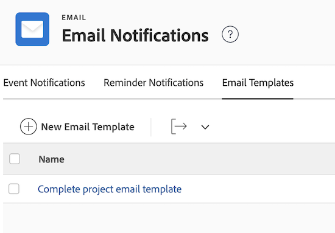
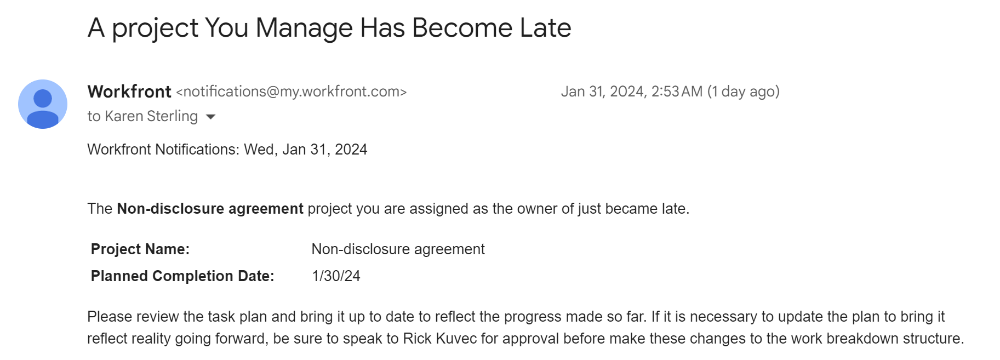
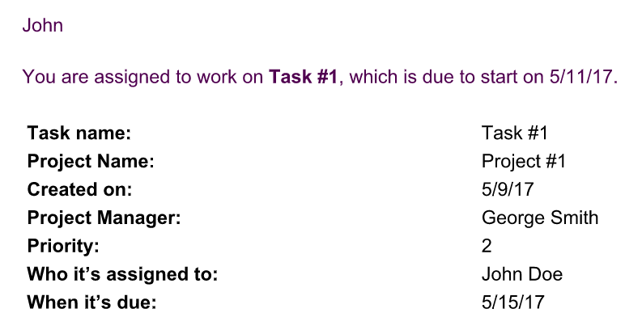

# Configure email templates

As an Adobe Workfront administrator, you can configure email templates to support reminder notifications.

Email templates contain the message sent to users when a reminder notification is initiated.  
Without an email template, the reminder notification will be delivered as empty content in the body of the email.

Email templates can be associated with reminder notifications for issues, tasks, projects, and timesheets. When creating email templates, your Workfront administrator can provide content for the email and a subject line.

## Access requirements

+++ Expand to view access requirements for the functionality in this article.

You must have the following access to perform the steps in this article:

<table style="table-layout:auto"> 
 <col> 
 <col> 
 <tbody> 
  <tr> 
   <td role="rowheader">Adobe Workfront plan</td> 
   <td>Any</td> 
  </tr> 
  <tr> 
   <td role="rowheader">Adobe Workfront license*</td> 
   <td><p>Current: Plan</p>
   Or
   <p>New: Standard</p></td> 
  </tr> 
  <tr> 
   <td role="rowheader">Access level configuration</td> 
   <td> <p>System administrator</p> </td> 
  </tr> 
 </tbody> 
</table>

*For more information about access requirements, see [Access requirements in Workfront documentation](/help/quicksilver/administration-and-setup/add-users/access-levels-and-object-permissions/access-level-requirements-in-documentation.md).  

+++

## Create an email template {#create-an-email-template}

{{step-1-to-setup}}

1. In the left panel, click **Email** > **Notifications**> **Email Templates**.

    
  
1. Click **New Email Template**.  

1. In the **New Email Template** box, specify the following information:

   <table style="table-layout:auto"> 
    <col> 
    <col> 
    <tbody> 
     <tr> 
      <td role="rowheader">Name</td> 
      <td>Add a title for the email template. This is a required field.</td> 
     </tr> 
     <tr> 
      <td role="rowheader">Object type</td> 
      <td>Specify the object type that you want to associate the template with. Choose from the following objects:
      <ul>
      <li>Project</li>
      <li>Task</li>
      <li>Issue</li>
      <li>Timesheet</li> </ul>
      
      This is a required field and it is set to Project, by default.</td> 
     </tr>
     <tr> 
      <td role="rowheader">Description</td> 
      <td>Add more information about the email template, its purpose, and intended audience.</td> 
     </tr> 
      
     <tr> 
      <td role="rowheader">Subject </td> 
      <td>Add the text that displays in the Subject line of the email, when the email message generated by the template is sent. This is a required field.</td> 
     </tr> 
     <tr> 
      <td role="rowheader">Body </td> 
      <td> <p>Add the text for the content of the email message.</p> <p>You can use HTML formatting for the email content, as described in the section <a href="#add-html-formatting-to-an-email-template" class="MCXref xref">Add HTML formatting to an email template</a> in this article.</p> </td> 
     </tr> 
    </tbody> 
   </table>

1. Click **Save**.

## Add HTML formatting to an email template {#add-html-formatting-to-an-email-template}

You can add HTML tags to email templates to produce custom notifications.   
Begin creating the email template as described in [Create a new email template](#create-a-new-email-template).

HTML formatting can enrich your email templates, as shown in the following sections.

* [Link to Workfront objects](#link-to-workfront-objects) 
* [Link to custom fields with HTML](#link-to-custom-fields-with-html) 
* [HTML email examples](#html-email-examples)

### Link to Workfront objects {#link-to-workfront-objects}

You can include links to Workfront fields by using the `$$` wildcard to tell the email generator to look for values from the database associated with a specific object.

For example, the body of the email for a notification alerting the assignee of the task that the task is about to start can follow this structure:

```html
<html>
<p>$$assignedTo:firstName$$</p>
<p>You are assigned to work on <b><a href="https://<your domain>.my.workfront.com/task/view?ID=$$ID$$">$$name$$</a></b>, which is due to start on $$plannedStartDate$$.</p>
<table width="350" style="font-size:12px;">
<tr>
<td><b><strong>HEADING</b></td>
<td>$$WILDCARD$$</td>
</tr>
<tr>
<td><b>HEADING</b></td>
<td>$$WILDCARD$$</td>
</tr>
<tr>
<td><b>HEADING</b></td>
<td>$$WILDCARD$$</td></tr>
</table>
</html>
```

To get the "wildcard" value for an object, do one of the following:

* Refer to the API Explorer and select the names of your objects from the Fields tab of any object. For more information about the API Explorer, see [API Explorer](/help/quicksilver/wf-api/general/api-explorer.md).

* Use the `valuefield` value you find inside of a text mode view of a report. For more information about text mode values, see [Text Mode overview](../../../reports-and-dashboards/reports/text-mode/understand-text-mode.md).

The `heading` value can be the name of the object, as you want it to appear in the email body.

### Link to custom fields with HTML {#link-to-custom-fields-with-html}

You can include links to users and custom fields by using the `$$` wildcard to tell the email generator to look for values from the database associated with the object. They must be present on either side of the database attribute reference.

For example, adding the following text as HTML would add the assigned user's first name to the reminder notification associated with a task: 

`assignedTo:firstName`

To add custom fields using the same formatting, you can add the following in your email notification:

`DE:Custom Field As It Appears in Workfront`

For example, this is an email template which includes a reference to a custom field named Delivery Date, and it's assuming that the field Delivery Date belongs to a task.

Replace `<your domain>` with your company's Workfront domain, without the brackets:

```html
<html>
<p>$$assignedTo:firstName$$</p>
<p>You are assigned to work on <b><a href="https://<your domain>.my.workfront.com/task/view?ID=$$ID$$">$$name$$</a></b>, which has a Delivery Date of $$DE:Task:Delivery Date$$.</p>
<table width="350" style="font-size:12px;">
<tr>
<td><b>Project Name:</b></td>
<td>$$project:name$$</td>
</tr>
<tr>
<td><b>Description:</b></td>
<td>$$description$$</td>
<tr>
<td><b>Estimated Effort:</b></td>
<td>$$work$$ hours</td>
</tr>
<tr>
<td><b>Planned Completion Date:</b></td>
<td>$$plannedCompletionDate$$</td>
<td><b>Delivery Date:</b></td>
<td>$$DE:Task:Delivery Date$$</td>
</tr>
</table>
</html>
```

>[!NOTE]
>
>If the field belongs to a project, replace task with project: 
>
>`DE:Project:Delivery Date`

### HTML email examples {#html-email-examples}

* [Late Project reminder notification (example)](#late-project-reminder-notification-example) 
* [Task or Issue About to Start reminder (example)](#task-or-issue-about-to-start-reminder-example)

#### Late Project reminder notification (example) {#late-project-reminder-notification-example}

To edit an email template for a late project reminder, consider this information for the Subject and Content fields.

Replace `<your domain>` with your company's Workfront domain, without the brackets. 

**Subject:**

A Project You Manage Has Become Late

**Content:** 

```html
<html>
<p>The <b><a href="https://<your domain>.my.workfront.com/project/view?ID=$$ID$$">$$name$$</a></b> project you are assigned as the owner of just became late.</p>
<table width="350" style="font-size:12px;">
<tr>
<td><b>Project Name:</b></td>
<td>$$project:name$$</td>
</tr>
</tr>
<tr>
<td><b>Planned Completion Date:</b></td>
<td>$$plannedCompletionDate$$</td>
</tr>
</table>
<p>Please review the task plan and bring it up to date to reflect the progress made so far. If it is necessary to update the plan to bring it reflect reality going forward, be sure to speak to $$sponsor:name$$ for approval before make these changes to the work breakdown structure.</p>
</html>
```

This produces an email similar to the following: 



#### Task or Issue About to Start reminder {#task-or-issue-about-to-start-reminder-example}

You might also want to create a reminder notification for an upcoming task or issue.

The following code can be included in an email template to be used for task and issue reminder notifications that are sent any number of days before the planned start date of the task or issue.

Replace `<your domain>` with your company's Workfront domain, without the brackets.  

To use this for an Issue email, change the `/task/view.` value in the link to the work item to `/issue/view`.

**Subject:**

`$$name$$ to start on $$plannedStartDate$$`

**Content:**

```html
<html>
<p>$$assignedTo:firstName$$</p>
<p>You are assigned to work on <b><ahref=https://<your domain>.my.workfront.com/task/view?ID=$$ID$$">$$name$$</a></b>, which is due to start on $$plannedStartDate$$.</p>
<tablewidth=350"style=font-size:12px;">
<tr>
<td><b>Task Name:</b></td>
<td>$$name$$</td>
</tr>
<td><b>Project Name:</b></td>
<td>$$project:name$$</td>
</tr>
</tr>
<td><b>Created on:</b></td>
<td>$$entryDate$$</td>
</tr>
<tr>
<td><b>Project Manager:</b></td>
<td>$$project:owner:name$$</td>
<tr>
<td><b>Priority:</b></td>
<td>$$priority$$</td>
</tr>
<tr>
<td><b>Who is assigned to:</b></td>
<td>$$assignedTo:name$$</td>
</tr>
<tr>
<td><b>When it's due:</b></td>
<td>$$estCompletionDate$$</td>
</tr>
</table>
</html>
```



After an email template is created, users can associate it with reminder notifications, as described in [Set up reminder notifications](../../../administration-and-setup/manage-workfront/emails/set-up-reminder-notifications.md).
