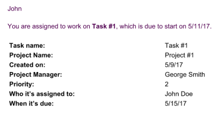

# Configure email templates

As an Adobe Workfront administrator, you can configure email templates to support reminder notifications.

Email templates contain the message sent to users when a reminder notification is initiated.  
Without an email template, the reminder notification will be delivered as&nbsp;empty content in the body of the email.

Email templates can be associated with reminder notifications for issues, tasks, projects, and timesheets. When creating email templates, your Workfront administrator can provide content for the email and a subject line.

## Access requirements

You must have the following access to perform the steps in this article:

<table cellspacing="0"> 
 <col> 
 <col> 
 <tbody> 
  <tr> 
   <td role="rowheader">Adobe Workfront plan</td> 
   <td> <p>Any</p> </td> 
  </tr> 
  <tr> 
   <td role="rowheader">Adobe Workfront license</td> 
   <td> <p>Plan</p> </td> 
  </tr> 
  <tr> 
   <td role="rowheader">Access level configurations</td> 
   <td> <p>System administrator</p> </td> 
  </tr> 
 </tbody> 
</table>

## Create a new email template {#create-a-new-email-template}

1. Click the **Main Menu** icon  in the upper-right corner of Adobe Workfront, then click **Setup** .

1. In the panel on the left, click **Email**&nbsp;> **Notifications**.

1. Click the **Email Templates** tab, then click **New Email Template**.  

1. In the **New Email Template** box that appears, specify the following information:

   <table cellspacing="0"> 
    <col> 
    <col> 
    <tbody> 
     <tr> 
      <td role="rowheader">Email template</td> 
      <td>Title of the email template (required).</td> 
     </tr> 
     <tr> 
      <td role="rowheader">Description</td> 
      <td>Description of the template.</td> 
     </tr> 
     <tr> 
      <td role="rowheader">Object type</td> 
      <td>Specify the&nbsp;object type that you want to associate the template with (required, by default it will be set to 'Issue').</td> 
     </tr> 
     <tr> 
      <td role="rowheader">Subject </td> 
      <td>Subject that is displayed when the email message is sent (required).</td> 
     </tr> 
     <tr> 
      <td role="rowheader"> </td> 
      <td> <p>Content that is displayed when the email message is sent.</p> <p>You can use HTML formatting for the email content, as described in <a href="#add-html-formatting-to-an-email-template" class="MCXref xref">Add HTML formatting to an email template</a> in this article.</p> </td> 
     </tr> 
    </tbody> 
   </table>

1. Click **Save**.

## Add HTML formatting to an email template {#add-html-formatting-to-an-email-template}

You can add HTML tags to email templates to produce custom ```notifications.   
Begin creating the email template as described in [Create a new email template](#create-a-new-email-template).```

```HTML formatting can enrich your email templates, as shown in the following sections.```

* [Link to Workfront objects](#link-to-workfront-objects) 
* [Link to custom fields with HTML](#link-to-custom-fields-with-html) 
* [HTML email examples](#html-email-examples)

### Link to Workfront objects {#link-to-workfront-objects}

```You can include links to Workfront fields by using the``` **$$** wildcard to tell the email generator to look for values from the database associated with a specific object.

For example, the body of the email for a notification alerting the assignee of the task that the task is about to start can follow this structure:

<!--WRITER
<pre>
      <html>
</pre><pre><p>$$assignedTo:firstName$$</p><br><p>You are assigned to work on <b><a href="https://<your domain>.my.workfront.com/task/view?ID=$$ID$$">$$name$$</a></b>, which is due to start on $$plannedStartDate$$.</p><br><table width="350" style="font-size:12px;"><br><tr><br><td><b><strong>HEADING</strong></b></td><br><td>$$<strong>WILDCARD</strong>$$</td><br></tr><br><tr><br><td><b><strong>HEADING</strong></b></td><br><td>$$<strong>WILDCARD</strong>$$</td><br></tr><br><tr><br><td><b><strong>HEADING</strong></b></td><br><td>$$<strong>WILDCARD</strong>$$</td><br></tr><br></table></pre><pre>
      </html>
</pre> To get the "wildcard" value for an object, do one of the following:
-->

* Refer to the API Explorer and select the names of your objects from the Fields tab of any object. For more information about the API Explorer, see [Adobe Workfront API](../../../wf-api/workfront-api.md).
* Use the "valuefield" value you find inside of a text mode view of a report. For more information about text mode values, see [Text Mode overview](../../../reports-and-dashboards/reports/text-mode/understand-text-mode.md).

  The "heading" value can be the name of the object, as you want it to appear in the email body.

### Link to custom fields with HTML {#link-to-custom-fields-with-html}

You can include links to users and custom fields by using the **$$**wildcard to tell the email generator to look for values from the database associated with the object. They must be present on either side of the database attribute reference.

For example, adding the following&nbsp;text as HTML would add the assigned user's first name to the reminder&nbsp;notification associated with a task:&nbsp;**$$assignedTo:firstName$$**.

To add custom fields using the same formatting, you can add this in your email notification: **$$DE:Custom Field As It Appears in Workfront$$**.

For example, this is an email template which includes a reference to a custom field named Delivery Date, and it's assuming that the field Delivery Date belongs to a task.

Replace `<your domain>` with your company's Workfront domain, without the brackets:
<pre><html><br><p>$$assignedTo:firstName$$</p><br><p>You are assigned to work on <b><a href="https://<em><your domain></em>.my.workfront.com/task/view?ID=$$ID$$">$$name$$</a></b>, which has a Delivery Date of <strong>$$DE:Task:Delivery Date$$</strong>.</p><br><table width="350" style="font-size:12px;"><br><tr><br><td><b>Project Name:</b></td><br><td>$$project:name$$</td><br></tr><br><tr><br><td><b>Description:</b></td><br><td>$$description$$</td><br><tr><br><td><b>Estimated Effort:</b></td><br><td>$$work$$ hours</td><br></tr><br><tr><br><td><b>Planned Completion Date:</b></td><br><td>$$plannedCompletionDate$$</td><br><strong><td><b>Delivery Date:</b></td></strong><br><strong><td>$$DE:Task:Delivery Date$$</td></strong><br></tr><br></table><br></html></pre>

>[!NOTE]
>
>If the field belongs to a project, replace task with project: $$DE:Project:Delivery Date$$"

### HTML email examples {#html-email-examples}

* [Late Project reminder notification (example)](#late-project-reminder-notification-example) 
* [Task or Issue About to Start reminder (example)](#task-or-issue-about-to-start-reminder-example)

#### **Late Project reminder notification (example)** {#late-project-reminder-notification-example}

To edit an email template for a late project reminder, consider this information for the Subject and Content fields.

Replace `<your domain>` with your company's Workfront domain, without the brackets.&nbsp;

**Subject:**

A Project You Manage Has Become Late

**Content:** 
<pre><html><br><p>The <b><a href="https://<em><your domain></em>.my.workfront.com/project/view?ID=$$ID$$">$$name$$</a></b> project you are assigned as the owner of just became late.</p><br><table width="350" style="font-size:12px;"><br><tr><br><td><b>Project Name:</b></td><br><td>$$project:name$$</td><br></tr><br></tr><br><tr><br><td><b>Planned Completion Date:</b></td><br><td>$$plannedCompletionDate$$</td><br></tr><br></table><br><p>Please review the task plan and bring it up to date to reflect the progress made so far. If it is necessary to update the plan to bring it reflect reality going forward, be sure to speak to $$sponsor:name$$ for approval before make these changes to the work breakdown structure.</p><br></html></pre>This produces an email similar&nbsp;to the following:&nbsp;


#### **Task or Issue About to Start reminder (example)** {#task-or-issue-about-to-start-reminder-example}

You might&nbsp;also want to create a reminder notification for an upcoming task or issue.

The following code can be included in an email template to be used for task and issue reminder notifications that are sent any number of days before the planned start date of the task or issue.  
Replace `<your domain>` with your company's Workfront domain, without the brackets.  
To use this for an Issue email, change the **/task/view.**value in the link to the work item to**/issue/view**.

**Subject:**

$$name$$ to start on $$plannedStartDate$$

<!--WRITER

**Content:** 
<pre><code class="plain"><</code><code class="keyword">html</code><code class="plain">><br></code><code class="plain"><</code><code class="keyword">p</code><code class="plain">>$$assignedTo:firstName$$</</code><code class="keyword">p</code><code class="plain">><br><code class="plain"><</code><code class="keyword">p</code><code class="plain">>You are assigned to work on <</code><code class="keyword">b</code><code class="plain">><</code><code class="keyword">a</code><code class="color1">href</code><code class="plain">=</code><code class="string"><a href="https://attask-ondemand.com/task/view?ID=">https://<your domain>.my.workfront.com/task/view?ID=</a>$$ID$$"</code><code class="plain">>$$name$$</</code><code class="keyword">a</code><code class="plain">></</code><code class="keyword">b</code><code class="plain">>, which is due to start on $$plannedStartDate$$.</</code><code class="keyword">p</code><code class="plain">></code></code><br><code class="plain"><</code><code class="keyword">table</code><code class="color1">width</code><code class="plain">=</code><code class="string">350"</code><code class="color1">style</code><code class="plain">=</code><code class="string">font-size:12px;"</code><code class="plain">></code><br><code class="plain"><</code><code class="keyword">tr><br><code class="plain"><</code>td<code class="plain">><</code>b<code class="plain">>Task Name:</</code>b<code class="plain">></</code>td<code class="plain">><br><td>$$name$$</td><br></tr></code></code><br><code class="plain"><</code><code class="keyword">td</code><code class="plain">><</code><code class="keyword">b</code><code class="plain">>Project Name:</</code><code class="keyword">b</code><code class="plain">></</code><code class="keyword">td</code><code class="plain">><br><code class="plain"><</code><code class="keyword">td</code><code class="plain">>$$project:name$$</</code><code class="keyword">td</code><code class="plain">></code><br><code class="plain"></</code><code class="keyword">tr</code><code class="plain">><br></code><code class="keyword"></tr></code><br><<code class="keyword">td</code>><<code class="keyword">b</code>>Created on:</<code class="keyword">b</code>></<code class="keyword">td</code>><br><<code class="keyword">td</code>>$$entryDate$$</<code class="keyword">td</code>><br></<code class="keyword">tr</code>><br><code class="plain"><</code><code class="keyword">tr</code><code class="plain">></code><br><code class="plain"><</code><code class="keyword">td</code><code class="plain">><</code><code class="keyword">b</code><code class="plain">>Project Manager:</</code><code class="keyword">b</code><code class="plain">></</code><code class="keyword">td</code><code class="plain">></code><br><code class="plain"><</code><code class="keyword">td</code><code class="plain">>$$project:owner:name$$</</code><code class="keyword">td</code><code class="plain">></code><br><code class="plain"><</code><code class="keyword">tr</code><code class="plain">></code><br><code class="plain"><</code><code class="keyword">td</code><code class="plain">><</code><code class="keyword">b</code><code class="plain">>Priority:</</code><code class="keyword">b</code><code class="plain">></</code><code class="keyword">td</code><code class="plain">></code><br><code class="plain"><</code><code class="keyword">td</code><code class="plain">>$$priority$$</</code><code class="keyword">td</code><code class="plain">></code><br><code class="plain"></</code><code class="keyword">tr</code><code class="plain">></code><br><code class="plain"><</code><code class="keyword">tr</code><code class="plain">></code><br><code class="plain"><</code><code class="keyword">td</code><code class="plain">><</code><code class="keyword">b</code><code class="plain">>Who is assigned to:</</code><code class="keyword">b</code><code class="plain">></</code><code class="keyword">td</code><code class="plain">></code><br><code class="plain"><</code><code class="keyword">td</code><code class="plain">>$$assignedTo:name$$</</code><code class="keyword">td</code><code class="plain">></code><br><code class="plain"></</code><code class="keyword">tr</code><code class="plain">><br><<code class="keyword">tr</code>><br><<code class="keyword">td</code>><<code class="keyword">b</code>>When it's due:</<code class="keyword">b</code>></<code class="keyword">td</code>><br><<code class="keyword">td</code>>$$estCompletionDate$$</<code class="keyword">td</code>><br></<code class="keyword">tr</code>></code><br></table><br></html><br></code></pre>This text returns an email similar to the following:
-->



After an email template is created, users can associate it with reminder notifications, as described in [Set up reminder notifications](../../../administration-and-setup/manage-workfront/emails/set-up-reminder-notifications.md).
