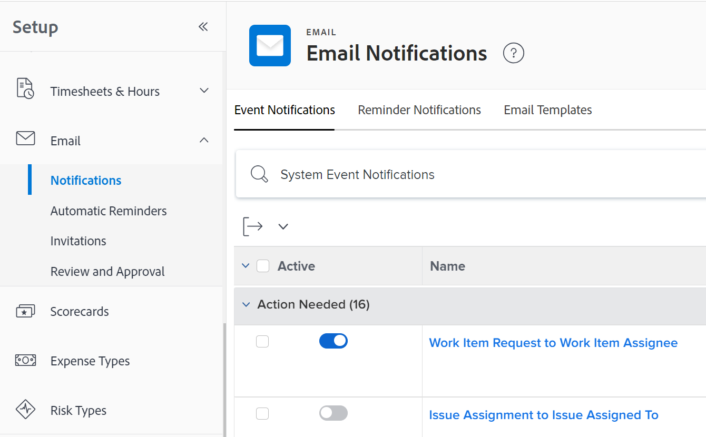

# Configure event notifications for everyone in the system

<!-- Audited: 1/2024 -->

<!--DON'T DELETE, DRAFT OR HIDE THIS ARTICLE. IT IS LINKED TO THE PRODUCT, THROUGH THE CONTEXT SENSITIVE HELP LINKS-->

Event notifications trigger emails to users when a certain event occurs. As an Adobe Workfront administrator or a user with a Planner access level, you can configure an event notification for all users in the system. Configuration of an event notification consists of activating or deactivating it.

<!--Alina annotation on the word "all" in 2nd sentence: abive, drafted and remains QS only-->

Depending on the event you enable and the user keeps enabled on their own profile, users receive instant, daily, or both instant and daily email notifications when an event occurs.

You first must specify which notifications you want all your users to receive in the Setup area of your Workfront instance. Once you activate a notification in the Setup area, it displays as activated for each user in their profile page.

After notifications are activated in the Setup area and they appear in the users' profile pages, individual users or another user with a Plan license can also configure the activated notifications in a user profile to control what notifications that specific user receives and how often. For more information, see [Modify your own email notifications](../../../workfront-basics/using-notifications/activate-or-deactivate-your-own-event-notifications.md).

For a list of all event notifications that you can activate and deactivate, see [Event notification types](../../../administration-and-setup/manage-workfront/emails/event-notifications-available-in-wf.md).

For information about unlocking an event notification so that group administrators can configure it for their groups, see [Unlock or lock configuration of event notifications for all groups](../../../administration-and-setup/manage-workfront/emails/unlock-configuration-of-event-notifications-for-groups.md) and [View and configure event notifications for a group](../../../administration-and-setup/manage-groups/create-and-manage-groups/view-and-configure-event-notifications-group.md).

## Access requirements

You must have the following access to perform the steps in this article:

<table style="table-layout:auto"> 
 <col> 
 <col> 
 <tbody> 
  <tr> 
   <td role="rowheader">Adobe Workfront plan</td> 
   <td>Any</td> 
  </tr> 
  <tr> 
   <td role="rowheader">Adobe Workfront license</td> 
   <td> 
New: Standard

 
or
 

Current: Plan
 
</td> 
  </tr> 
  <tr> 
   <td role="rowheader">Access level configurations</td> 
   <td> 
Planner or higher, with administrative access to reminder notifications
 </td> 
  </tr> 
 </tbody> 
</table>

For more detail about the information in this table, see [Access requirements in Workfront documentation](/help/quicksilver/administration-and-setup/add-users/access-levels-and-object-permissions/access-level-requirements-in-documentation.md).

## Configure event notifications for all users

You must enable notifications in the Setup area of Workfront before users can enable or disable them in their individual profiles.

>[!TIP]
>
>You cannot activate notifications for Workfront Goals from the Setup area. Users can activate these notifications only in their profiles. Users with Plan licenses can activate them for other users. For information about enabling Workfront Goals notifications for users, see [Notifications: Goals](../../../workfront-basics/using-notifications/notifications-goals.md).

{{step-1-to-setup}}

1. Click **Email** > **Notifications**.

    
   

1. Make sure the **Event Notifications** tab is open.
1. Toggle the switch to the left of the event name to turn it on or off.

   To see the default notification status for an event, see [Event notifications](../../../workfront-basics/using-notifications/event-notifications.md).

1. (Optional) Click the name of an event notification to customize the subject line of the email notification.

   For more information about customizing the subject lines of email notifications, see [Customize email subjects for event notifications](../../../administration-and-setup/manage-workfront/emails/custom-email-subjects-event-notification.md).

1. (Optional) If you want to unlock configuration for an email notification so that group administrators can configure it separately for their groups, click the button  to the right of the notification to switch it to the unlocked position .

   >[!NOTE]
   >
   >This functionality is available initially only to customers on Cluster 4 as part of a phased roll-out. It will become available for other clusters shortly thereafter. This article will be updated as this occurs.

   For more information, see [Unlock or lock configuration of event notifications for all groups](../../../administration-and-setup/manage-workfront/emails/unlock-configuration-of-event-notifications-for-groups.md).
