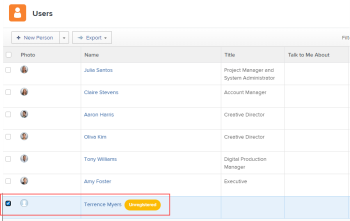

# Manage email invitations to new users

<!--

*** DON'T DELETE, DRAFT OR HIDE THIS ARTICLE. IT IS LINKED TO THE PRODUCT, THROUGH THE CONTEXT SENSITIVE HELP LINKS. **

-->

>[!IMPORTANT]
>
>The procedure described on this page applies only to organizations that have not yet been onboarded to the Admin Console. If your organization has been onboarded to the Adobe Admin Console, you must perform this action through the Adobe Admin Console.
>
>For a list of procedures that differ based on whether your organization has been onboarded to the Adobe Admin Console, see [Platform-based administration differences (Adobe Workfront/Adobe Business Platform)](../../../administration-and-setup/get-started-wf-administration/actions-in-admin-console.md).

As an Adobe Workfront administrator, you can add users to Workfront and notify them that they have been added, by using email invitations.

The email invitation allows new users to follow a link where they can choose a password for their Workfront account. They can then finish setting up their account.

To ensure the security of the new accounts, we recommend that you use email invitations for your new users, so they can choose their own password. Alternatively, you can also select a password for a new user when creating their account. For more information about adding new users to Workfront, see [Add users](../../../administration-and-setup/add-users/create-and-manage-users/add-users.md).

You can configure the new user emails for:

* Any new user added to Workfront
* Users added to Workfront with a Requestor license

All new users see the same email when an email invitation is sent.

For information about receiving email invitations, see [Receive email invitations and create a password for Adobe Workfront](../../../workfront-basics/manage-your-account-and-profile/managing-your-workfront-account/receive-email-invitations.md).

## Access requirements

You must have the following access to perform the steps in this article:

<table style="table-layout:auto"> 
 <col> 
 <col> 
 <tbody> 
  <tr> 
   <td role="rowheader">Adobe Workfront plan</td> 
   <td>Any</td> 
  </tr> 
  <tr> 
   <td role="rowheader">Adobe Workfront license</td> 
   <td>Plan</td> 
  </tr> 
  <tr> 
   <td role="rowheader">Access level configurations</td> 
   <td> 
System administrator
 </td> 
  </tr> 
 </tbody> 
</table>

## Generate email invitations {#generate-email-invitations}

Email invitations are generated in the following scenarios:

* When you create a new user and you select the **Send an invite email to this person** on the **New User** form. For more information about creating new users, see [Add users](../../../administration-and-setup/add-users/create-and-manage-users/add-users.md).
* When you import multiple new users and you select the **Send invite emails to these people** option. For more information about importing several new users, see [Import users](../../../administration-and-setup/add-users/create-and-manage-users/import-users.md).
* After the users are created, you can manually generate the invitations to users who have not yet registered their account with Workfront, and they have not established a Workfront password.  
  Users who have an account created but have not yet registered their account are marked as **Unregistered** in Workfront.

  >[!NOTE]
  >
  >If you deselect the **Send an email invite to this person** box when you create the user, the email invitation cannot be generated manually. Resending the email invitations manually is only possible for users who have been sent the original email invitation when their account was created. For more information about creating new users, see [Add users](../../../administration-and-setup/add-users/create-and-manage-users/add-users.md).

To manually generate email invitations to existing unregistered users:

1. Click the **Main Menu** icon  in the upper-right corner of Adobe Workfront, then click **Users** . 
1. Select the user who shows the **Unregistered** label after their name.

   

1. Click the More icon , then click **Remind user to register**.

   An email invitation is sent to the new user with a new link they can use to create their Workfront password.

   >[!NOTE]
   >
   >If your organization has been onboarded to the Admin Console and you add a user through Workfront, you do not have the option to send an email invitation to new users.
   >
   >New Adobe users are added to the Admin Console, and the Admin Console delivers an email to invite them to complete the registration process. All users must complete the registration process to access any Adobe system.
   >
   >For existing Adobe users, the user may or may not receive an email about Workfront being available. This is a preference controlled by the Adobe administrator for the product.

## Configure email invitations {#configure-email-invitations}

As a Workfront administrator, you can configure the message you include with the email invitations for new users.

1. Click the **Main Menu** icon  in the upper-right corner of Adobe Workfront, then click **Setup** .

1. In the list on the left, click **Email** > **Invitations**.

1. In the **General Options** section, make any of the following modifications:

   <table style="table-layout:auto"> 
    <col> 
    <col> 
    <tbody> 
     <tr> 
      <td role="rowheader"><strong>Deactivate invitation links after ... days</strong> </td> 
      <td> 
Choose the amount of time after which the email invitations no longer contain a valid link to Workfront. The default amount of days is 45.
 </td> 
     </tr> 
     <tr> 
      <td role="rowheader"><strong>Include a message and/ or term of service</strong> </td> 
      <td> 
Select this option if you want to modify the email invitation for all new users added to Workfront. This does not include users with a Requestor license.
 
       <ul> 
        <li><strong>Message</strong>: If you select to modify the email invitation for all new users, specify the text that you want to include in your email invitations as the email body.</li> 
        <li><strong>Terms and Conditions</strong>: If you select to modify the email invitation for all new users, specify the text that you want to include in your email invitations as the terms and conditions. </li> 
        <li><strong>Include a message and/or term of service for helpdesk users</strong>: Select this option if you want to modify the email invitation for all new users added to Workfront that have a Requestor license.</li> 
        <li><strong>Message</strong>: If you select to modify the email invitation for all new users with a Requestor license, specify the text that you want to include in your email invitations as the email body.</li> 
        <li><strong>Terms and Conditions</strong>: If you select to modify the email invitation for all new users with a Requestor license, specify the text that you want to include in your email invitations as the terms and conditions. </li> 
        <li> 
In the <strong>Invitation Preview</strong> section, you can see a preview of your email invitation. If you selected to include a customized message in your email invitation, the customized message shows in this area.
 
  
 </li> 
       </ul> </td> 
     </tr> 
    </tbody> 
   </table>

1. Click **Save**.
