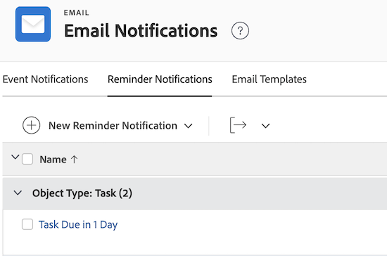
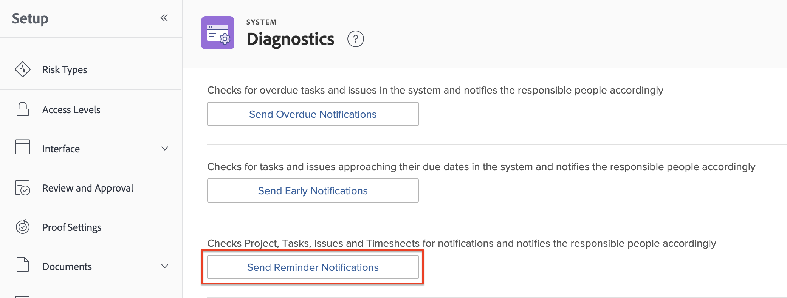

# Set up reminder notifications

<!-- Audited: 1/2024 -->

Reminder notifications send emails to recipients based on specified criteria. You can manually associate reminder notifications with your work items, such as projects, tasks, issues, and timesheets. 

<!--
DRAFTED IN FLARE:
An example of how this can be used would be helpful here and/or in the section 
<a href="../../../workfront-basics/using-notifications/wf-notifications.md#reminder-notifications" class="MCXref xref">Reminder notifications</a>
 in 
<a href="../../../workfront-basics/using-notifications/wf-notifications.md" class="MCXref xref">Adobe Workfront notifications</a>

-->

## Access requirements

You must have the following access to perform the steps in this article:

<table style="table-layout:auto"> 
 <col> 
 <col> 
 <tbody> 
  <tr> 
   <td role="rowheader">Adobe Workfront plan*</td> 
   <td>Any</td> 
  </tr> 
  <tr> 
   <td role="rowheader">Adobe Workfront license*</td> 
   <td> 
New: Standard 

 
or
 

Current: Plan
 
</td> 
  </tr> 
  <tr> 
   <td role="rowheader">Access level configurations*</td> 
   <td> 
Planner or higher, with administrative access to reminder notifications
 
For information about giving a Plan user administrative access, see <a href="../../../administration-and-setup/add-users/configure-and-grant-access/grant-users-admin-access-certain-areas.md" class="MCXref xref">Grant users administrative access to certain areas</a>.
 </td> 
  </tr> 
 </tbody> 
</table>

&#42;To find out what plan, license type, or access you have, contact your Workfront administrator.

## Customize the reminder email

You can customize the subject, body, and HTML in the reminder notification email. 

Or, you can use the default email included with the reminder notification. The default email uses the reminder notification name as the email subject and the object name in the email body, including the event that triggered the notification.

If you want to customize the reminder email, you need to create an email template and attach it to the reminder notification.

For information about how to create an email template, see [Configure email templates](../../../administration-and-setup/manage-workfront/emails/configure-email-templates.md).

## Create a reminder notification

{{step-1-to-setup}}

1. Click **Email** > **Notifications** > **Reminder Notifications**.

   
   
1. Click **New Reminder Notification**.

1. In the drop-down list, click the object type you want to associate with the reminder notification.

   For example, if you want to attach a reminder notification to a timesheet, click **Timesheet**.

1. In the **New Reminder Notification** box that appears, specify the following information.

   <table style="table-layout:auto"> 
    <col> 
    <col> 
    <tbody> 
     <tr> 
      <td role="rowheader">Reminder Notification Name</td> 
      <td>Specify a name for the reminder notification.</td> 
     </tr> 
     <tr> 
      <td role="rowheader">Qualifying Period</td> 
      <td> 
Specify the number of hours, work days, days (calendar days), weeks, or months before or after the date in the <strong>Timing</strong> field.
 
<b>NOTE</b>:  
        <ul> 
         <li> 
Reminder notifications begin 24 hours after the specified date and once all criteria are met.
 </li> 
         <li> 
Reminder notifications for projects, tasks, and issues trigger every night at midnight, US Mountain Time. All objects that qualify for a reminder notification from that day trigger a notification to the designated users shortly after that time.
 </li> 
         <li> 
Reminder notifications for timesheets are sent at the specified time based on your time zone and the timesheet's End Date, Start Date, or Last Update Date.
 </li> 
        </ul> 
 </td> 
     </tr> 
     <tr> 
      <td role="rowheader">Timing</td> 
      <td> 
Select the event that triggers the reminder notification to be scheduled.
 
If the reminder notification is intended for projects, tasks, or issues, the available options are related to the Completion Date or Start Date. The reminder notification takes into account the time stamp on the Completion and Start Dates of projects, tasks and issues.
 
      
      
If the reminder notification is intended for Timesheets, the available options are related to the End Date, Start Date, or Last Update Date. The reminder notification for Timesheets takes into account the time stamp of the timesheet End, Start and Last Update Date. The Timesheet starts at midnight on the day of the Start Date (12:00 AM) and ends right before midnight on the End Date (11:59 PM).
 
      
      
<b>NOTE</b>

      
Timesheet reminder notifications are only distributed once every 24 hours.
 
When you set up multiple reminder notifications within a 24-hour period, Workfront sends out one notification email with all the reminders included in that notification.

      
For example, if you configure three reminder notifications to trigger 10 hours before, 2 hours before, and 1 hour before a due date, the three reminders would all be combined in the same notification if they occur during the same day.
 
However, if you set a reminder notification for 26 hours before and another one for 1 hour before a due date, users would receive two separate notifications. 
 
        
      </td> 
     </tr> 
     <tr> 
      <td role="rowheader">Criteria</td> 
      <td> 
Select the criteria to qualify the reminder notification to be scheduled. Reminder notifications are not scheduled unless the criteria selection is met.
 
The following criteria options are available, depending on the object type that you selected in Step 4:
 
       <ul> 
        <li><strong>Incomplete in Current Projects:</strong> <i>(Available for task and issue reminders)</i> The reminder notification is scheduled to be sent only when the object status that the reminder notification is associated with is not Complete and the project status is Current.</li> 
        <li><strong>All in Current Projects:</strong> <i>(Available for task and issue reminders)</i> The reminder notification is scheduled to be sent regardless of the object status and only when the project status that the reminder notification is associated with is Current.</li> 
        <li><strong>Incomplete Projects:</strong> <i>(Available for project reminders)</i> The reminder notification is scheduled to be sent when the project status is anything but Complete.</li> 
        <li><strong>All Projects:</strong> <i>(Available for project reminders)</i> The reminder notification is scheduled to be sent regardless of the project status.</li> 
        <li><strong>Open Timesheets:</strong> <i>(Available for timesheet reminders)</i> The reminder notification is scheduled to be sent when the timesheet status is Open.</li> 
        <li><strong>Submitted Timesheets:</strong> <i>(Available for timesheet reminders)</i> The reminder notification is scheduled to be sent when the timesheet status is Submitted.</li> 
        <li><strong>Open Timesheet or Less than 40 Hours per Week:</strong> <i>(Available for timesheet reminders)</i> The reminder notification is scheduled to be sent when the timesheet status is Open or when the timesheet has less than 40 hours logged.</li> 
        <li><strong>Email Template:</strong> From the drop-down, select an email template to attach to your reminder. For information on how to build an email template, refer to <a href="../../../administration-and-setup/manage-workfront/emails/configure-email-templates.md" class="MCXref xref">Configure email templates</a>.</li> 
       </ul> </td> 
     </tr> 
     <tr> 
      <td role="rowheader">Recipients</td> 
      <td>Select the types of users you want to receive the notification. Select from various object stakeholders, such as owner, approver, or assignee.</td> 
     </tr> 
    </tbody> 
   </table>

1. Click **Save**.
1. Attach the reminder notification to a work item, as described in [Attach a reminder notification to an object](../../../workfront-basics/using-notifications/attach-reminder-notification-object.md).

## Receive a reminder notification

When the condition is met on the item which has the reminder notification attached, an email notification is triggered to the user defined in the reminder notification.

For more information about receiving reminder notifications, see the [Reminder notifications](../../../workfront-basics/using-notifications/wf-notifications.md#reminder-notifications) section in [Adobe Workfront notifications](../../../workfront-basics/using-notifications/wf-notifications.md).

## Test reminder notification delivery

Reminder notifications trigger every night at midnight, Mountain Time. All the objects that qualify for a reminder notification trigger a notification to the designated users shortly after that.

To cause reminder notifications to trigger manually, the condition for the reminder must first be met.  
For instance, if a reminder is set to trigger an hour after the Planned Completion Date of a project, that time must have passed between when the reminder was set and now. Any projects that had planned completion dates passed before the reminder was activated will not trigger a notification.

To cause a reminder notification to trigger manually:

{{step-1-to-setup}}

1. Click **System** > **Diagnostics** in the lower left corner of Workfront. 

1. Click **Send Reminder Notifications** and wait for the confirmation at the top of the screen that they have been sent.

   The users designated in the reminder notification receive an email.

