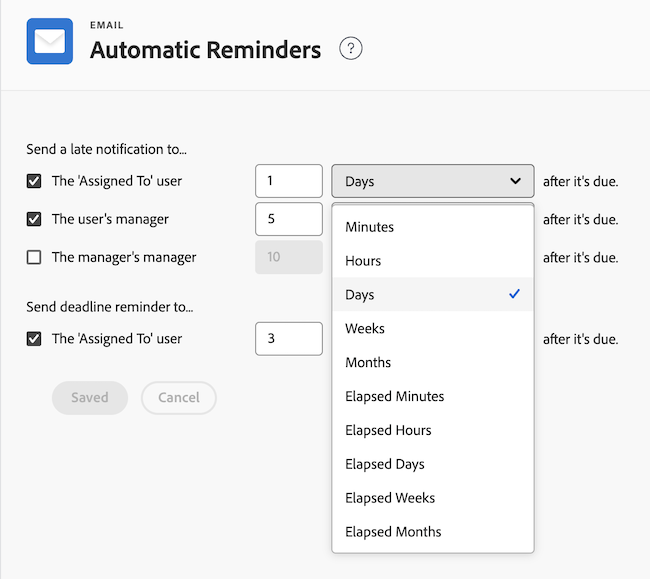

# Set up automatic reminders

<!--DON'T DELETE, DRAFT OR HIDE THIS ARTICLE. IT IS LINKED TO THE PRODUCT, THROUGH THE CONTEXT SENSITIVE HELP LINKS.-->

As an Adobe Workfront administrator, you can set up automatic reminders to trigger email notifications when all tasks or issues are due, late, or near the planned completion date. After you configure these settings, users cannot disable automatic reminders.

For late notifications, the email is sent nightly until the task or issue is completed.

An automatic reminder can be sent to one or more of the following:

* The users assigned to a task or issue
* The user's immediate manager
* The manager of the immediate manager

>[!NOTE]
>
>You cannot change the content or the subject line of the email triggered by an automatic reminder.

## Access requirements

+++ Expand to view access requirements for the functionality in this article.

You must have the following access to perform the steps in this article:

<table style="table-layout:auto"> 
 <col> 
 <col> 
 <tbody> 
  <tr> 
   <td role="rowheader">Adobe Workfront plan</td> 
   <td>Any</td> 
  </tr> 
  <tr> 
   <td role="rowheader">Adobe Workfront license</td> 
   <td>Plan</td> 
  </tr> 
  <tr> 
   <td role="rowheader">Access level configurations</td> 
   <td> 
System administrator
 </td> 
  </tr> 
 </tbody> 
</table>

+++

## Set up automatic reminders

{{step-1-to-setup}}

1. Click **Email** > **Automatic Reminders**.

1. In the **Send a late notification to** area, select any of the following options:

   <table>
    <tr>
        <td>The "Assigned To" user</td>
        <td>Select this option if you want the user assigned to a task or issue to receive a late notification about their work item being late.</td>
        <td></td>
    </tr>
    <tr>
        <td>The user's manager</td>
        <td>Select this option if you want the user's manager to receive a late notification about their direct report's work item being late.</td>
        <td></td>
    </tr>
    <tr>
        <td>The manager's manager</td>
        <td>Select this option if you want the immediate manager's manager to receive a late notification about a work item of one of their direct report's users being late.</td>
        <td></td>
    </tr>
    <tr>
        <td>The "Assigned To" user</td>
        <td>(In the <b>Send deadline reminder to</b> area.) Select this option if you want the user assigned to a task or an issue to receive a notification about their work item approaching the due date.</td>
        <td></td>
    </tr>
   </table>

1. Select the time for the automatic reminder to send by selecting the amount of time before or after the due date of the work item.

   The time is calculated from the Planned Completion Date of the task or issue.

   Specify the number of minutes, hours, days, weeks, or months to add time to the Planned Completion Date of the tasks or issues. Select **Elapsed Minutes**, **Elapsed Hours**, **Elapsed Days**, or **Elapsed Weeks** to add time that includes any weekends, holidays, and non-working hours as indicated in your schedule.

   For example, if a task is assigned on Friday and has a duration of 3 elapsed days, the task completion date is set for Monday (assuming that Saturday and Sunday is a weekend). If the task has a duration of 3 days (not elapsed), the task completion date is set for Wednesday.

   

1. Click **Save**.

## Receive automatic reminders

If you are the designated entity in an Automatic Reminder notification, you receive an email when the specified deadline is met. For late notifications, the email is sent nightly until the task or issue is completed.

Tasks with certain dependency types may deliver after the specified start date, even though they are past due. For example, if a task has a predecessor with a Finish-Start (fs) dependency, it won't be included in the email, even if it's passed the specified start date, because you can't start the task until the predecessor is complete.

For more information about receiving Automatic Reminders emails, see the [Automatic reminders](../../../workfront-basics/using-notifications/wf-notifications.md#automatic-reminders) section in [Adobe Workfront notifications](../../../workfront-basics/using-notifications/wf-notifications.md).

## Send automatic reminders

Automatic reminders are sent as soon as the time selected by the Workfront administrator is met.

If you want to trigger sending the automatic reminder emails manually, you can do so by using Diagnostics. For more information about accessing and using Diagnostics in Workfront, see [Use Diagnostics to trigger automated processes](../../../administration-and-setup/manage-workfront/run-diagnostics/use-diagnostics-to-trigger-automated-processes.md).
