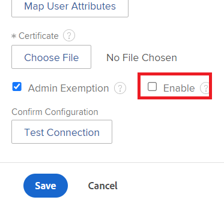

# Manage API keys

<!--DON'T DELETE, DRAFT OR HIDE THIS ARTICLE. IT IS LINKED TO THE PRODUCT, THROUGH THE CONTEXT SENSITIVE HELP LINKS.

-->

In order to minimize API security vulnerabilities, Adobe Workfront administrators can manage the API Keys used to enable applications to access Workfront on behalf of a user.

You can reset or remove your current administrator API Key, configure API Keys to expire, and remove the API Keys for all users.

Examples of applications that leverage the Workfront API are:

* Document integrations such as Dropbox, Google Drive, and Workfront DAM
* Workfront mobile applications

>[!IMPORTANT]
>
>When resetting or removing an API Key, any application that leverages the Workfront API and authenticates to Workfront via this API Key must be re-configured in order to regain access to Workfront.

## Access requirements

+++ Expand to view access requirements for the functionality in this article.

You must have the following access to perform the steps in this article: 

<table style="table-layout:auto"> 
 <col> 
 <col> 
 <tbody> 
  <tr> 
   <td role="rowheader">Adobe Workfront plan</td> 
   <td>Any</td> 
  </tr> 
  <tr> 
   <td role="rowheader">Adobe Workfront license</td> 
   <td>Plan</td> 
  </tr> 
  <tr> 
   <td role="rowheader">Access level configurations</td> 
   <td> 
You must be a Workfront administrator.
 
<b>NOTE</b>: If you still don't have access, ask your Workfront administrator if they set additional restrictions in your access level. For information on how a Workfront administrator can modify your access level, see <a href="../../../administration-and-setup/add-users/configure-and-grant-access/create-modify-access-levels.md" class="MCXref xref">Create or modify custom access levels</a>.
 </td> 
  </tr> 
 </tbody> 
</table>

+++

## Workfront API Keys

Each user in Workfront has a unique API Key. This key is generated on a per-user basis at the time the user accesses an integration that leverages the Workfront API (such as the Workfront mobile app or a document integration).

>[!NOTE]
>
> API Keys you generate in the production environment are copied to your Preview environment during the weekly refresh. Any API Keys you generate in the Preview environment will be overwritten with your production API Keys during the weekly refresh.

Workfront administrators also have a unique API Key. When an application uses an administrator API Key to access Workfront, the application has administrator access to Workfront.

## Manage an administrator API key

You can generate, reset, or remove the API Key for your administrator user account. 

>[!NOTE]
>
>You can also generate an API Key through the API. For more information, see the [Event Subscription API](../../../wf-api/general/event-subs-api.md) section in [Event Subscription API](../../../wf-api/general/event-subs-api.md).

{{step-1-to-setup}} 

1. Click **System >** **Customer Info.**
1. (Conditional) Perform one of the following actions:

   To generate an API Key: In the **API Key Settings** section, click **Generate API Key**.

   Or  
   To reset an API Key: In the **API Key Settings** section, click **Reset**, then **Reset.**

   Or

   To remove the API Key: In the **API Key Settings** section, click **Remove**, then **Remove**. 

## Generate an API Key for Non-Admin Users

You can generate and manage API Keys for users in roles other than Workfront administrator.

>[!NOTE]
>
>This is not available if your organization's Workfront instance is enabled with Adobe IMS. See your network or IT administrator if you need more information.

1. (Conditional) If your organization uses Single Sign-On (SSO) access management, temporarily disable the option requiring SSO authentication.

   {{step-1-to-setup}} 
   
   1. Expand **System**, then click **Single Sign-on (SSO)**. 
   1. In the **Type** field, select the type of SSO your organization uses.
   1. With the type selected, scroll down and clear the **Enable** checkbox. 
        
   1. Click **Save**.

1. In the address bar of a browser, enter the following API call:

   `<domain>`**.my.workfront.com/attask/api/v7.0/user?action=generateApiKey&username=**username**&password=**password**&method=PUT

   Replace `<domain>` with your Workfront domain name, and username and password with the user's Workfront credentials.

1. (Conditional) Enable the option requiring SSO authentication if you disabled it in Step 1.

   {{step-1-to-setup}}
   
   1. Expand **System**, then click **Single Sign-on (SSO)**.
   
   1. Select your SSO method in the **Type** drop down menu.
   1. Check the checkbox requiring SSO authentication.

## Configure when API keys expire

You can configure API Keys to expire for all users in your system. When the API Key of a user expires, the user must re-authenticate to any applications that use the Workfront API to access Workfront. You can change the frequency with which the API Keys expire. You can also configure whether API Keys expire when the password of a user expires.

{{step-1-to-setup}}  

1. Click **System** > **Customer Info**.
1. In the **API Key Settings** area, in the **After creation**, **API keys expire in** drop-down list, select the timeframe when you want the API keys to expire.

   When you change this option, the new timeframe begins from the time that you made the change. For example, if you change this option from *1 month* to *6 months*, the API Keys expire 6 months from the time you make the change.

   By default, API Keys expire each month.

1. To configure API Keys to expire at the time the users' passwords expire, select **Remove API key when a user's password expire**.

   By default, this option is not selected.

   For information about how to configure user passwords to expire, see [Configure system security preferences](../../../administration-and-setup/manage-workfront/security/configure-security-preferences.md). 

1. Click **Save**.

## Remove the API keys for all users

If you are concerned about a particular security breach regarding your Workfront system, you can remove API Keys simultaneously for all users.

>[!IMPORTANT]
>
>Removing API Keys for all users invalidates ALL of the API Keys for all the users in the system. This action will cause all of your integrations in Workfront to fail until you generate a new API Key in Workfront and update all your integrations.

{{step-1-to-setup}}  

1. Expand **System**, then click **Customer Info**.

1. In the **API Key Settings** area, click **Remove all API keys**, then click **Remove** **All**.

## Restricting API logins with an X.509 certificate

>[!IMPORTANT]
>
>The procedure described in this section applies only to organizations that have not yet been onboarded to the Adobe Business Platform. Logging in to Workfront through the Workfront API is not available if your organization has been onboarded to the Adobe Business Platform.
>
>For a list of procedures that differ based on whether your organization has been onboarded to the Adobe Business Platform, see [Platform-based administration differences (Adobe Workfront/Adobe Business Platform)](../../../administration-and-setup/get-started-wf-administration/actions-in-admin-console.md).

Third-party applications can communicate with Workfront through the API. To increase the security of your Workfront site, you can configure Workfront to restrict API login requests by uploading an X.509 certificate to Workfront. Once enabled, all login requests through the API must include a client certificate in addition to username and password.

>[!NOTE]
>
>This is not available if your organization's Workfront instance is enabled with Adobe IMS. See your network or IT administrator if you need more information.

* [Obtain the X.509 certificate](#obtain-the-x-509-certificate) 
* [Upload the certificate to Workfront](#upload-the-certificate-to-workfront) 
* [Verify API login calls are restricted](#verify-api-login-calls-are-restricted)

### Obtain the X.509 certificate {#obtain-the-x-509-certificate}

Obtain a valid X.509 certificate from a trusted Certificate Authority (such as Verisign), and place it in a temporary location on your workstation. 

### Upload the certificate to Workfront {#upload-the-certificate-to-workfront}

After you have obtained the X.509 certificate from your Certificate Authority, you need to upload it to Workfront.

1. Click the **Main Menu** icon  in the upper-right corner of Adobe Workfront, then click **Setup** .  

1. Expand **System**, then click **Customer Info**.

1. In the **API Key Settings** area, select **Enable X.509 Certificate**.
1. On your workstation, browse to and select the X.509 certificate that you previously downloaded.
1. (Optional) Click **View Details** next to the certificate name to view the following details about the certificate:

   * Subject Common Name
   * Subject Organization
   * Subject Organization Unit
   * Issuer Common Name
   * Issuer Organization
   * Issuer Organization Unit
   * Serial Number
   * Issue Date
   * Expiration Date

1. Click **Save**. 

### Verify API login calls are restricted {#verify-api-login-calls-are-restricted}

Prior to configuring your instance of Workfront to require an X.509 certificate, perform an API request to the `/login` endpoint using valid username and password parameters. You will receive a 200 response that contains a sessionID.

After making the X.509 certificate a requirement via the customer info page in your instance of Workfront, make another login attempt. This time you will receive a 500 error response with the following message: "Untrusted request. Please contact your system administrator and attach certificate."

After confirming that the X.509 certificate is required, perform the same login request with an additional parameter for apiCertificate set to the value of your certificate. If this operation was performed correctly you will receive a 200 response that contains a valid sessionID.
